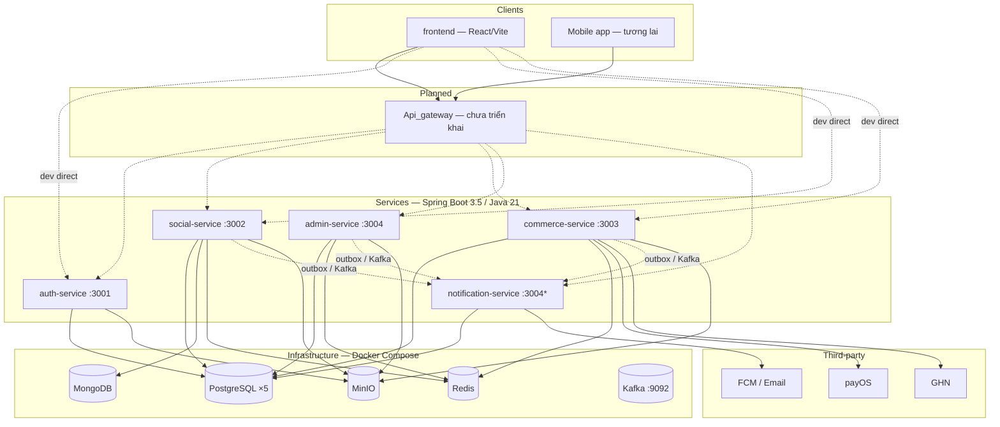

# 2Hands — Monorepo (MVP)

Nền tảng **thương mại điện tử kết hợp mạng xã hội**: đăng ký/đăng nhập, feed & bài viết, mua bán & thanh toán, kiểm duyệt admin, thông báo đa kênh.

Repo này gom **microservices Spring Boot**, **tài liệu nghiệp vụ/kỹ thuật**, **hạ tầng Docker local** và **frontend React (Vite)** trong một workspace. Kiến trúc: **Microservices + Clean Architecture + Event-Driven (Outbox Pattern)**.

Tài liệu tổng quan: [`docs/Master Specification.md`](docs/Master%20Specification.md) · Kiến trúc: [`docs/architecture/system-architecture.md`](docs/architecture/system-architecture.md)

---

## Sơ đồ hệ thống (MVP)



\* `admin-service` và `notification-service` cùng mặc định port **3004** — khi chạy song song local, đặt `SERVER_PORT=3005` (hoặc tương đương) cho một trong hai service.

---

## Cấu trúc repository

```
2Hand_Projects/
├── Services/              # Microservices (Gradle, độc lập từng project)
│   ├── auth-service/
│   ├── social-service/
│   ├── commerce-service/
│   ├── admin-service/
│   ├── notification-service/
│   └── skeleton-service/  # Template tham chiếu (auth scaffold)
├── Infrastructure/        # docker-compose.yml — Postgres, Mongo, Redis, MinIO, Kafka
├── docs/                  # Spec, FR, API behavior, schema, use cases
├── frontend/              # React 19 + Vite + Tailwind (MSW)
├── .cursor/rules/         # Chuẩn implement theo domain (admin, commerce, social)
├── Api_gateway/           # (placeholder — chưa có mã)
├── Packages/              # (placeholder — shared libs tương lai)
└── Scripts/               # (placeholder — automation tương lai)
```

Mỗi service là **Gradle project riêng** (`settings.gradle` + `build.gradle`). Không có root Gradle wrapper chung — chạy lệnh trong thư mục service tương ứng.

---

## Microservices

| Service | Port | PostgreSQL | Khác | API prefix (trong service) | README |
|---------|------|------------|------|----------------------------|--------|
| **auth-service** | 3001 | `localhost:5432` / `auth_db` | Redis (session) | `/api/v1/auth`, `/api/v1/users`, `/api/v1/admin` | [Services/auth-service/README.md](Services/auth-service/README.md) |
| **social-service** | 3002 | `localhost:5433` / `social_db` | MongoDB, Redis, MinIO (optional) | `/api/v1/social/*` | [Services/social-service/README.md](Services/social-service/README.md) |
| **commerce-service** | 3003 | `localhost:5434` / `commerce_db` | Redis, MinIO, payOS, GHN | `/commerce/api/v1/*` | [Services/commerce-service/README.md](Services/commerce-service/README.md) |
| **admin-service** | 3004 | `localhost:5436` / `admin_db` | Redis | `/admin/api/v1/*` | [Services/admin-service/README.md](Services/admin-service/README.md) |
| **notification-service** | 3004† | `localhost:5435` / `notification_db` | Kafka consumer (tùy env) | `/api/v1/notification/*` | [Services/notification-service/README.md](Services/notification-service/README.md) |

**Trạng thái triển khai (tóm tắt):**

| Service | Mức độ | Ghi chú |
|---------|--------|---------|
| Auth | Core MVP | Register/login, OAuth, RBAC, profile, enforcement hooks, outbox user events |
| Social | Core MVP | Feed, post/comment, like/save, follow, search, moderation consumer, outbox social events |
| Commerce | Core MVP | Catalog, cart, checkout, orders, payOS, GHN webhooks, seller/admin APIs |
| Admin | Core MVP | Moderation (user/post/product/review), enforcement, audit, system config |
| Notification | Scaffold + ingest | In-app pipeline; Kafka/outbox consumer tùy bật env; internal ingest API cho dev |

Qua **API Gateway production** (khi có): `https://api.2hands.vn/{service-name}/api/v1/...` — xem [`docs/engineering_rules/api-standard.md`](docs/engineering_rules/api-standard.md).

---

## Chạy local nhanh

### Yêu cầu

- **JDK 21**
- **Docker** (Postgres, Mongo, Redis, MinIO, Kafka)
- **Gradle** (wrapper trong từng `Services/*`)

### 1. Hạ tầng

```bash
cd Infrastructure
docker compose up -d
```

| Container | Port host | Mục đích |
|-----------|-----------|----------|
| `postgres-auth` | 5432 | `auth_db` |
| `postgres-social` | 5433 | `social_db` (+ outbox, follows, likes…) |
| `postgres-commerce` | 5434 | `commerce_db` |
| `postgres-notification` | 5435 | `notification_db` |
| `postgres-admin` | 5436 | `admin_db` |
| `mongodb` | 27017 | `social_db` (posts, comments, projections) |
| `redis` | 6379 | Session, cart, rate limit |
| `minio` | 9000 / 9001 | Object storage (avatar, product, post media) |
| `kafka` | 9092 | Event broker (KRaft) — app host: `localhost:9092` |
| `kafka-ui` | 8080 | Debug Kafka — http://localhost:8080 |

Chi tiết Kafka: [hạng mục 0](docs/kafka/kafka_section_0.md) · [1 — outbox](docs/kafka/kafka_section_1.md) · [2A — auth → notification](docs/kafka/kafka_section_2.md) · [3A — auth → social](docs/kafka/kafka_section_3.md) · [4A — social → notification](docs/kafka/kafka_section_4.md) · [5A — commerce → notification](docs/kafka/kafka_section_5.md)

> Hạng mục **1**: bật `*_KAFKA_PRODUCER_ENABLED` + `*_OUTBOX_PUBLISH_ENABLED` (auth publish). **2A**: bật thêm `NOTIFICATION_KAFKA_CONSUMER_ENABLED` + `NOTIFICATION_PROCESS_EVENTS_ENABLED` — xem [kafka_section_2.md](docs/kafka/kafka_section_2.md).

### 2. Backend service (ví dụ)

```bash
cd Services/auth-service
# Tạo .env: JWT_ACCESS_SECRET, JWT_REFRESH_SECRET (≥32 ký tự, đồng bộ giữa các service)
./gradlew bootRun
```

Lặp tương tự cho `social-service`, `commerce-service`, `admin-service`. File mẫu env: `Services/*/(.env.example)` nơi có sẵn.

**JWT:** Mọi API protected dùng chung secret với `auth-service` (`JWT_ACCESS_SECRET`).

### 3. Frontend

```bash
cd frontend
npm install
npm run dev
```

- Dev server: **http://localhost:5173**
- Stack: React 19, Vite 5, Tailwind 4, React Router 7, MSW (mock API)

### 4. Chia sẻ data dev giữa máy (dump / restore)

Mỗi dev mặc định có **stack Docker riêng** — data test (user, post, avatar MinIO…) **không tự sync** qua git. Để đồng nghiệp dùng chung bộ data local, export dump rồi gửi file (Drive/OneDrive/Slack). **Không commit** thư mục `dev-dumps/` (đã có trong `.gitignore`).

**Cần dump:** PostgreSQL ×5, MongoDB `social_db`, MinIO buckets (avatar, post media, commerce media). **Không cần:** Redis (session/cart), Kafka.

**Yêu cầu:** Docker infra đang chạy; [MinIO Client `mc`](https://min.io/docs/minio/linux/reference/minio-mc.html) (`winget install MinIO.mc`) hoặc dùng image `minio/mc` qua Docker.

#### Export (máy có data)

```powershell
cd Infrastructure
docker compose up -d

$DATE = Get-Date -Format "yyyy-MM-dd"
$DUMP = "..\dev-dumps\$DATE"
New-Item -ItemType Directory -Force -Path $DUMP | Out-Null
Set-Location $DUMP

docker exec postgres-auth         pg_dump -U postgres -Fc auth_db         > auth_db.dump
docker exec postgres-social       pg_dump -U postgres -Fc social_db       > social_db.dump
docker exec postgres-commerce     pg_dump -U postgres -Fc commerce_db     > commerce_db.dump
docker exec postgres-admin        pg_dump -U postgres -Fc admin_db        > admin_db.dump
docker exec postgres-notification pg_dump -U postgres -Fc notification_db > notification_db.dump

docker exec mongodb mongodump --db=social_db --archive=/tmp/social_db.archive
docker cp mongodb:/tmp/social_db.archive ./social_db.archive

mc alias set local http://localhost:9000 admin password123
New-Item -ItemType Directory -Force -Path .\minio | Out-Null
mc mirror local/2hands-avatar           .\minio\2hands-avatar
mc mirror local/2hands-social-post      .\minio\2hands-social-post
mc mirror local/2hands-commerce-product .\minio\2hands-commerce-product
mc mirror local/2hands-commerce-review  .\minio\2hands-commerce-review
mc mirror local/2hands-commerce-shop    .\minio\2hands-commerce-shop

Set-Location ..
Compress-Archive -Path $DATE -DestinationPath "2hands-dev-dump-$DATE.zip"
```

Bucket MinIO trống → thư mục tương ứng rỗng; vẫn restore được.

#### Restore (máy đồng nghiệp)

1. Giải nén vào `dev-dumps/<ngày>/`.
2. Tắt các service backend (`bootRun`).
3. Infra + bucket MinIO:

```powershell
cd Infrastructure
docker compose up -d
docker compose run --rm minio-init
```

4. Restore (đổi `<ngày>` cho đúng):

```powershell
cd ..\dev-dumps\<ngày>

docker cp auth_db.dump postgres-auth:/tmp/auth_db.dump
docker exec postgres-auth pg_restore -U postgres -d auth_db --clean --if-exists /tmp/auth_db.dump

docker cp social_db.dump postgres-social:/tmp/social_db.dump
docker exec postgres-social pg_restore -U postgres -d social_db --clean --if-exists /tmp/social_db.dump

docker cp commerce_db.dump postgres-commerce:/tmp/commerce_db.dump
docker exec postgres-commerce pg_restore -U postgres -d commerce_db --clean --if-exists /tmp/commerce_db.dump

docker cp admin_db.dump postgres-admin:/tmp/admin_db.dump
docker exec postgres-admin pg_restore -U postgres -d admin_db --clean --if-exists /tmp/admin_db.dump

docker cp notification_db.dump postgres-notification:/tmp/notification_db.dump
docker exec postgres-notification pg_restore -U postgres -d notification_db --clean --if-exists /tmp/notification_db.dump

docker cp social_db.archive mongodb:/tmp/social_db.archive
docker exec mongodb mongorestore --db=social_db --drop --archive=/tmp/social_db.archive

mc alias set local http://localhost:9000 admin password123
mc mirror .\minio\2hands-avatar           local/2hands-avatar
mc mirror .\minio\2hands-social-post      local/2hands-social-post
mc mirror .\minio\2hands-commerce-product local/2hands-commerce-product
mc mirror .\minio\2hands-commerce-review  local/2hands-commerce-review
mc mirror .\minio\2hands-commerce-shop    local/2hands-commerce-shop
```

5. Chạy lại backend + FE; **đăng nhập lại** (token/Redis không nằm trong dump).

**Lưu ý:** `JWT_ACCESS_SECRET` / `JWT_REFRESH_SECRET` trong `.env` các service nên **giống nhau** giữa người export và import (hoặc chỉ dùng login mới sau restore). URL media dạng `http://localhost:9000/...` hoạt động nếu cùng port infra local.

Chi tiết MinIO init: [Infrastructure/README.md](Infrastructure/README.md).

---

## Tài liệu (`docs/`)

| Thư mục | Nội dung |
|---------|----------|
| [`architecture/`](docs/architecture/) | System design, EDA, database strategy |
| [`business-spec/`](docs/business-spec/) | Spec nghiệp vụ từng service |
| [`feature_requirements/`](docs/feature_requirements/) | FR theo domain (auth, social, commerce, admin, notification) |
| [`api_fe_behavior/`](docs/api_fe_behavior/) | Contract API + hành vi cho FE (envelope, lỗi, edge cases) |
| [`database/`](docs/database/) | Schema reference |
| [`business_flow/`](docs/business_flow/) | Luồng nghiệp vụ end-to-end |
| [`use_cases/`](docs/use_cases/) | Use case theo actor |
| [`engineering_rules/`](docs/engineering_rules/) | API standard, naming, backend/frontend convention |
| [`kafka/`](docs/kafka/) | Kafka local: hạng mục 0 (infra), hạng mục 1 (outbox publisher) |

**Quy tắc implement (Cursor):** `.cursor/rules/{admin,commerce,social}/` — Clean Architecture, Outbox, JWT, cấu trúc package, bắt buộc doc API behavior khi thêm endpoint.

---

## Chuẩn kỹ thuật chung

- **Kiến trúc:** `delivery → application → domain → infrastructure` (không đảo chiều).
- **API response:** envelope `{ code, success, message, data, errors, timestamp }`.
- **Xóa mặc định:** soft delete.
- **Ghi + event:** Transactional **Outbox** (`outbox_events` trong DB của từng service) → worker publish Kafka.
- **Bảo mật:** JWT trên API public; không service nào đọc DB của service khác.
- **DB:** Database-per-service; Social dùng **polyglot** (PostgreSQL + MongoDB).

Chi tiết: [`docs/engineering_rules/backend-convention.md`](docs/engineering_rules/backend-convention.md)

---

## Kiểm thử

Trong từng service:

```bash
cd Services/<service-name>
./gradlew test
```

- **Unit:** logic application/domain  
- **Integration:** API (`@WebMvcTest`), persistence khi có  

Báo cáo: `Services/<service-name>/build/reports/tests/test/index.html`

---

## Tích hợp liên service (high level)

| Luồng | Cơ chế |
|-------|---------|
| User lifecycle | Auth outbox → Social projection (`user_projections`) |
| Enforcement | Admin → Kafka → Auth / Social cập nhật trạng thái |
| Moderation bài viết | Admin `POST_MODERATED` → Social ẩn/xóa mềm post |
| Engagement | Social outbox (`POST_LIKED`, `COMMENT_CREATED`, `USER_FOLLOWED`) → Notification |
| Đơn hàng | Commerce outbox + payOS webhook + GHN webhook |
| Media | MinIO presigned URL; URL lưu trong DB/document |

Ma trận event: [`docs/architecture/event-driven-architecture.md`](docs/architecture/event-driven-architecture.md)

---

## Roadmap / giới hạn hiện tại

- **Api_gateway:** thư mục trống — client dev gọi thẳng port service.
- **Kafka:** broker + UI (hạng mục 0); outbox publisher Java sẵn sàng, tắt mặc định (hạng mục 1). Consumer notification/social → hạng mục 2.
- **notification-service vs admin-service:** trùng port 3004 — chỉnh port khi dev full stack.
- **Packages / Scripts:** chưa dùng.

---

## Liên kết nhanh

- [auth-service](Services/auth-service/README.md) · [social-service](Services/social-service/README.md) · [commerce-service](Services/commerce-service/README.md)
- [admin-service](Services/admin-service/README.md) · [notification-service](Services/notification-service/README.md) · [skeleton-service](Services/skeleton-service/README.md) (template)
- Docker infra: [Infrastructure/docker-compose.yml](Infrastructure/docker-compose.yml) · [Infrastructure/README.md](Infrastructure/README.md)
