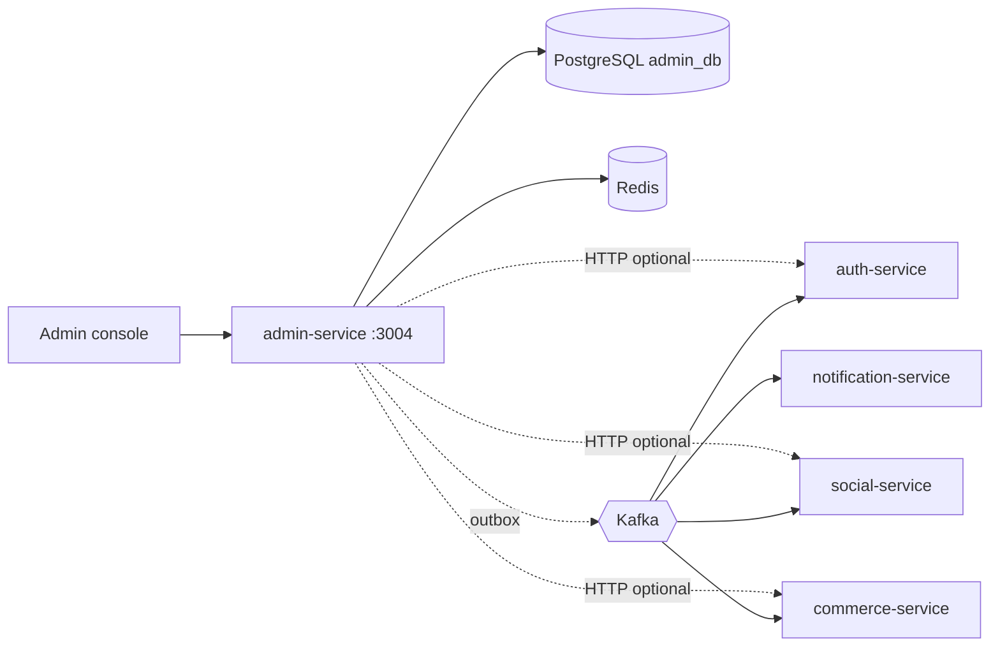

# Admin Service

Microservice **vận hành & kiểm duyệt** của 2Hands: enforcement người dùng, moderation nội dung (post, comment, product, review, shop), cấu hình hệ thống, thông báo admin, audit log và outbox sự kiện admin.

**Spring Boot 3.5** · **Java 21** · **PostgreSQL** + **Redis** · Clean Architecture.

---

## Vai trò trong hệ thống



| Thành phần | Vai trò |
|-----------|---------|
| **PostgreSQL** | Moderation logs, enforcements, system config, announcements, audit, outbox |
| **Redis** | Cache / hỗ trợ session admin |
| **Outbox** | Phát `admin.user.*`, `admin.post.moderated`, `admin.product.*`, … |
| **HTTP integrations** | Gọi Auth/Commerce/Social khi `ADMIN_*_INTEGRATION_ENABLED=true` (tắt mặc định local) |

Admin **không** sở hữu dữ liệu post/order/product — ghi log + event; domain service xử lý projection.

---

## API (đã triển khai)

Base URL local: **`http://localhost:3004`**

Prefix: **`/admin/api/v1/...`** · JWT admin (cùng secret với auth hoặc luồng login admin riêng tùy triển khai) · Lỗi **`ADMIN-*`**.

### Auth & authorization

| Method | Path | Mô tả |
|--------|------|--------|
| `POST` | `/auth/login` | Đăng nhập admin |
| `POST` | `/auth/logout` | Đăng xuất |
| `POST` | `/auth/token/refresh` | Refresh token |
| `GET` | `/me` | Thông tin admin hiện tại |
| `GET` | `/me/roles`, `/me/roles/check` | Vai trò |
| `GET` | `/me/permissions/check` | Kiểm tra permission |
| `GET` | `/authorization-probe/user-suspend` | Probe quyền (dev/support) |
| `GET` | `/health` | Health API (protected) |

### Enforcement người dùng (`/users`)

| Method | Path | Mô tả |
|--------|------|--------|
| `GET` | `/{userId}/enforcements/current` | Enforcement hiện tại |
| `GET` | `/{userId}/enforcements/history` | Lịch sử |
| `POST` | `/{userId}/suspend` \| `/ban` \| `/restrict` | Áp enforcement |
| `POST` | `/user-enforcements/{enforcementId}/revoke` | Thu hồi |

### Moderation

| Resource | Base | Hành động |
|----------|------|-----------|
| Social post | `/social/posts` | `POST /{postId}/moderate`, `/restore` |
| Social comment | `/social/comments` | `POST /{commentId}/moderate`, `/restore` |
| Product | `/products` | `GET .../moderation-history`, `remove`, `restore` |
| Review | `/reviews` | `hide`, `remove`, `restore` |
| Shop | `/shops` | `suspend`, `close`, `reopen` |

### Hệ thống & vận hành

| Nhóm | Path | Mô tả |
|------|------|--------|
| System config | `/system-configs` | CRUD, toggle, lịch sử |
| Announcements | `/system-announcements` | Tạo, publish, pin, cancel, dismiss |
| Audit | `/admin-action-logs` | Xem log hành động admin |
| Investigation | `/users/{userId}/profile` | Hồ sơ điều tra |
| Support | `/support/orders`, `payments`, `shipments`, `webhook-logs` | Tra cứu cross-service |
| Sessions | `/admin-sessions/{sessionId}/revoke` | Thu hồi phiên admin |

> Chi tiết: [`docs/api_fe_behavior/admin_api_fe_behavior/`](../../docs/api_fe_behavior/admin_api_fe_behavior/)

---

## Outbox (phát sự kiện)

`ADMIN_OUTBOX_PUBLISH_ENABLED=true` + worker publish lên Kafka.

| Event type | Topic |
|------------|--------|
| `USER_SUSPENDED` | `admin.user.suspended` |
| `USER_BANNED` | `admin.user.banned` |
| `USER_RESTRICTED` | `admin.user.restricted` |
| `USER_ENFORCEMENT_REVOKED` | `admin.user.enforcement_revoked` |
| `USER_ENFORCEMENT_EXPIRED` | `admin.user.enforcement_expired` |
| `POST_MODERATED` | `admin.post.moderated` |
| `POST_RESTORED` | `admin.post.restored` |
| `COMMENT_MODERATED` | `admin.comment.moderated` |
| `PRODUCT_REMOVED` / `PRODUCT_RESTORED` | `admin.product.*` |
| `REVIEW_HIDDEN` / `REVIEW_REMOVED` / `REVIEW_RESTORED` | `admin.review.*` |
| `SHOP_SUSPENDED` / `SHOP_CLOSED` / `SHOP_RESTORED` | `admin.shop.*` |
| `SYSTEM_CONFIG_UPDATED` | `admin.config.updated` |
| `SYSTEM_ANNOUNCEMENT_PUBLISHED` / `CANCELLED` | `admin.announcement.*` |

Job hết hạn enforcement: `ADMIN_ENFORCEMENT_EXPIRATION_ENABLED`.

---

## Chạy local

### 1. Hạ tầng

```bash
cd Infrastructure
docker compose up -d postgres-admin redis
```

| Dependency | Mặc định |
|------------|----------|
| PostgreSQL | `localhost:5436` / `admin_db` (user/pass: `postgres` / `123456`) |
| Redis | `localhost:6379` |

### 2. Environment

```bash
cd Services/admin-service
cp .env.example .env
```

```env
SERVER_PORT=3004
DB_URL=jdbc:postgresql://localhost:5436/admin_db
JWT_ACCESS_SECRET=<cùng auth-service, ≥32 ký tự>
JWT_REFRESH_SECRET=<cùng auth-service>

ADMIN_OUTBOX_PUBLISH_ENABLED=false
ADMIN_OUTBOX_RETRY_ENABLED=false
ADMIN_ENFORCEMENT_EXPIRATION_ENABLED=false

# Bật khi cần gọi service khác trực tiếp
ADMIN_AUTH_INTEGRATION_ENABLED=false
ADMIN_COMMERCE_INTEGRATION_ENABLED=false
ADMIN_SOCIAL_INTEGRATION_ENABLED=false
```

### 3. Chạy

```bash
./gradlew bootRun
```

- **Health (actuator):** `GET http://localhost:3004/actuator/health`
- **API health:** `GET http://localhost:3004/admin/api/v1/health` (Bearer JWT)

### 4. Smoke test

```bash
curl -s http://localhost:3004/admin/api/v1/health \
  -H "Authorization: Bearer <admin_access_token>"
```

**Docker:** profile `apps` / `dev` trong `Infrastructure/docker-compose.*.yml` — port **3004** cố định trong `.env.docker.example`.

---

## Kiểm thử

```bash
cd Services/admin-service
./gradlew test
```

Quy tắc Cursor: `.cursor/rules/admin/`

---

## Cấu trúc mã nguồn

```
src/main/java/com/twohands/admin_service/
├── application/     # moderation, enforcement, config, audit, outbox
├── delivery/http/
├── domain/
├── infrastructure/  # JPA, HTTP clients, outbox, Kafka
└── config/ security/ exception/
```

---

## Tài liệu

| Tài liệu | Đường dẫn |
|----------|-----------|
| Business spec | [`docs/business-spec/admin-service-spec.md`](../../docs/business-spec/admin-service-spec.md) |
| DB schema | [`docs/database/admin-schema.md`](../../docs/database/admin-schema.md) |
| Feature requirements | [`docs/feature_requirements/admin/`](../../docs/feature_requirements/admin/) |
| Business flows | [`docs/business_flow/admin_business_flow/`](../../docs/business_flow/admin_business_flow/) |
| Monorepo | [`README.md`](../../README.md) |

---

## Cổng local (tham chiếu)

| Service | HTTP | PostgreSQL |
|---------|------|------------|
| auth-service | 3001 | 5432 |
| social-service | 3002 | 5433 |
| commerce-service | 3003 | 5434 |
| notification-service | 3005 | 5435 |
| **admin-service** | **3004** | **5436** |
