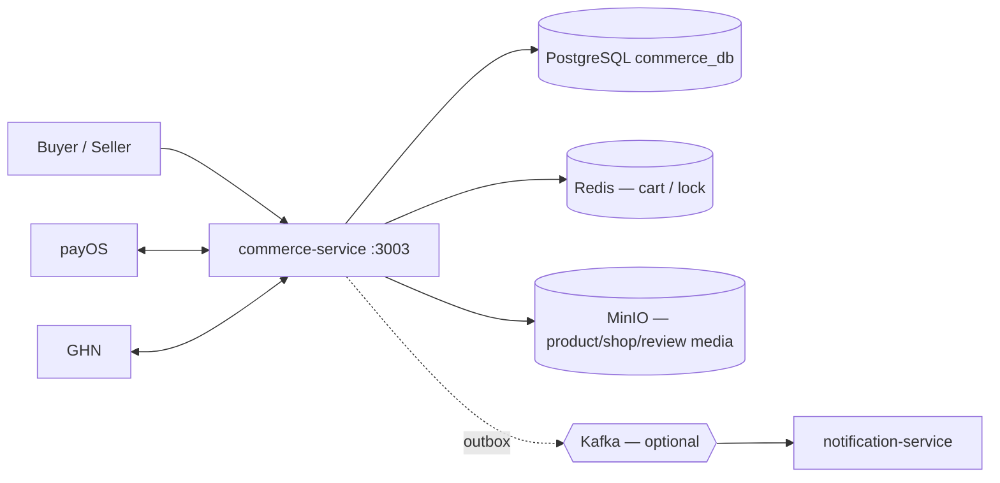

# Commerce Service

Microservice **thương mại điện tử** của 2Hands: shop, sản phẩm, giỏ hàng, checkout, đơn hàng, thanh toán (payOS), vận chuyển (GHN), đánh giá và outbox sự kiện commerce.

**Spring Boot 3.5** · **Java 21** · **PostgreSQL** + **Redis** · Clean Architecture · **không dùng MongoDB** trong service này.

---

## Vai trò trong hệ thống



| Thành phần | Vai trò |
|-----------|---------|
| **PostgreSQL** | Products, shops, cart, orders, payments, shipments, reviews, outbox |
| **Redis** | Giỏ hàng, distributed lock tồn kho (checkout) |
| **MinIO** | Buckets `2hands-commerce-product`, `-shop`, `-review` |
| **payOS / GHN** | Tích hợp tắt mặc định; mock fallback khi dev |

**Ranh giới:** Chỉ lưu `user_id` / `buyer_id` / `seller_id` (UUID). Không truy cập DB Auth/Social/Admin.

---

## API (đã triển khai)

Base URL local: **`http://localhost:3003`**

Prefix: **`/commerce/api/v1/...`** · Lỗi: **`COMMERCE-*`** · Envelope chuẩn 2Hands.

### Buyer — khám phá & mua

| Nhóm | Base path | Ví dụ |
|------|-----------|--------|
| Catalog | `/products`, `/categories/{id}/products`, `/shops/{shopId}/products` | Tìm kiếm, chi tiết SP (một số GET **public**) |
| Cart | `/cart` | Tạo/xem giỏ, thêm/sửa/xóa item |
| Checkout | `/checkout` | Checkout từ giỏ |
| Orders | `/orders` | Danh sách, chi tiết, hủy, xác nhận nhận hàng |
| Payments | `/payments` | Tạo thanh toán, payOS checkout URL, trạng thái |
| Addresses | `/addresses` | CRUD địa chỉ giao hàng |
| Shipping | `/shipping` | Tính phí ship |
| Shipments | `/shipments` | Theo dõi vận đơn; chi tiết gồm `shipping_address` (snapshot). Tùy chọn: `GET /shipments/{id}/address-snapshot` — FE hiện không dùng |
| Reviews | `/reviews` | Tạo/sửa đánh giá sản phẩm |

### Seller

| Base path | Mô tả |
|-----------|--------|
| `/seller/shop` | Hồ sơ shop, vacation mode |
| `/seller/products` | CRUD sản phẩm, publish/pause/archive |
| `/seller/orders` | Đơn của shop |
| `/seller/order-items` | Xử lý từng dòng đơn (fulfillment) |
| `/seller/shipments` | Tạo/quản lý vận đơn |
| `/seller/reviews` | Phản hồi review |

### Admin & support (commerce-side)

| Base path | Mô tả |
|-----------|--------|
| `/admin/products`, `/admin/shops`, `/admin/reviews` | Moderation hỗ trợ |
| `/admin/support/orders`, `payments`, `shipments`, `webhook-logs` | Tra cứu vận hành (Admin Service proxy; Commerce FE chưa dùng) |
| `/reviews/context`, `/me/products/{id}/review`, `GET /reviews/{id}` | Buyer review read — form viết/sửa review (Commerce FE) |

### Webhook (public, verify signature)

| Method | Path |
|--------|------|
| `POST` | `/commerce/api/v1/payments/webhooks/**` (payOS) |
| `POST` | `/commerce/api/v1/shipments/webhooks/**` (GHN) |

> Contract đầy đủ: [`docs/api_fe_behavior/commerce_api_fe_behavior/`](../../docs/api_fe_behavior/commerce_api_fe_behavior/) (~72 tài liệu)

---

## Nghiệp vụ cốt lõi

- **Tồn kho:** Checkout `reserve` (`stock_quantity ↓`, `reserved_quantity ↑`); thanh toán thành công / hủy có luồng release tương ứng.
- **Snapshot:** `order_items` và `shipping_address_snapshots` — không phụ thuộc bản ghi mutable sau checkout.
- **Thanh toán payOS:** Trạng thái `PAID` chỉ từ **webhook hợp lệ**, không từ redirect URL.
- **Shipment:** Tạo khi order `PROCESSING` và payment đủ điều kiện; GHN webhook cập nhật trạng thái.
- **Soft delete / archive:** Product `ARCHIVED` / `REMOVED`; không hard delete mặc định.

---

## Outbox & background jobs

### Outbox (`COMMERCE_OUTBOX_PUBLISH_ENABLED`)

Ví dụ event → topic (xem `CommerceOutboxTopicResolver`):

| Event type | Topic |
|------------|--------|
| `COMMERCE_ORDER_CREATED` | `commerce.order.created` |
| `COMMERCE_PAYMENT_PAID` | `commerce.payment.paid` |
| `COMMERCE_SHIPMENT_STATUS_CHANGED` | `commerce.shipment.status_changed` |
| `COMMERCE_PRODUCT_PUBLISHED` | `commerce.product.published` |
| `COMMERCE_REVIEW_CREATED` | `commerce.review.created` |
| … | (30+ loại trong resolver) |

### Scheduled jobs (tắt mặc định)

| Job | Env |
|-----|-----|
| Hủy đơn chưa thanh toán | `COMMERCE_AUTO_CANCEL_UNPAID_ORDER_ENABLED` |
| Auto-complete đơn đã giao | `COMMERCE_AUTO_COMPLETE_DELIVERED_ORDER_ENABLED` |
| Đồng bộ trạng thái item giỏ | `COMMERCE_SYNC_CART_ITEM_STATUS_ENABLED` |
| Retry outbox | `COMMERCE_OUTBOX_RETRY_ENABLED` |

---

## Chạy local

### 1. Hạ tầng

```bash
cd Infrastructure
docker compose up -d postgres-commerce redis minio
```

| Dependency | Mặc định |
|------------|----------|
| PostgreSQL | `localhost:5434` / `commerce_db` |
| Redis | `localhost:6379` |
| MinIO | `localhost:9000` |

### 2. Environment

```bash
cd Services/commerce-service
cp .env.example .env
```

Biến quan trọng: `DB_URL`, `JWT_ACCESS_SECRET` / `JWT_REFRESH_SECRET` (**cùng auth-service**), `COMMERCE_*_ENABLED` flags, MinIO buckets — xem [`.env.example`](.env.example).

### 3. Chạy

```bash
./gradlew bootRun
```

- **Port:** `3003`
- **Health:** `GET http://localhost:3003/actuator/health`
- **Jackson TZ:** `Asia/Ho_Chi_Minh`

**Docker:** `Infrastructure/scripts/setup-docker-env.ps1` + `docker compose -f docker-compose.yml -f docker-compose.apps.yml --profile apps up -d --build commerce-service`. PayOS/GHN thật: `.env.docker.local`.

### 4. Dev thuần CRUD (không payOS/GHN thật)

```env
COMMERCE_PAYOS_ENABLED=false
COMMERCE_GHN_ENABLED=false
COMMERCE_PAYOS_MOCK_FALLBACK_ENABLED=true
COMMERCE_GHN_MOCK_FALLBACK_ENABLED=true
COMMERCE_OUTBOX_PUBLISH_ENABLED=false
```

### 5. GHN Sprint 1 (Get Service + địa chỉ)

**Env:** `COMMERCE_GHN_TOKEN`, `COMMERCE_GHN_SHOP_ID`, `COMMERCE_GHN_BASE_URL`, `COMMERCE_GHN_DEFAULT_SERVICE_TYPE_ID` (mặc định `2` = Chuẩn). Xem [`.env.example`](.env.example).

**API mới:** `POST /commerce/api/v1/shipping/ghn/available-services` (JWT)

```json
{ "from_district_id": 1447, "to_district_id": 1442 }
```

Trả danh sách dịch vụ GHN + `resolved_service` theo cấu hình. Doc GHN: `docs/ghn/GHN.Get Service.txt`.

**Địa chỉ cho GHN:** `district_code` phải là **số** (GHN district id), `ward_code` là **mã phường GHN**. Tạo shipment carrier `GHN` sẽ reject nếu pickup/delivery chưa đủ (`COMMERCE-400-GHN-ADDRESS`).

### 6. GHN Sprint 2 (Calculate Fee)

Khi `COMMERCE_GHN_ENABLED=true` và đủ token/shop-id, `POST /commerce/api/v1/shipping/fee` gọi GHN **Calculate Fee** (`/shipping-order/fee`) thay vì mock.

- Tự resolve `service_id` / `service_type_id` qua Sprint 1 (`ResolveGhnServiceUseCase` + available-services).
- Cần `ward_code` địa chỉ giao hàng + pickup profile seller (GHN ward/district id).
- Kích thước mặc định gói: `COMMERCE_GHN_DEFAULT_PACKAGE_*_CM` (20×20×10 cm).
- `COMMERCE_GHN_MOCK_FALLBACK_ENABLED=true`: lỗi provider GHN → fallback mock; địa chỉ chưa GHN-ready vẫn trả `COMMERCE-400-GHN-ADDRESS`.

Doc GHN: `docs/ghn/GHN.Calculate Fee.txt`.

### 7. GHN Sprint 3 (Create Order + webhook + sync)

**Create Order hardened:** seller tạo shipment `carrier=GHN` sẽ gửi đủ `service_id`, `service_type_id` (resolve từ available-services), `items[]` từ order lines, kích thước gói mặc định, `from_name`/`from_phone` từ pickup profile. `order_code` GHN được lưu làm `ghn_order_code` + `tracking_number`.

**Webhook production:**
- Verify `Token` / `Authorization` khi `COMMERCE_GHN_WEBHOOK_SECRET` có giá trị.
- Bỏ qua chuyển trạng thái với webhook `Type` kiểu `Update_fee`, `Update_weight`, `Update_cod`.
- Fallback tìm shipment qua `ClientOrderCode` (= `shipment_id`) nếu chưa có `ghn_order_code`.
- Map `picked` / `storing` → `SHIPPED`.

**Order Info sync:** `GET /commerce/api/v1/shipments/{id}/tracking` tự gọi GHN Order Info (`/shipping-order/detail`) khi GHN bật và shipment chưa terminal, rồi cập nhật trạng thái nội bộ.

Doc GHN: `docs/ghn/GHN.Create Order.txt`, `GHN.Callback order status.txt`, `GHN.Order Info.txt`.

### 8. GHN Sprint 4 (master data + cancel/print + sync polish)

**Địa chỉ GHN (JWT):**
- `GET /commerce/api/v1/shipping/ghn/provinces`
- `GET /commerce/api/v1/shipping/ghn/districts?province_id=201`
- `GET /commerce/api/v1/shipping/ghn/wards?district_id=1442`

FE dùng để chọn `district_code` (GHN district id) + `ward_code` khi tạo địa chỉ.

**Seller GHN ops:**
- `POST /commerce/api/v1/seller/shipments/{id}/ghn/cancel` — hủy vận đơn GHN (`switch-status/cancel`)
- `GET /commerce/api/v1/seller/shipments/{id}/ghn/print-label?format=a5|80x80|52x70` — link in vận đơn (token 30 phút)

**Sync:**
- `POST /commerce/api/v1/shipments/{id}/ghn/sync` — đồng bộ thủ công từ Order Info
- `GET /shipments/{id}/tracking` vẫn auto-sync nhưng có cooldown `COMMERCE_GHN_TRACK_SYNC_COOLDOWN_SECONDS` (mặc định 300s)

**Dev webhook:** `Infrastructure/scripts/print-ghn-webhook-url.sh`

Doc GHN: `GHN.API Get Province.txt`, `GHN.Get District.txt`, `GHN.Get Ward.txt`, `GHN.Cancel Order.txt`, `GHN.Print Order.txt`.

---

## Kiểm thử

```bash
cd Services/commerce-service
./gradlew test
```

Quy tắc implement: `.cursor/rules/commerce/` · Object storage: [`docs/engineering_rules/commerce-object-storage.md`](../../docs/engineering_rules/commerce-object-storage.md)

---

## Cấu trúc mã nguồn

```
src/main/java/com/twohands/commerce_service/
├── application/       # Use cases theo domain (cart, order, payment, …)
├── delivery/http/     # Controllers theo buyer/seller/admin
├── domain/
├── infrastructure/    # JPA, Redis, PayOS, GHN, MinIO, outbox
└── config/ security/ exception/
```

---

## Tài liệu

| Tài liệu | Đường dẫn |
|----------|-----------|
| Business spec | [`docs/business-spec/commerce-service-spec.md`](../../docs/business-spec/commerce-service-spec.md) |
| DB schema | [`docs/database/commerce-schema.md`](../../docs/database/commerce-schema.md) |
| Feature requirements | [`docs/feature_requirements/commerce/`](../../docs/feature_requirements/commerce/) |
| Business flows | [`docs/business_flow/commerce_business_flow/`](../../docs/business_flow/commerce_business_flow/) |
| Monorepo | [`README.md`](../../README.md) |
