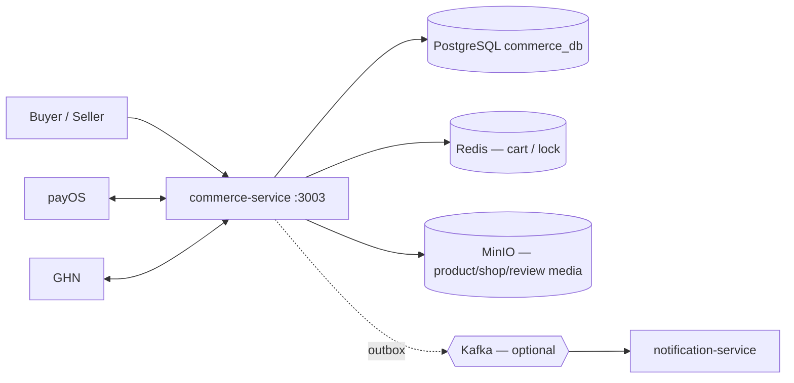

# Commerce Service

Microservice **thương mại điện tử** của 2Hands: shop, sản phẩm, giỏ hàng, checkout, đơn hàng, thanh toán (payOS), vận chuyển (GHN), đánh giá và outbox sự kiện commerce.

**Spring Boot 3.5** · **Java 21** · **PostgreSQL** + **Redis** · Clean Architecture · **không dùng MongoDB** trong service này.

---

## Vai trò trong hệ thống



| Thành phần | Vai trò |
|-----------|---------|
| **PostgreSQL** | Products, shops, cart, orders, payments, shipments, reviews, outbox |
| **Redis** | Giỏ hàng, distributed lock tồn kho (checkout) |
| **MinIO** | Buckets `2hands-commerce-product`, `-shop`, `-review` |
| **payOS / GHN** | Tích hợp tắt mặc định; mock fallback khi dev |

**Ranh giới:** Chỉ lưu `user_id` / `buyer_id` / `seller_id` (UUID). Không truy cập DB Auth/Social/Admin.

---

## API (đã triển khai)

Base URL local: **`http://localhost:3003`**

Prefix: **`/commerce/api/v1/...`** · Lỗi: **`COMMERCE-*`** · Envelope chuẩn 2Hands.

### Buyer — khám phá & mua

| Nhóm | Base path | Ví dụ |
|------|-----------|--------|
| Catalog | `/products`, `/categories/{id}/products`, `/shops/{shopId}/products` | Tìm kiếm, chi tiết SP (một số GET **public**) |
| Cart | `/cart` | Tạo/xem giỏ, thêm/sửa/xóa item |
| Checkout | `/checkout` | Checkout từ giỏ |
| Orders | `/orders` | Danh sách, chi tiết, hủy, xác nhận nhận hàng |
| Payments | `/payments` | Tạo thanh toán, payOS checkout URL, trạng thái |
| Addresses | `/addresses` | CRUD địa chỉ giao hàng |
| Shipping | `/shipping` | Tính phí ship |
| Shipments | `/shipments` | Theo dõi vận đơn |
| Reviews | `/reviews` | Tạo/sửa đánh giá sản phẩm |

### Seller

| Base path | Mô tả |
|-----------|--------|
| `/seller/shop` | Hồ sơ shop, vacation mode |
| `/seller/products` | CRUD sản phẩm, publish/pause/archive |
| `/seller/orders` | Đơn của shop |
| `/seller/order-items` | Xử lý từng dòng đơn (fulfillment) |
| `/seller/shipments` | Tạo/quản lý vận đơn |
| `/seller/reviews` | Phản hồi review |

### Admin & support (commerce-side)

| Base path | Mô tả |
|-----------|--------|
| `/admin/products`, `/admin/shops`, `/admin/reviews` | Moderation hỗ trợ |
| `/admin/support/orders`, `payments`, `shipments`, `webhook-logs` | Tra cứu vận hành |

### Webhook (public, verify signature)

| Method | Path |
|--------|------|
| `POST` | `/commerce/api/v1/payments/webhooks/**` (payOS) |
| `POST` | `/commerce/api/v1/shipments/webhooks/**` (GHN) |

> Contract đầy đủ: [`docs/api_fe_behavior/commerce_api_fe_behavior/`](../../docs/api_fe_behavior/commerce_api_fe_behavior/) (~62 tài liệu)

---

## Nghiệp vụ cốt lõi

- **Tồn kho:** Checkout `reserve` (`stock_quantity ↓`, `reserved_quantity ↑`); thanh toán thành công / hủy có luồng release tương ứng.
- **Snapshot:** `order_items` và `shipping_address_snapshots` — không phụ thuộc bản ghi mutable sau checkout.
- **Thanh toán payOS:** Trạng thái `PAID` chỉ từ **webhook hợp lệ**, không từ redirect URL.
- **Shipment:** Tạo khi order `PROCESSING` và payment đủ điều kiện; GHN webhook cập nhật trạng thái.
- **Soft delete / archive:** Product `ARCHIVED` / `REMOVED`; không hard delete mặc định.

---

## Outbox & background jobs

### Outbox (`COMMERCE_OUTBOX_PUBLISH_ENABLED`)

Ví dụ event → topic (xem `CommerceOutboxTopicResolver`):

| Event type | Topic |
|------------|--------|
| `COMMERCE_ORDER_CREATED` | `commerce.order.created` |
| `COMMERCE_PAYMENT_PAID` | `commerce.payment.paid` |
| `COMMERCE_SHIPMENT_STATUS_CHANGED` | `commerce.shipment.status_changed` |
| `COMMERCE_PRODUCT_PUBLISHED` | `commerce.product.published` |
| `COMMERCE_REVIEW_CREATED` | `commerce.review.created` |
| … | (30+ loại trong resolver) |

### Scheduled jobs (tắt mặc định)

| Job | Env |
|-----|-----|
| Hủy đơn chưa thanh toán | `COMMERCE_AUTO_CANCEL_UNPAID_ORDER_ENABLED` |
| Auto-complete đơn đã giao | `COMMERCE_AUTO_COMPLETE_DELIVERED_ORDER_ENABLED` |
| Đồng bộ trạng thái item giỏ | `COMMERCE_SYNC_CART_ITEM_STATUS_ENABLED` |
| Retry outbox | `COMMERCE_OUTBOX_RETRY_ENABLED` |

---

## Chạy local

### 1. Hạ tầng

```bash
cd Infrastructure
docker compose up -d postgres-commerce redis minio
```

| Dependency | Mặc định |
|------------|----------|
| PostgreSQL | `localhost:5434` / `commerce_db` |
| Redis | `localhost:6379` |
| MinIO | `localhost:9000` |

### 2. Environment

```bash
cd Services/commerce-service
cp .env.example .env
```

Biến quan trọng: `DB_URL`, `JWT_ACCESS_SECRET` / `JWT_REFRESH_SECRET` (**cùng auth-service**), `COMMERCE_*_ENABLED` flags, MinIO buckets — xem [`.env.example`](.env.example).

### 3. Chạy

```bash
./gradlew bootRun
```

- **Port:** `3003`
- **Health:** `GET http://localhost:3003/actuator/health`
- **Jackson TZ:** `Asia/Ho_Chi_Minh`

### 4. Dev thuần CRUD (không payOS/GHN thật)

```env
COMMERCE_PAYOS_ENABLED=false
COMMERCE_GHN_ENABLED=false
COMMERCE_PAYOS_MOCK_FALLBACK_ENABLED=true
COMMERCE_GHN_MOCK_FALLBACK_ENABLED=true
COMMERCE_OUTBOX_PUBLISH_ENABLED=false
```

---

## Kiểm thử

```bash
cd Services/commerce-service
./gradlew test
```

Quy tắc implement: `.cursor/rules/commerce/` · Object storage: [`docs/engineering_rules/commerce-object-storage.md`](../../docs/engineering_rules/commerce-object-storage.md)

---

## Cấu trúc mã nguồn

```
src/main/java/com/twohands/commerce_service/
├── application/       # Use cases theo domain (cart, order, payment, …)
├── delivery/http/     # Controllers theo buyer/seller/admin
├── domain/
├── infrastructure/    # JPA, Redis, PayOS, GHN, MinIO, outbox
└── config/ security/ exception/
```

---

## Tài liệu

| Tài liệu | Đường dẫn |
|----------|-----------|
| Business spec | [`docs/business-spec/commerce-service-spec.md`](../../docs/business-spec/commerce-service-spec.md) |
| DB schema | [`docs/database/commerce-schema.md`](../../docs/database/commerce-schema.md) |
| Feature requirements | [`docs/feature_requirements/commerce/`](../../docs/feature_requirements/commerce/) |
| Business flows | [`docs/business_flow/commerce_business_flow/`](../../docs/business_flow/commerce_business_flow/) |
| Monorepo | [`README.md`](../../README.md) |
