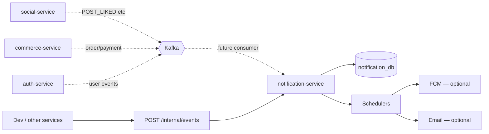

# Notification Service

Microservice **thông báo** của 2Hands (MVP): nhận sự kiện domain, lưu hàng đợi xử lý, gửi in-app / push (FCM) / email — kiến trúc worker + ingest nội bộ cho dev.

**Spring Boot 3.5** · **Java 21** · **PostgreSQL** + **Redis** · Clean Architecture.

> **Trạng thái:** Core pipeline (ingest + DB + workers) đã có; Kafka consumer đa domain và FCM/Email **tắt mặc định** — phù hợp scaffold + test local qua internal API.

---

## Vai trò trong hệ thống



| Thành phần | Vai trò |
|-----------|---------|
| **PostgreSQL** | Notification events, deliveries, user notifications (theo migration) |
| **Redis** | Hỗ trợ cache / rate limit (nếu bật) |
| **Internal ingest** | Nhận event JSON từ service khác hoặc curl dev (`X-Internal-Api-Key`) |
| **Kafka consumer** | Consume domain events từ Auth/Social/Commerce/Admin (`NOTIFICATION_KAFKA_CONSUMER_ENABLED`, tắt mặc định) |
| **Workers** | `ProcessPendingNotificationEvents`, retry event/delivery (cron, tắt mặc định) |

---

## API (đã triển khai)

Base URL local: **`http://localhost:3004`**

> **Xung đột port:** Trùng mặc định với `admin-service`. Dev full stack: `SERVER_PORT=3005` trong `.env` hoặc chỉ chạy một trong hai.

### Health

| Method | Path | Auth |
|--------|------|------|
| `GET` | `/api/v1/notification/health` | Public |
| `GET` | `/actuator/health` | Public |

### Internal ingest (dev / service-to-service)

| Method | Path | Auth |
|--------|------|------|
| `POST` | `/api/v1/notification/internal/events` | Header `X-Internal-Api-Key` |

Bật/tắt: `NOTIFICATION_INTERNAL_INGEST_ENABLED` (mặc định `true`).

**Ví dụ:**

```bash
curl -X POST http://localhost:3004/api/v1/notification/internal/events \
  -H "Content-Type: application/json" \
  -H "X-Internal-Api-Key: dev-internal-key" \
  -d '{
    "sourceEventId": "11111111-1111-1111-1111-111111111111",
    "eventType": "POST_LIKED",
    "sourceService": "SOCIAL",
    "payload": "{}"
  }'
```

JWT (`JWT_ACCESS_SECRET`) dùng cho API user-facing khi được bổ sung; hiện MVP tập trung ingest + workers.

---

## Workers (scheduled)

| Worker | Env bật | Mô tả |
|--------|-----------|--------|
| Process pending events | `NOTIFICATION_PROCESS_EVENTS_ENABLED` | Xử lý batch event `PENDING` |
| Retry failed events | `NOTIFICATION_RETRY_EVENTS_ENABLED` | Retry event lỗi |
| Retry failed delivery | `NOTIFICATION_RETRY_DELIVERY_ENABLED` | Retry gửi FCM/email |

Cron & batch size: xem `application.yml` / `.env.example`.

### Tích hợp gửi (tắt mặc định)

| Kênh | Env |
|------|-----|
| FCM push | `NOTIFICATION_FCM_ENABLED=false` |
| Email | `NOTIFICATION_EMAIL_ENABLED=false` |

---

## Sự kiện dự kiến tiêu thụ (theo spec hệ thống)

Notification là **consumer trung tâm** cho các event từ Auth, Social, Commerce, Admin — ví dụ:

| Nguồn | Event (ví dụ) | Hành động |
|-------|----------------|-----------|
| Auth | `USER_CREATED`, `EMAIL_VERIFICATION_REQUESTED` | Welcome / OTP email |
| Social | `POST_LIKED`, `COMMENT_CREATED`, `USER_FOLLOWED` | Push in-app |
| Commerce | `COMMERCE_ORDER_CREATED`, `COMMERCE_PAYMENT_PAID` | Thông báo đơn hàng |
| Admin | `SYSTEM_ANNOUNCEMENT_PUBLISHED` | Broadcast |

Luồng Kafka consumer: bật `NOTIFICATION_KAFKA_CONSUMER_ENABLED=true` khi có broker. Dev-only vẫn có thể dùng `POST /internal/events`.

---

## Chạy local

### 1. Hạ tầng

```bash
cd Infrastructure
docker compose up -d postgres-notification redis
```

| Dependency | Mặc định |
|------------|----------|
| PostgreSQL | `localhost:5435` / `notification_db` |
| Redis | `localhost:6379` |

### 2. Environment

```bash
cd Services/notification-service
cp .env.example .env
```

```env
# Tránh xung đột admin-service
SERVER_PORT=3005

DB_URL=jdbc:postgresql://localhost:5435/notification_db
JWT_ACCESS_SECRET=<cùng auth-service>
JWT_REFRESH_SECRET=<cùng auth-service>

NOTIFICATION_INTERNAL_INGEST_ENABLED=true
NOTIFICATION_INTERNAL_API_KEY=dev-internal-key

NOTIFICATION_PROCESS_EVENTS_ENABLED=false
NOTIFICATION_RETRY_EVENTS_ENABLED=false
NOTIFICATION_RETRY_DELIVERY_ENABLED=false
NOTIFICATION_FCM_ENABLED=false
NOTIFICATION_EMAIL_ENABLED=false
```

### 3. Chạy

```bash
./gradlew bootRun
```

- **Health:** `GET http://localhost:3005/api/v1/notification/health` (nếu dùng `SERVER_PORT=3005`)

---

## Kiểm thử

```bash
cd Services/notification-service
./gradlew test
```

Use cases hiện có: `ConsumeDomainEventUseCase`, `StoreNotificationEventUseCase`, `ProcessNotificationEventUseCase`, `ApplyNotificationDeliveryRulesUseCase`, `ApplySkipSelfNotificationUseCase`, `InitializeDefaultNotificationSettingsUseCase`, `MarkNotificationEventCompletedUseCase`, `MarkNotificationEventFailedUseCase`, `EnsureNotificationEventIdempotencyUseCase`, `CreateIdempotentUserNotificationUseCase`, `RecoverStaleProcessingNotificationEventsUseCase`, `IngestNotificationEventUseCase`, `ProcessPendingNotificationEventsUseCase`, `RetryFailedNotificationEventsUseCase`, `RetryFailedNotificationDeliveryUseCase`.

---

## Cấu trúc mã nguồn

```
src/main/java/com/twohands/notification_service/
├── application/consume/    # ConsumeDomainEventUseCase, envelope parser
├── application/ingest/       # Store, Ingest
├── application/idempotency/  # Ensure event/user idempotency, stale recovery
├── application/delivery/     # ApplyNotificationDeliveryRulesUseCase, ApplySkipSelfNotificationUseCase
├── application/settings/     # InitializeDefaultNotificationSettingsUseCase
├── application/handler/      # Event handlers + recipient/skip policies
├── application/worker/       # Process / retry use cases
├── delivery/http/       # Health, InternalEventController
├── domain/
├── infrastructure/
└── config/ security/ exception/
```

---

## Tài liệu

| Tài liệu | Đường dẫn |
|----------|-----------|
| Business spec | [`docs/business-spec/notification-service-spec.md`](../../docs/business-spec/notification-service-spec.md) |
| DB schema | [`docs/database/notification-schema.md`](../../docs/database/notification-schema.md) |
| Feature requirements | [`docs/feature_requirements/notification/`](../../docs/feature_requirements/notification/) |
| Event matrix (hệ thống) | [`docs/architecture/event-driven-architecture.md`](../../docs/architecture/event-driven-architecture.md) |
| Monorepo | [`README.md`](../../README.md) |
