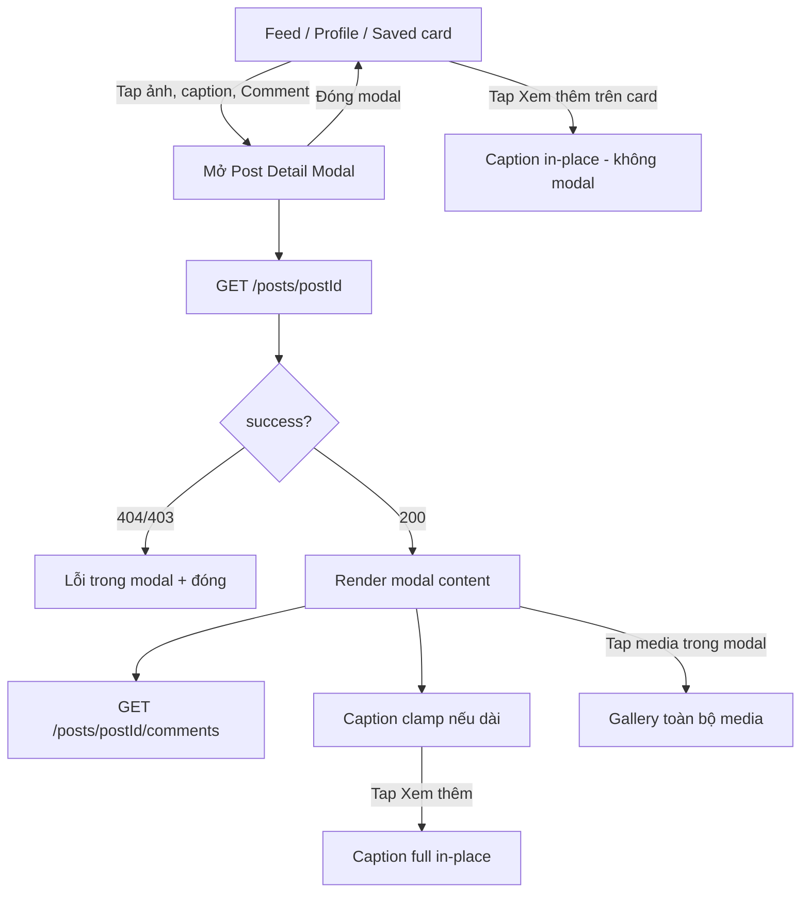

# View Post Detail – API & Behavior

> Tham chiếu FR backend: `docs/feature_requirements/social/FR_ViewPostDetail.md`

## 1. Mục tiêu nghiệp vụ

- Cho phép user đã đăng nhập xem chi tiết một bài viết (caption, media, hashtags, counters, author, trạng thái tương tác của viewer).
- Phục vụ **Post Detail Modal** (overlay trên feed / profile / saved — **không** chuyển sang route/page full-screen mới khi drill-down từ danh sách), deep link, share.
- Drill-down từ feed global, feed following, profile grid, saved posts → mở modal; feed/list phía sau vẫn giữ nguyên (scroll position không mất khi đóng modal).
- FE hiển thị nội dung theo layout **rút gọn mặc định** trong modal và trên post card; mở rộng caption tại chỗ qua **「Xem thêm」** (không cần gọi API bổ sung).

## 2. API Contract

- **Method:** `GET`
- **URL:** `/api/v1/social/posts/{postId}`
- **Auth:** Bắt buộc JWT Bearer token.
- **Headers:**
  - `Authorization: Bearer <access_token>`
  - `Content-Type: application/json` (optional với GET)
- **Path params:**

| Field    | Type   | Required | Mô tả                          |
|----------|--------|----------|--------------------------------|
| `postId` | String | yes      | ID bài viết (MongoDB ObjectId). |

- **Query params:** Không có.
- **Request body:** Không có.

## 3. Response – Success

**HTTP 200 OK**

```json
{
  "code": 200,
  "success": true,
  "message": "Lay chi tiet bai viet thanh cong.",
  "data": {
    "postId": "507f1f77bcf86cd799439011",
    "author": {
      "userId": "d7548df7-8b14-4a35-86cc-3f3e6adcbaf3",
      "displayName": "User A",
      "avatarUrl": "https://cdn.2hands.vn/avatars/user-a.png"
    },
    "caption": "Noi dung bai viet...",
    "media": [
      { "url": "https://cdn.2hands.vn/social/posts/1.jpg", "type": "IMAGE" },
      { "url": "https://cdn.2hands.vn/social/posts/2.jpg", "type": "IMAGE" }
    ],
    "productTags": [
      { "productId": "a1b2c3d4-e5f6-7890-abcd-ef1234567890", "price": 199000 }
    ],
    "visibility": "PUBLIC",
    "status": "ACTIVE",
    "likeCount": 10,
    "replyCount": 2,
    "hashtags": ["thoitrang"],
    "allowComments": true,
    "likedByMe": false,
    "savedByMe": true,
    "isOwner": false,
    "createdAt": "2026-05-21T09:00:00Z",
    "updatedAt": "2026-05-21T09:30:00Z"
  },
  "errors": null,
  "timestamp": "2026-05-21T10:00:00Z"
}
```

**Lưu ý:** API luôn trả **đầy đủ** `caption` và toàn bộ `media[]`. Việc rút gọn hiển thị là **trách nhiệm FE** (xem mục 9).

## 4. Response – Error

| HTTP | Code string  | Mô tả |
|------|----------------|-------|
| 400  | `SOCIAL-400`   | `postId` không phải ObjectId hợp lệ. |
| 401  | `SOCIAL-401`   | Thiếu hoặc JWT không hợp lệ. |
| 403  | `SOCIAL-403`   | Post `FOLLOWERS`, viewer không follow author (`ACCEPTED`). |
| 404  | `SOCIAL-404`   | Post không tồn tại hoặc viewer không được xem (DRAFT người khác, DELETED, HIDDEN moderation, v.v.). |
| 500  | `SOCIAL-500`   | Lỗi hệ thống. |

Ví dụ lỗi 404:

```json
{
  "code": 404,
  "success": false,
  "message": "Khong tim thay bai viet.",
  "data": null,
  "errors": null,
  "timestamp": "2026-05-21T10:00:00Z"
}
```

## 5. Business rules

### 5.1 Visibility & status

| Post status | Visibility   | Viewer                         | Kết quả |
|-------------|--------------|--------------------------------|---------|
| `ACTIVE`    | `PUBLIC`     | User đăng nhập bất kỳ          | 200     |
| `ACTIVE`    | `FOLLOWERS`  | Author hoặc follower `ACCEPTED`| 200     |
| `ACTIVE`    | `FOLLOWERS`  | Không follow                   | 403     |
| `DRAFT`     | (bất kỳ)     | Author                         | 200     |
| `DRAFT`     | (bất kỳ)     | Khác author                    | 404     |
| `DELETED`   | (bất kỳ)     | Viewer thường                  | 404     |
| `ACTIVE` + moderation `HIDDEN` | — | Không phải author | 404     |

### 5.2 Engagement flags

- `likedByMe`: có bản ghi `post_likes(post_id, viewer_id)`.
- `savedByMe`: có bản ghi `post_saves(post_id, viewer_id)`.
- `isOwner`: `author.userId` trùng `viewer_id` từ JWT.

### 5.3 Khác

- `productTags`: chỉ trả tags đã lưu trên post; không gọi Commerce DB trong request read.
- Endpoint read-only; không áp dụng `UserWriteGuard` (user `SUSPENDED` vẫn đọc được nếu policy cho phép).

## 6. Edge cases

- **Deep link post đã xóa / không có quyền:** 404 hoặc 403 → hiển thị lỗi **trong modal** (hoặc toast + đóng modal) + nút đóng/quay lại; không cache payload cũ.
- **Deep link / share URL hợp lệ:** mở **Post Detail Modal** trên shell hiện tại (vd. feed); có thể cập nhật URL query/hash (`?postId=...`) để share — **không** bắt buộc route page riêng `/social/posts/:id`.
- **Post DRAFT của chính mình:** `status = DRAFT`, hiển thị badge nháp; ẩn hoặc disable action công khai (like/comment tùy product).
- **`media` rỗng:** chỉ render caption + metadata; không hiện vùng gallery.
- **`caption` null hoặc rỗng:** ẩn block text; không hiện 「Xem thêm」.
- **Một ảnh / video:** layout đơn; không overlay `+N`.
- **Refresh sau like/save:** có thể optimistic update local hoặc refetch detail; `likedByMe` / `savedByMe` / counters phải đồng bộ với API tương ứng.
- **Author projection thiếu:** `displayName` fallback `"User"`, `avatarUrl` có thể `null` → placeholder avatar.

## 7. Phụ thuộc dữ liệu

- **MongoDB `posts`:** đọc theo `_id`.
- **PostgreSQL `user_projections`:** author summary.
- **PostgreSQL `post_likes`, `post_saves`:** flags viewer.
- **PostgreSQL `follows`:** khi `visibility = FOLLOWERS`.

## 8. Ghi chú FE integration (API layer)

- Parse payload tại `data`; kiểm tra `success` trước khi render.
- Field JSON **camelCase** (`postId`, `likedByMe`, `savedByMe`, `isOwner`, `productTags`).
- Unwrap envelope tại API client; component không parse wrapper.
- Query key gợi ý: `postKeys.detail(postId)`.
- Sau khi edit/delete post: invalidate `postKeys.detail(postId)` và feed/profile liên quan.
- Binh luận: gọi riêng `GET /api/v1/social/posts/{postId}/comments` sau khi modal mở và post detail 200 (`ListPostComments-api-and-behavior.md`).
- State modal: `postId` active + optional URL query; đóng modal clear `postId` / query.
- Tham chiếu: `docs/engineering_rules/frontend-api-integration.md`.
- Hành vi mở modal & entry points: **mục 9.1**.

---

## 9. Hành vi hiển thị UI (bắt buộc)

> Áp dụng cho **Post Detail Modal** và **post card** (feed, profile, saved). Backend **không** trả field `isTruncated`; FE tự tính từ `caption` và `media.length`.

### 9.1 Mở Post Detail Modal — khi nào & không khi nào

**Presentation (bắt buộc):** Post detail hiển thị dạng **modal / dialog overlay** (desktop: dialog giữa hoặc split post + comments; mobile: full-viewport overlay hoặc bottom sheet — vẫn là **layer trên** màn list, **không** unmount feed). Đóng modal (ESC, nút X, click backdrop nếu product cho phép) → quay lại list, **không** `navigate` sang page mới.

**Nguồn mở modal:** feed global, feed following, profile posts grid, saved posts, deep link / share.

#### 9.1.1 Trên post card (feed / profile / saved) — **MỞ modal**

| Vùng tương tác | Hành vi |
|----------------|---------|
| **Ảnh / video** (preview media trên card) | Mở **Post Detail Modal** → `GET /posts/{postId}` + load comments |
| **Phần chữ / vùng caption** (vùng nội dung post, **không** gồm link/hashtag riêng lẻ) | Mở **Post Detail Modal** |
| **Số comment** (`replyCount`) hoặc nút/label **「Comment」** / icon comment | Mở **Post Detail Modal**, scroll/focus khu vực bình luận; gọi `GET .../comments` sau khi post detail 200 |

#### 9.1.2 Trên post card — **KHÔNG** mở modal

| Vùng tương tác | Hành vi |
|----------------|---------|
| **「Xem thêm」 / 「Thu gọn」** trên caption | Expand/collapse caption **in-place** trên card (mục 9.3) |
| **Hashtag / link** trong caption (phần tử link riêng) | Điều hướng theo đích link (hashtag search, URL ngoài) — **không** mở post modal |
| **Like / Unlike** | Toggle like tại chỗ (API like riêng) |
| **Share** | Flow share (không mở post modal) |
| **Save** (nếu có trên card) | Toggle save tại chỗ |
| **Avatar / tên tác giả** (header card) | Điều hướng profile tác giả — **không** mở post modal |
| **Menu `...`** (more) | Menu hành động post — **không** mở modal trừ khi user chọn "Xem chi tiết" (nếu có) |

#### 9.1.3 Sau khi modal mở

- Gọi `GET /api/v1/social/posts/{postId}`; thành công → render nội dung trong modal.
- Gọi `GET /api/v1/social/posts/{postId}/comments` (top-level) — xem `ListPostComments-api-and-behavior.md`.
- Entry từ **Comment** / **replyCount**: cùng modal; ưu tiên scroll/focus ô nhập comment (nếu `allowComments`).

### 9.2 Rút gọn caption & 「Xem thêm」 (card + trong modal)

| Thành phần | Rút gọn mặc định? | Mở rộng khi nào |
|------------|-------------------|-----------------|
| **Caption (text)** | Có, nếu vượt ngưỡng (mục 9.3) | Bấm **「Xem thêm」** → full text **in-place**; có thể **「Thu gọn」** |
| **Hashtags, author, counters, product tags** | Không rút gọn | — |
| **Media preview trên card** | Grid preview (mục 9.4) | Tap → **mở Post Detail Modal** (không gallery độc lập trên feed) |
| **Media trong modal** | Grid preview tương tự | Tap ảnh / ô `+N` → **gallery / lightbox** toàn bộ `media[]` **trong modal** |

- **Không** gọi lại `GET /posts/{postId}` khi expand caption hoặc mở gallery trong modal.
- **Chỉ** rút gọn **nội dung text** (`caption`). Không cắt `hashtags` hay metadata.

### 9.3 Caption – Text 「Xem thêm」

**Ngưỡng gợi ý (cấu hình FE, có thể điều chỉnh theo design):**

- `CAPTION_MAX_LINES_COLLAPSED = 3` (hoặc tương đương ~125 ký tự nếu đo theo width một dòng).
- Coi caption **ngắn** nếu sau khi render ≤ `CAPTION_MAX_LINES_COLLAPSED` dòng (không tràn).

**Hành vi:**

| Trường hợp | Hiển thị mặc định | Nút 「Xem thêm」 |
|------------|-------------------|------------------|
| Caption ngắn (≤ ngưỡng) | **Full text** | **Ẩn** |
| Caption dài (> ngưỡng) | **Rút gọn** (ellipsis / clamp N dòng) | **Hiện** |
| User bấm 「Xem thêm」 | Full text, giữ nguyên layout post | Đổi thành 「Thu gọn」 (optional) |
| User bấm 「Thu gọn」 | Quay lại trạng thái rút gọn | — |

**Quy tắc bổ sung:**

- Link/hashtag trong caption: vẫn clickable; bấm link/hashtag **không** mở Post Detail Modal (mục 9.1.2).
- Bấm **「Xem thêm」** chỉ expand **in-place** — **không** mở modal.
- Trong **Post Detail Modal**, lần đầu mở vẫn clamp caption nếu dài (mặc định **chưa** full text).

### 9.4 Media – Grid & overlay `+N` (giống Facebook)

API trả `media[]` đầy đủ; FE chỉ **hiển thị preview** một phần trên card và trong modal (trước khi mở gallery).

**Hằng số gợi ý:**

- `MEDIA_MAX_VISIBLE_IN_PREVIEW = 4` (tối đa 4 ô trong lưới preview).
- Layout lưới theo số lượng (tham khảo Facebook):

| `media.length` | Layout preview |
|----------------|----------------|
| 0 | Không render gallery |
| 1 | 1 ảnh full width |
| 2 | 2 cột ngang |
| 3 | 1 lớn trái + 2 nhỏ phải |
| 4 | Lưới 2×2 |
| ≥ 5 | Lưới 2×2, **ô thứ 4** là ảnh thứ 4 + overlay **`+{remaining}`** |

Trong đó: `remaining = media.length - MEDIA_MAX_VISIBLE_IN_PREVIEW`  
Ví dụ 7 ảnh → hiện 4 ô, ô cuối overlay **`+3`**.

**Hành vi tương tác:**

| Ngữ cảnh | Tap ảnh / video / ô `+N` |
|----------|---------------------------|
| **Post card** (feed, profile, saved) | Mở **Post Detail Modal** (mục 9.1.1) — **không** mở gallery trước |
| **Trong Post Detail Modal** | Mở **gallery / lightbox / carousel** với **toàn bộ** `media[]`, index từ ảnh được tap |
| Video (`type !== "IMAGE"`) trong modal | Icon play; player fullscreen trong gallery |

- **Không** tự động mở gallery khi modal vừa mở; chỉ khi user tap media **bên trong** modal.

### 9.5 Luồng màn hình (tóm tắt)



### 9.6 Checklist QA cho FE

- [ ] Tap ảnh/video trên feed → modal mở, feed vẫn ở phía sau; đóng modal không mất scroll feed.
- [ ] Tap vùng caption (không phải link) → modal mở.
- [ ] Tap replyCount / Comment → modal mở + focus comment.
- [ ] Tap Like / Share / hashtag / link → **không** mở modal.
- [ ] Tap 「Xem thêm」 trên card → expand in-place, **không** mở modal.
- [ ] Caption 2 dòng: không có 「Xem thêm」.
- [ ] Caption 10 dòng: mặc định 3 dòng + 「Xem thêm」; bấm mở hết không gọi API.
- [ ] Trong modal: tap ảnh → gallery đủ `media.length`.
- [ ] 6 ảnh preview: grid 4 ô, ô cuối `+2`.
- [ ] Post không caption: không crash, không nút thừa.
- [ ] 403/404 từ API: không hiển thị partial content từ cache.

## 10. Liên quan

| Tài liệu | Mục đích |
|----------|----------|
| `docs/feature_requirements/social/FR_ViewPostDetail.md` | FR backend |
| `FR_ListPostComments` / `ListPostComments-api-and-behavior.md` | Binh luận |
| `FR_LikeUnlikePost`, `FR_SaveUnsavePost` | Tương tác |
| `ViewGlobalFeed-api-and-behavior.md`, `ViewFollowingFeed-api-and-behavior.md` | Nguồn drill-down |
| `ViewUserPosts-api-and-behavior.md` | Grid profile → detail |
