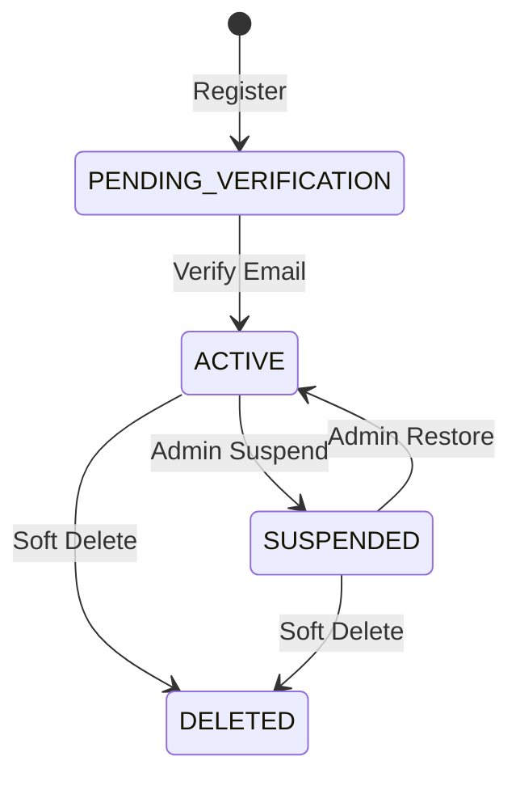
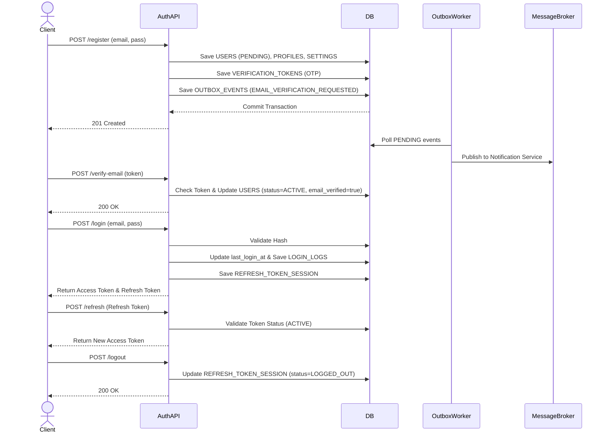

# Authentication Lifecycle Flow

## 1. Overview
Đây là luồng cốt lõi nhất của Auth Service, quản lý toàn bộ vòng đời của một người dùng từ khi đăng ký, xác thực, đăng nhập, duy trì phiên làm việc cho đến khi đăng xuất.

## 2. State Machine (User Status)

## 3. Business Flow Diagram

## 4. Entity Impact
- `USERS`: Quản lý trạng thái cốt lõi (`status`, `last_login_at`).
- `VERIFICATION_TOKENS`: Lưu mã xác thực thời hạn ngắn.
- `REFRESH_TOKEN_SESSION`: Lưu trạng thái phiên đăng nhập.
- `LOGIN_LOGS`: Tracking Audit.
- `OUTBOX_EVENTS`: Đảm bảo đồng bộ Event.

## 5. Event Publishing
- `USER_CREATED`: Phát khi tạo user thành công.
- `EMAIL_VERIFICATION_REQUESTED`: Yêu cầu Notification Service gửi email.