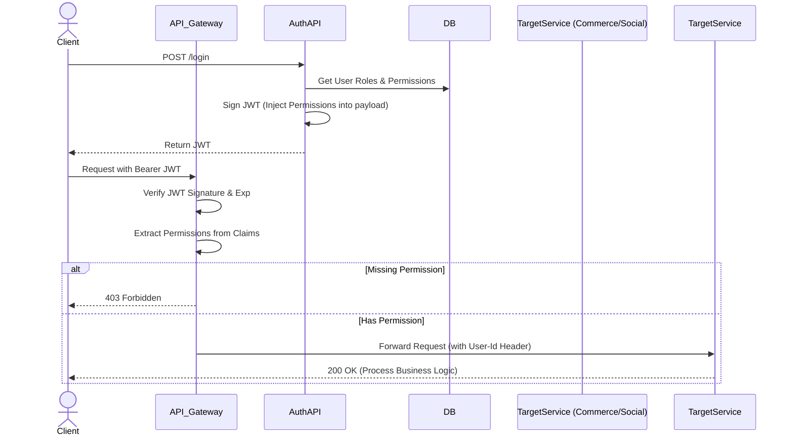

# Role & Permission Authorization Flow

## 1. Overview
Cơ chế kiểm soát truy cập (RBAC) cho hệ thống Microservices. Đảm bảo quyền hạn được kiểm tra tập trung, nhanh chóng tại API Gateway hoặc qua Interceptor nội bộ mà không tạo áp lực lên Database.

## 2. Business Flow Diagram

## 3. JWT Claim Design
- Thông tin phân quyền (Permission codes) được đính kèm (embedded) trực tiếp vào Payload của Access Token.
- Việc này giúp hệ thống xác thực Stateless: API Gateway chỉ cần parse JWT là biết user có quyền `CREATE_PRODUCT` hay `BAN_USER` không, không cần gọi lại DB của Auth Service.
- Giới hạn: Khi Admin đổi quyền của User, User phải đăng nhập lại (hoặc gọi refresh token) để JWT mới nhận được claim mới.