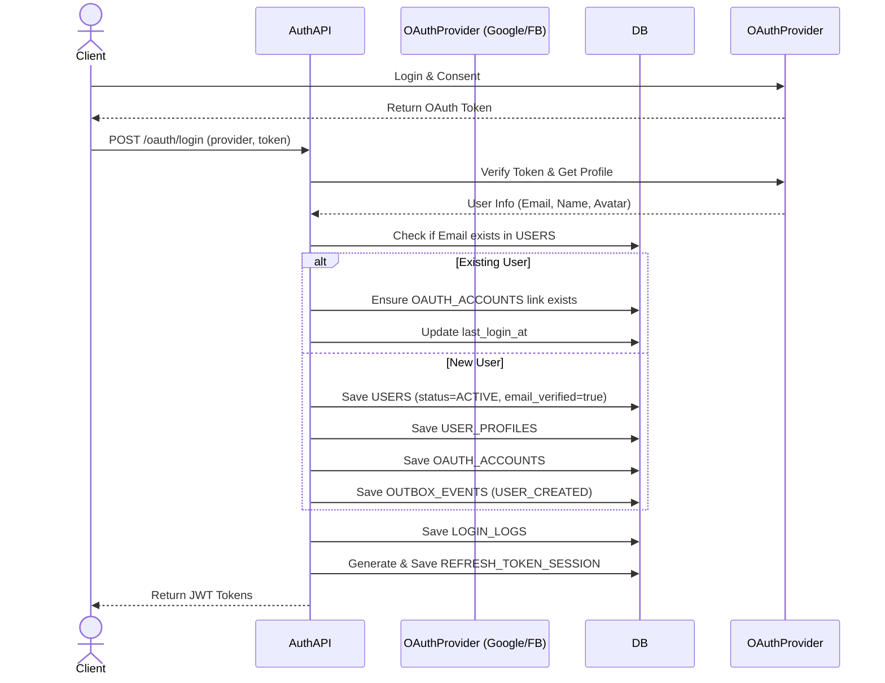

# OAuth Authentication Flow

## 1. Overview
Quy trình đăng nhập/đăng ký liền mạch thông qua Google, Facebook. Đảm bảo ánh xạ (mapping) chính xác dữ liệu từ Provider vào hệ thống 2Hands.

## 2. Business Flow Diagram

## 3. Business Linking
- Bảng `OAUTH_ACCOUNTS` cho phép 1 user (`user_id`) có thể map với nhiều provider khác nhau (Vd: Cùng 1 email đăng nhập bằng cả Google và Facebook).
- Ưu tiên sử dụng **Email** làm khóa định danh đồng nhất.
- Tài khoản tạo qua OAuth được bypass trạng thái `PENDING_VERIFICATION` và chuyển thẳng sang `ACTIVE`.