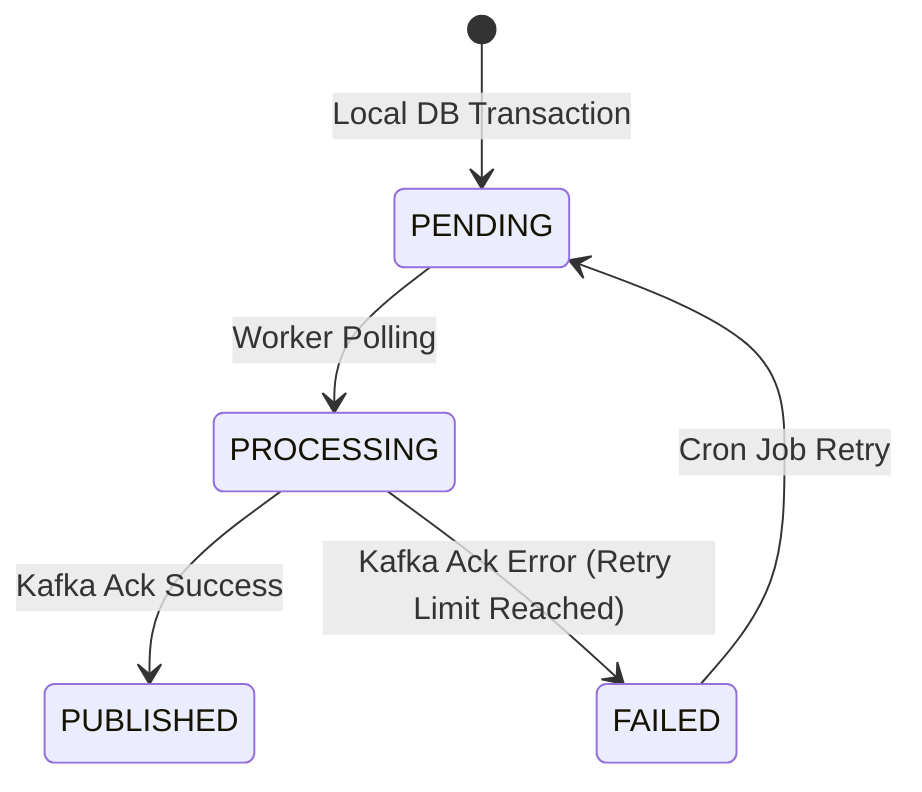
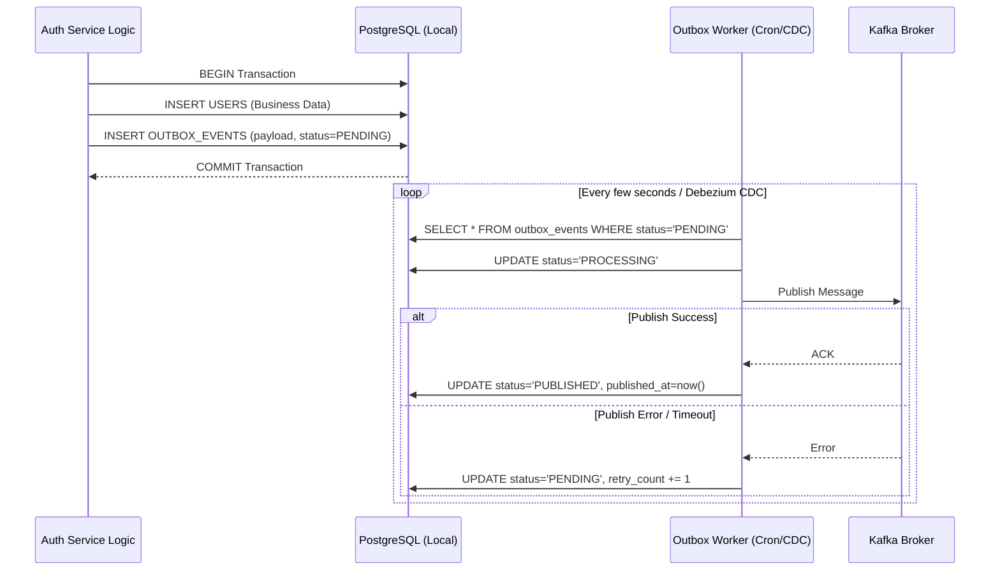

# Event Publishing & Outbox Flow

## 1. Overview
Flow quan trọng nhất để đảm bảo tính toàn vẹn dữ liệu trong hệ thống Microservices phân tán sử dụng Kafka. Xử lý triệt để lỗi "Dual-Write" (Vừa ghi DB vừa đẩy Kafka).

## 2. Transactional Outbox State Machine

## 3. Business Flow Diagram

## 4. Tác động của Flow
- Đảm bảo **At-least-once delivery** (Event chắc chắn sẽ được gửi đi, dù có thể gửi trùng). Các Consumer (Social, Notification) phải code logic theo hướng **Idempotent** (Xử lý trùng event không gây lỗi).
- Bảng `OUTBOX_EVENTS` đóng vai trò như một bộ đệm tin cậy. Nếu Kafka chết, dữ liệu vẫn an toàn nằm trong DB. Khi Kafka sống lại, Worker sẽ tiếp tục bơm dữ liệu đi.