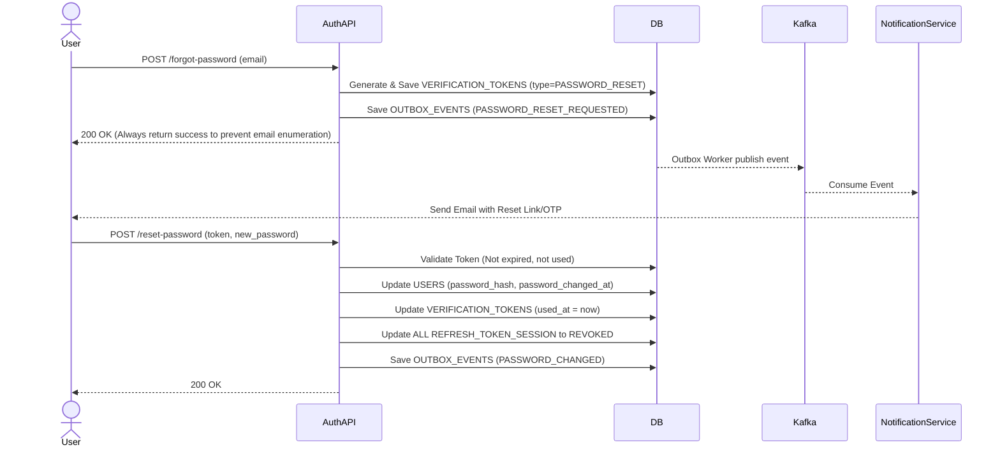

# Password Recovery Flow

## 1. Overview
Quy trình khôi phục mật khẩu bảo mật cao. Kết nối chặt chẽ giữa Auth Service, Notification Service và Session Management.

## 2. Business Flow Diagram

## 3. Entity Impact & Integration
- `VERIFICATION_TOKENS`: Lưu trữ token reset.
- `USERS`: Cập nhật `password_changed_at`. Cột này rất quan trọng để Gateway đối chiếu xem Access Token được cấp trước hay sau khi đổi mật khẩu (nếu cấp trước -> Reject).
- `REFRESH_TOKEN_SESSION`: Buộc vô hiệu hóa toàn bộ (`REVOKED`).
- Liên kết hệ thống: Bắn event để **Notification Service** thông báo cho user "Mật khẩu của bạn vừa bị đổi, nếu không phải bạn hãy liên hệ admin".