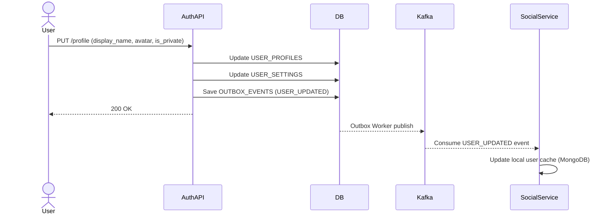

# User Profile & Privacy Flow

## 1. Overview
Quản lý thông tin hiển thị của người dùng và đảm bảo tính nhất quán dữ liệu (Eventual Consistency) với các service khác như Social Service.

## 2. Business Flow Diagram

## 3. Eventual Consistency & Privacy
- **Profile Ownership:** Auth Service là Nguồn sự thật (Source of Truth) cho thông tin Profile.
- **Data Sync:** Social Service không gọi trực tiếp AuthAPI mỗi khi load Feed. Nó nhận event `USER_UPDATED` để tự đồng bộ `display_name` và `avatar_url` trong MongoDB cục bộ.
- **Privacy Visibility:** Trường `is_private` trong `USER_PROFILES` sẽ quyết định xem các API Get Profile public có trả về thông tin chi tiết (bio, social_links) hay không. Cờ này cũng được sync sang Social Service để ẩn/hiện bài viết.