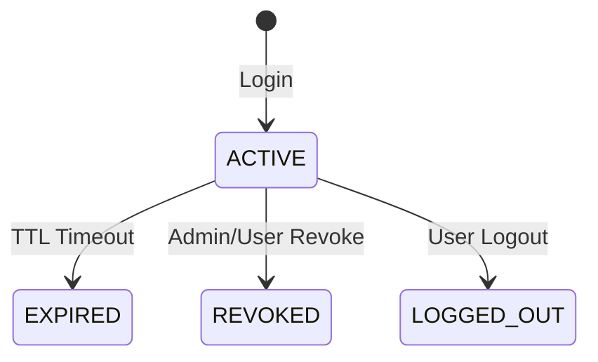
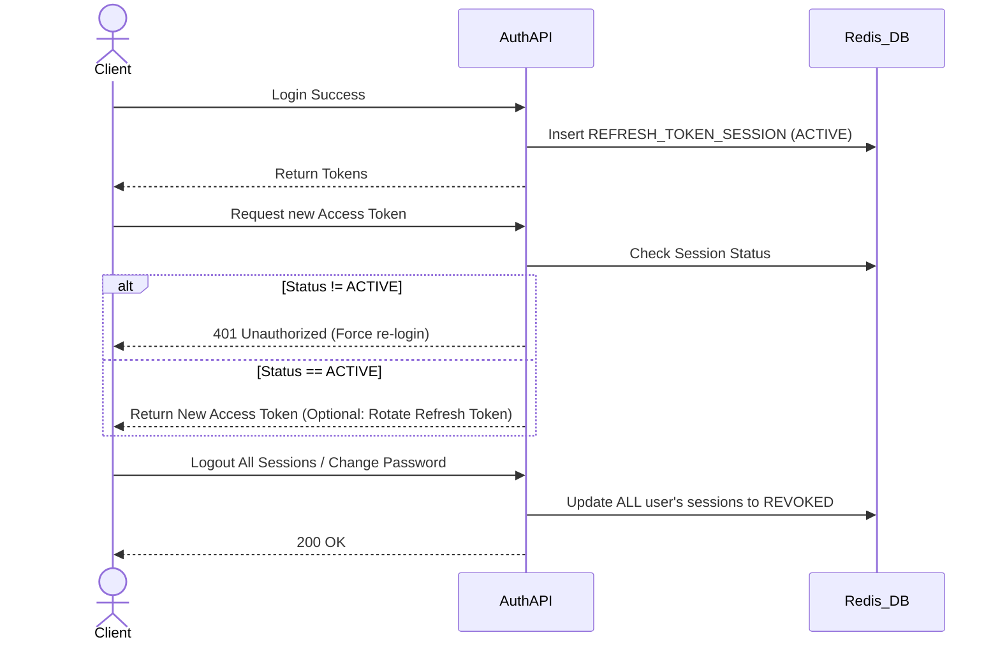

# Session Management Flow

## 1. Overview
Luồng này đảm bảo an toàn cho các phiên làm việc của người dùng, giúp ngăn chặn việc đánh cắp token, cho phép người dùng kiểm soát thiết bị và đảm bảo đăng xuất sạch sẽ.

## 2. Session State Machine

## 3. Business Flow Diagram

## 4. Ngăn chặn các rủi ro bảo mật (Critical Handling)
- **Refresh Token Reuse:** Nếu hệ thống áp dụng cơ chế Rotate Refresh Token (cấp lại RT mới mỗi lần lấy AT), khi phát hiện một RT cũ (đã rotate) bị sử dụng lại, hệ thống sẽ ngay lập tức **REVOKE ALL** session của user đó vì dấu hiệu token đã bị lộ.
- **Revoke sai session:** Mọi thao tác Revoke/Logout phải verify `user_id` trong JWT khớp với `user_id` của session bị tác động.
- **Logout sạch (Invalidate):** Khi gọi "Logout All Sessions", mọi Access Token hiện tại (dù chưa hết hạn) cũng cần được chặn thông qua Redis Blacklist tại tầng API Gateway.