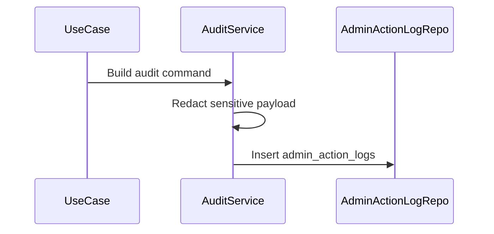

# Admin Audit Logging Flow

Admin Audit Logging records who performed sensitive admin actions, what target was affected, why, and from which request context.

## 1. Scope

In scope:

- Log enforcement actions.
- Log moderation actions.
- Log config changes.
- Log critical support/manual operations.
- Read audit logs with permission.

Out of scope:

- Immutable external audit warehouse.
- SIEM integration.
- Long-term retention automation.

## 2. Actors

- Admin/Moderator.
- Support.
- Super Admin.
- Admin API.

## 3. Audit Log Decision

Always log:

- User enforcement create/revoke/expire.
- Product/review/shop/social moderation.
- System config create/update/toggle.
- Announcement publish/cancel.
- Critical support/manual operation.

Optional log:

- Support read operations, depending privacy policy.

## 4. Critical Payload Rule

Only store `request_payload` and `response_payload` for critical actions:

- config update.
- destructive moderation.
- enforcement action.
- refund/manual operation if introduced later.

Payload must be redacted:

- no token.
- no password.
- no OTP.
- no provider credential.
- no unnecessary PII.

## 5. Logging Flow

## 6. Data Requirements

Required:

- `admin_id`
- `action_type`
- `target_type`
- `target_id`
- `created_at`

Recommended:

- `ip_address`
- `user_agent`
- reason/note inside payload or domain log.

## 7. Read Audit Logs Flow

Steps:

1. Admin requests audit logs.
2. System checks `ADMIN_AUDIT_READ`.
3. System filters by admin, target, action type, date.
4. System returns paginated logs.

## 8. Acceptance Criteria

- Critical admin actions are logged.
- Payloads are redacted.
- Audit read requires permission.
- Logs can be queried by admin/time and target.

