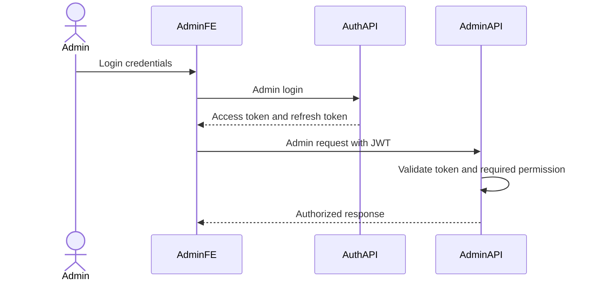
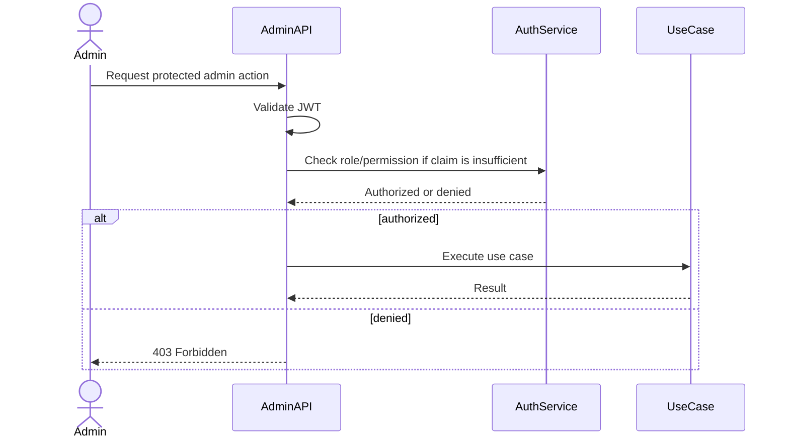

# Admin Auth Authorization Flow

Admin authentication and authorization are owned by Auth Service. Admin Service consumes JWT claims and/or calls Auth authorization APIs to protect admin endpoints. Admin Service must not store admin passwords or sessions.

## 1. Scope

In scope:

- Admin login delegation to Auth Service.
- Refresh/logout/revoke admin session via Auth Service.
- Check admin role and permission.
- Authorize admin APIs before executing use cases.

Out of scope:

- Password storage.
- OAuth provider implementation.
- Role/permission source-of-truth schema.

## 2. Actors

- Admin/Moderator.
- Support.
- Super Admin.
- Auth Service.
- Admin API.

## 3. Roles And Permissions

Example roles:

- `MODERATOR`
- `SUPPORT`
- `SUPER_ADMIN`

Example permissions:

- `USER_SUSPEND`
- `USER_RESTRICT`
- `PRODUCT_REMOVE`
- `REVIEW_HIDE`
- `SHOP_SUSPEND`
- `SYSTEM_CONFIG_UPDATE`
- `ADMIN_AUDIT_READ`
- `ORDER_SUPPORT_READ`

## 4. Authentication Flow

Rules:

- Admin Service trusts only verified JWT or Auth introspection result.
- Admin id comes from token.
- Admin Service never accepts `admin_id` from request body.
- Admin logout/revoke session is delegated to Auth Service.

## 5. Authorization Flow

## 6. Endpoint Protection Matrix

| Action group | Required permission |
|---|---|
| User enforcement | `USER_SUSPEND` or `USER_RESTRICT` |
| Product moderation | `PRODUCT_REMOVE` |
| Review moderation | `REVIEW_HIDE` |
| Shop moderation | `SHOP_SUSPEND` |
| System config update | `SYSTEM_CONFIG_UPDATE` |
| Announcement publish | `SYSTEM_ANNOUNCEMENT_PUBLISH` |
| Audit log read | `ADMIN_AUDIT_READ` |
| Order/payment/shipment support read | `ORDER_SUPPORT_READ` |

## 7. Audit And Security

- Authorization failures can be logged without sensitive payload.
- Successful critical actions must write `admin_action_logs`.
- Do not log tokens, passwords, refresh tokens, OTPs, or secrets.
- IP address and user agent should be captured for critical action logs.

## 8. Acceptance Criteria

- Admin APIs reject unauthenticated requests.
- Admin APIs reject missing permissions.
- Admin id is always derived from JWT/Auth.
- Admin Service does not own credentials or sessions.

