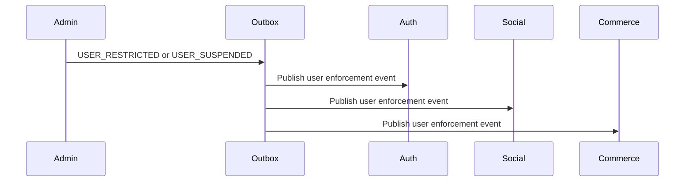

# Cross Service Integration Flow

Admin Service coordinates moderation and enforcement across services while respecting service ownership boundaries.

## 1. Scope

In scope:

- Integration with Auth for user status/session actions.
- Integration with Social for user restriction and content moderation.
- Integration with Commerce for product/review/shop moderation.
- Integration with Notification for announcements/enforcement notices.
- Event publishing through outbox.

Out of scope:

- Direct DB access to other services.
- Consumer implementation details.

## 2. Integration Principles

- Owner service owns final domain state.
- Admin Service owns decision and audit trail.
- Cross-service commands are sent by internal API or outbox events.
- Events are eventually consistent.
- Consumers must be idempotent.

## 3. Enforcement Integration

Expected effects:

- Auth suspends login/revokes sessions for suspend/ban.
- Social blocks create post/comment/follow for restricted users.
- Commerce blocks review/create product or configured writes for restricted users.

## 4. Commerce Moderation Integration

Events:

- `PRODUCT_REMOVED`
- `PRODUCT_RESTORED`
- `REVIEW_HIDDEN`
- `REVIEW_RESTORED`
- `SHOP_SUSPENDED`
- `SHOP_RESTORED`
- `SHOP_CLOSED`

Commerce owns:

- product status.
- shop status.
- review status.
- cart invalidation.
- checkout blocking.

## 5. Social Moderation Integration

Events:

- `POST_MODERATED`
- `COMMENT_MODERATED`

Social owns:

- post/comment status.
- feed/search/profile visibility.
- counters and notification side effects.

## 6. Synchronous API vs Event

Use synchronous API when:

- Admin must know immediate result.
- Action requires validation from owner service before success response.

Use event when:

- Eventual consistency is acceptable.
- Owner service can idempotently apply state.
- Admin decision is accepted locally first.

## 7. Acceptance Criteria

- Admin Service does not access other service DBs.
- Every cross-service state change has audit log and outbox event.
- Owner service applies final state.
- Consumers can process duplicate events safely.

