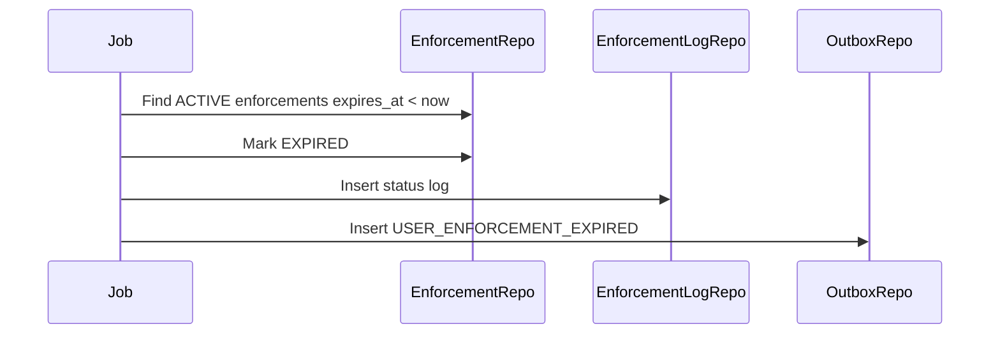

# Enforcement Expiration Flow

Enforcement Expiration is a background job that expires temporary user enforcements after `expires_at`.

## 1. Scope

In scope:

- Find active expired enforcements.
- Set status `EXPIRED`.
- Write enforcement logs.
- Publish expiration events.

Out of scope:

- Manual revoke.
- Appeal workflow.
- Auth session repair.

## 2. Actors

- System scheduler.
- Admin Service.
- Auth/Social/Commerce consumers.
- Outbox Worker.

## 3. Job Flow



## 4. Selection Criteria

```text
status = ACTIVE
expires_at IS NOT NULL
expires_at < now
```

## 5. Business Rules

- Permanent enforcements have `expires_at = null` and never auto-expire.
- Job must be idempotent.
- Already revoked enforcement must not be expired.
- Expiration should publish event so services can remove restrictions.
- If Auth/Social/Commerce miss event, retry outbox handles publishing.

## 6. Transaction

Per enforcement or small batch transaction includes:

- update `user_enforcements.status`.
- insert `user_enforcement_logs`.
- insert `outbox_events`.

Use row locking/skip locked for concurrent workers.

## 7. Failure Cases

- Worker crash after DB commit before broker publish: outbox retry handles event.
- Concurrent revoke wins first: expiration job rechecks status and no-ops.

## 8. Acceptance Criteria

- Temporary active enforcements expire after time.
- Revoked enforcements do not expire.
- Expiration writes log and outbox event.
- Job retry is safe.

