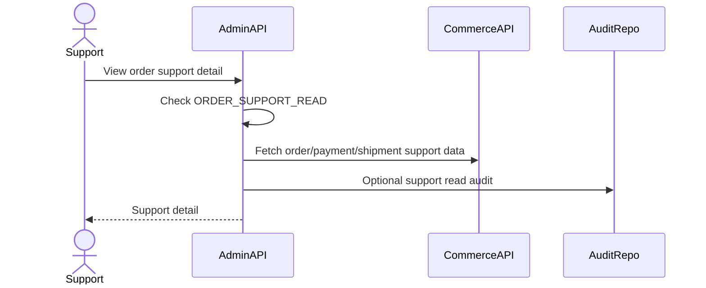

# Order Support Flow

Order Support is MVP-lite read-only support for order, payment, shipment, webhook logs, and histories. Admin Service does not execute real refund/dispute/payout reversal in MVP.

## 1. Scope

In scope:

- View order support detail.
- View payment support detail.
- View shipment support detail.
- View webhook logs.
- View status histories.

Out of scope:

- Real refund execution.
- Dispute handling.
- Payout reversal.
- Direct Commerce DB mutation.

## 2. Actors

- Support admin.
- Super Admin.
- Commerce Service.
- Admin Service.

## 3. Support View Flow

## 4. Data Returned

Order:

- order id, buyer id, status, payment status, amounts.
- order item snapshots.
- order status history.

Payment:

- payment method, status, amount, paid/expired time.
- webhook log summary.

Shipment:

- carrier, tracking, status, provider response summary.
- shipment status history.
- GHN webhook log summary.

## 5. Business Rules

- Support read requires permission.
- Admin Service calls Commerce support APIs or reads future support projections.
- No support write mutation in MVP.
- Sensitive provider payloads should be redacted.

## 6. Failure Cases

- Commerce unavailable -> 503.
- Order/payment/shipment not found -> 404.
- Missing permission -> 403.

## 7. Acceptance Criteria

- Authorized support can view order/payment/shipment support data.
- No mutation happens from support read.
- Sensitive provider data is not exposed unnecessarily.

