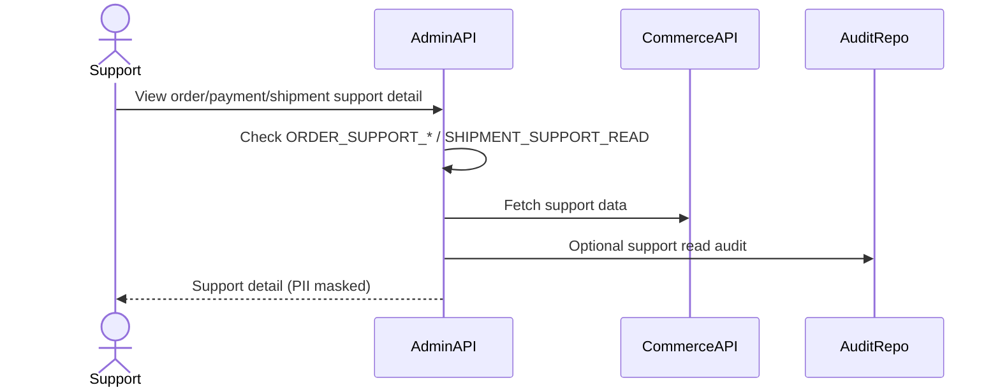
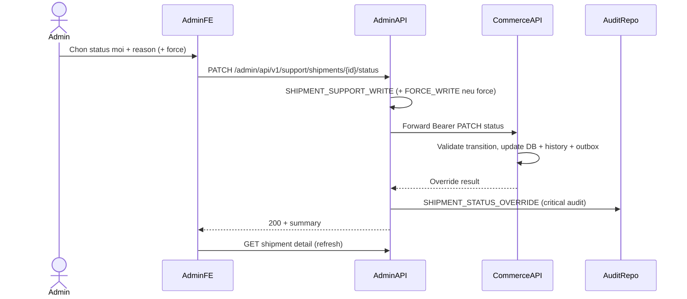

# Order Support Flow

Order Support cho phep admin/support tra cuu order, payment, shipment, webhook logs va lich su trang thai. MVP-lite bat dau read-only; **exception path** ghi de trang thai shipment noi bo da duoc them (khong goi GHN).

## 1. Scope

In scope:

- View order support detail.
- View payment support detail.
- View shipment support detail.
- View webhook logs.
- View status histories.
- **Admin override shipment status** (exception path — Commerce DB only).

Out of scope:

- Real refund execution.
- Dispute handling.
- Payout reversal.
- Dong bo nguoc len GHN / carrier API.
- Bulk override nhieu shipment.

## 2. Actors

- Support admin (`SHIPMENT_SUPPORT_READ`, `SHIPMENT_SUPPORT_WRITE`).
- Super Admin (`SHIPMENT_SUPPORT_FORCE_WRITE` cho `force=true`).
- Commerce Service (owner shipment data + mutation).
- Admin Service (gateway, permission, audit).

## 3. Support Read Flow

## 4. Shipment Status Override Flow (Exception)

Dung khi GHN webhook/sync cham, mat hoac sandbox — **chi** cap nhat Commerce DB.

FR: `docs/feature_requirements/admin/FR_AdminOverrideShipmentStatus.md`  
Chi tiet shipping: `docs/business_flow/commerce_business_flow/shipping-lifecycle-flow.md` (section 10)

### 4.1 APIs

| Layer | Method | URL | Permission |
|-------|--------|-----|------------|
| Admin gateway | PATCH | `/admin/api/v1/support/shipments/{shipmentId}/status` | `SHIPMENT_SUPPORT_WRITE` |
| Commerce owner | PATCH | `/commerce/api/v1/admin/support/shipments/{shipmentId}/status` | `SHIPMENT_SUPPORT_WRITE` |

Request body: `{ "status", "reason", "force" }` — `reason` 10–500 ky tu.

### 4.2 Override rules (tom tat)

- Khong goi GHN API.
- Transition theo `GhnShipmentStatusPolicy` (GHN) hoac `ManualShipmentStatusPolicy` (MANUAL / SELF_DELIVERY).
- `shipment_status_history.raw_status = admin_override`.
- Cap nhat `order_items` + outbox `COMMERCE_SHIPMENT_STATUS_CHANGED`.
- `DELIVERED` **khong** auto-complete order.
- Terminal status (`DELIVERED`, `CANCELLED`, `RETURNED`, `FAILED`) tu choi khi `force=false`.
- `force=true` can `SHIPMENT_SUPPORT_FORCE_WRITE`.
- Cung status hien tai → 200 no-op.

## 5. Data Returned (Read)

Order:

- order id, buyer id, status, payment status, amounts.
- order item snapshots.
- order status history.

Payment:

- payment method, status, amount, paid/expired time.
- webhook log summary.

Shipment:

- carrier, tracking, internal/carrier status, provider summary.
- shipment status history (gom `raw_status: admin_override` neu da override).
- GHN webhook log summary.
- shipping address (masked).

## 6. Permissions

| Permission | Muc dich |
|------------|----------|
| `ORDER_SUPPORT_READ` | Doc order support |
| `PAYMENT_SUPPORT_READ` | Doc payment support |
| `SHIPMENT_SUPPORT_READ` | Doc shipment support |
| `WEBHOOK_LOG_READ` | Doc webhook logs |
| `SHIPMENT_SUPPORT_WRITE` | Ghi de trang thai shipment |
| `SHIPMENT_SUPPORT_FORCE_WRITE` | `force=true` tu terminal status |

Admin can re-login sau khi auth migration seed permissions moi.

## 7. Business Rules

- Support read requires permission tuong ung.
- Admin Service goi Commerce support APIs; khong truy cap Commerce DB truc tiep.
- Override la exception path — khong thay webhook GHN chinh thuc.
- Sensitive provider payloads redacted / masked.
- Admin Service ghi `admin_action_logs` voi `SHIPMENT_STATUS_OVERRIDE` (critical payload).

## 8. Failure Cases

Read:

- Commerce unavailable → 503.
- Not found → 404.
- Missing permission → 403.

Override:

- Validation (`reason`, `status`) → 400.
- Invalid transition / terminal without force → 409 (`ADMIN-409-SHIPMENT-STATUS`).
- Commerce integration disabled → 503.

## 9. FE Integration

- Tab **Chi tiet van chuyen**: `ShipmentSupportDetailTab` + `ShipmentStatusOverrideCard`.
- API: `orderSupportApi.overrideShipmentStatus`.
- Checklist QA: `frontend/src/fe-module/features/auth/admin/orderSupport/CHECKLIST.md`.

## 10. Acceptance Criteria

- Authorized support doc duoc order/payment/shipment support data (masked).
- Admin co `SHIPMENT_SUPPORT_WRITE` ghi de status hop le voi reason + audit.
- History co `raw_status = admin_override` khi status thay doi.
- Khong co HTTP call nao tu Commerce/Admin sang GHN trong luong override.
- Force override chi thanh cong voi `SHIPMENT_SUPPORT_FORCE_WRITE`.

## 11. Related Documents

- `docs/use_cases/admin_use_cases/uc-order-support.md`
- `docs/feature_requirements/admin/FR_AdminOverrideShipmentStatus.md`
- `docs/api_fe_behavior/admin_api_fe_behavior/AdminOverrideShipmentStatus-api-and-behavior.md`
- `docs/api_fe_behavior/admin_api_fe_behavior/ViewShipmentSupportDetail-api-and-behavior.md`
- `docs/business_flow/commerce_business_flow/shipping-lifecycle-flow.md`
