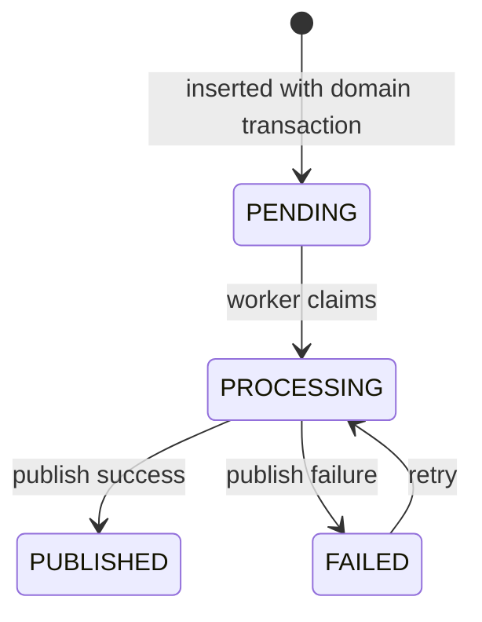
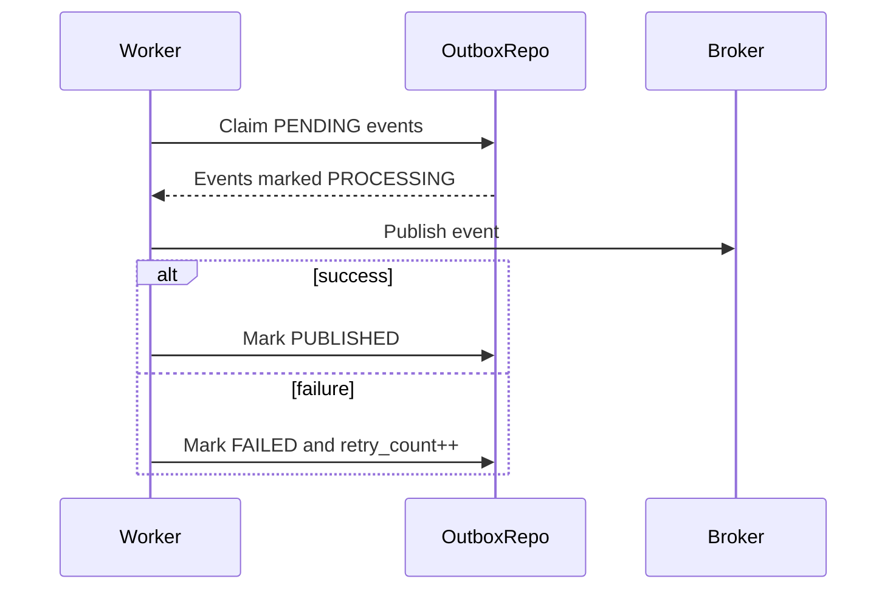

# Outbox Event Flow

Admin Service publishes cross-service events through Outbox Pattern. Local admin decision and outbox insert must commit atomically before a worker publishes to broker.

## 1. Scope

In scope:

- Insert admin outbox events.
- Publish pending events.
- Retry failed events.
- Recover stale processing events.

Out of scope:

- Consumer implementation.
- Broker provisioning.
- Dead-letter UI.

## 2. Actors

- Admin application use cases.
- Outbox worker.
- Message broker.
- Auth/Social/Commerce/Notification consumers.

## 3. Outbox State Machine

## 4. Write Event Flow

Steps:

1. Admin use case begins transaction.
2. Use case writes local decision/audit record.
3. Use case inserts `outbox_events` with `PENDING`.
4. Transaction commits.
5. Worker later publishes event.

## 5. Publish Flow

## 6. Event Catalog

Common events:

- `USER_SUSPENDED`
- `USER_BANNED`
- `USER_RESTRICTED`
- `USER_ENFORCEMENT_REVOKED`
- `USER_ENFORCEMENT_EXPIRED`
- `PRODUCT_REMOVED`
- `REVIEW_HIDDEN`
- `SHOP_SUSPENDED`
- `POST_MODERATED`
- `COMMENT_MODERATED`
- `SYSTEM_CONFIG_UPDATED`
- `SYSTEM_ANNOUNCEMENT_PUBLISHED`

## 7. Topic Naming

Use `{service}.{domain}.{action}`:

- `admin.user.suspended`
- `admin.user.restricted`
- `admin.product.removed`
- `admin.review.hidden`
- `admin.shop.suspended`
- `admin.config.updated`

## 8. Retry Rules

- Failed events remain retryable.
- `retry_count` increments.
- Stale `PROCESSING` events should be reset to `FAILED` or `PENDING` by recovery job.
- Publish is at-least-once; consumers deduplicate.

## 9. Acceptance Criteria

- No cross-service event is published before local transaction commits.
- Pending events eventually publish.
- Failed events retry.
- Duplicate publish is tolerated by consumers.

