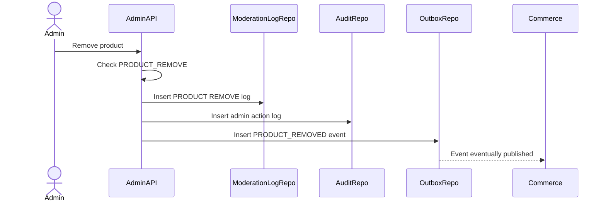

# Product Moderation Flow

Product Moderation handles admin actions on Commerce products. Admin Service records the moderation decision and publishes commands/events; Commerce Service owns product state.

## 1. Scope

In scope:

- Remove product.
- Restore product.
- View product moderation history.
- Log admin action and content moderation log.
- Publish product moderation events.

Out of scope:

- Direct Commerce DB update.
- Refund existing orders.
- Physical product deletion.

## 2. Actors

- Admin/Moderator.
- Commerce Service.
- Outbox Worker.

## 3. Remove Product Flow

Commerce expected effect:

- `products.status = REMOVED`.
- Related cart items become `INVALID_PRODUCT`.
- Product is not visible/searchable/checkoutable.

## 4. Restore Product Flow

Steps:

1. Admin requests restore with reason.
2. Admin Service checks permission.
3. Admin Service logs `RESTORE`.
4. Admin Service publishes `PRODUCT_RESTORED`.
5. Commerce validates product readiness and decides final status.

Rule:

- Restore must not bypass Commerce product readiness rules.

## 5. History Flow

- Query `content_moderation_logs` by `target_type = PRODUCT` and `target_id`.
- Sort by `created_at DESC`.
- Include admin id, action, reason, note.

## 6. Transaction And Audit

Write transaction includes:

- `content_moderation_logs`.
- `admin_action_logs`.
- `outbox_events`.

Critical payload logging may include target product id and reason, but not unrelated data.

## 7. Acceptance Criteria

- Product remove requires permission.
- Moderation log and audit log are created.
- Product event is published through outbox.
- Admin Service does not mutate Commerce DB directly.

