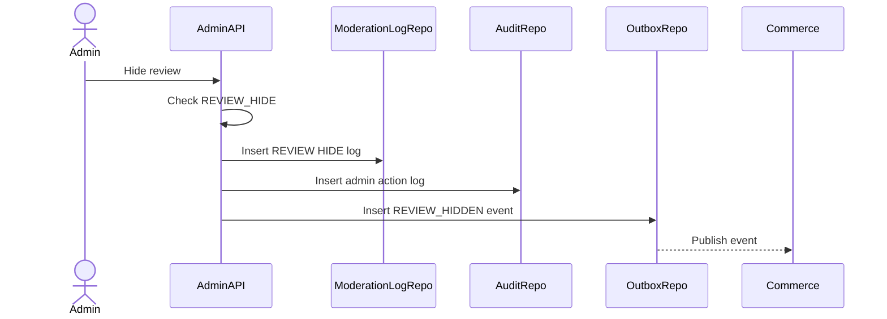

# Review Moderation Flow

Review Moderation handles admin actions on Commerce reviews. Admin Service records moderation decisions; Commerce Service owns review state and rating recalculation.

## 1. Scope

In scope:

- Hide review.
- Restore review.
- Soft remove review.
- View moderation history.
- Publish review moderation events.

Out of scope:

- Editing buyer rating/comment.
- Physical delete.
- Seller reply management.

## 2. Actors

- Admin/Moderator.
- Commerce Service.
- Outbox Worker.

## 3. Review State Impact

| Admin action | Expected Commerce effect |
|---|---|
| `HIDE` | `reviews.status = HIDDEN`, exclude public display |
| `RESTORE` | `reviews.status = VISIBLE` if allowed |
| `REMOVE` | Soft delete/status action according Commerce policy |

## 4. Hide Review Flow

## 5. Restore Review Flow

Steps:

1. Admin requests restore review.
2. System checks permission.
3. System logs moderation action.
4. System writes admin action log.
5. System publishes `REVIEW_RESTORED`.
6. Commerce makes review visible and recalculates rating if needed.

## 6. Business Rules

- Hidden review remains in DB.
- Hidden review is not public-visible.
- Admin cannot edit buyer rating/comment.
- Rating summary recalculation is Commerce responsibility.

## 7. Acceptance Criteria

- Review moderation requires permission.
- Moderation and audit logs are written.
- Review event is published via outbox.
- Public visibility changes are applied by Commerce.

