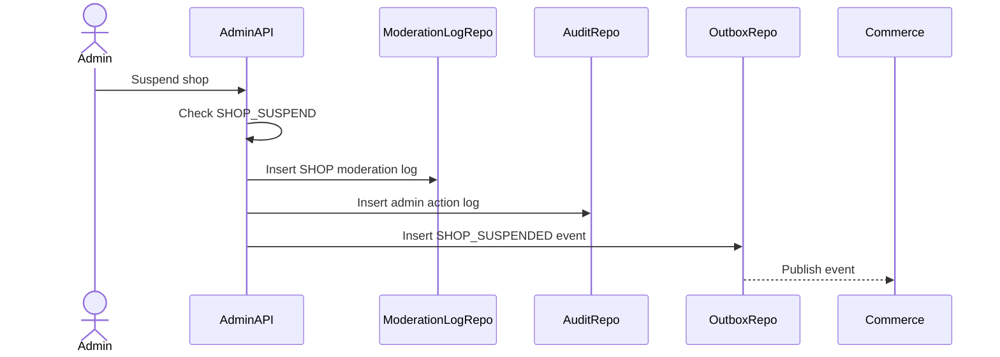

# Shop Moderation Flow

Shop Moderation handles admin decisions for Commerce seller shops. Admin Service stores moderation logs and events; Commerce Service owns shop status and marketplace effects.

## 1. Scope

In scope:

- Suspend shop.
- Reopen shop.
- Close shop.
- Log moderation decision.
- Publish shop moderation events.

Out of scope:

- Seller payout/refund.
- Auto-cancel existing paid orders.
- Direct Commerce DB mutation.

## 2. Actors

- Admin/Moderator.
- Commerce Service.
- Seller.
- Outbox Worker.

## 3. Shop Status Impact

| Action | Expected Commerce state | Marketplace effect |
|---|---|---|
| Suspend | `seller_shops.status = SUSPENDED` | Block publish and checkout |
| Close | `seller_shops.status = CLOSED` | Hide/block new commerce |
| Reopen | `seller_shops.status = ACTIVE` | New commerce can resume if products valid |

## 4. Suspend Shop Flow

## 5. Business Rules

- Reason is required.
- Existing orders remain supportable and should not be mutated by Admin Service directly.
- Reopen shop does not automatically republish removed/archived products.
- Commerce validates final state transition and side effects.

## 6. Transaction And Audit

Write transaction includes:

- moderation log.
- admin action log.
- outbox event.

## 7. Acceptance Criteria

- Shop moderation requires permission.
- Logs and outbox events are written.
- Commerce owns final shop state.
- Existing order snapshots remain unchanged.

