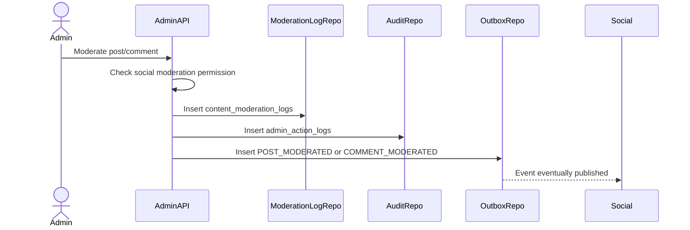

# Social Content Moderation Flow

Social Content Moderation handles admin decisions for Social Service posts and comments. Admin Service records decisions and publishes/calls moderation commands; Social Service owns content state and feed visibility.

## 1. Scope

In scope:

- Hide/remove/restore post.
- Hide/remove/restore comment.
- Log moderation action.
- Publish social moderation events.

Out of scope:

- Editing post/comment content.
- Direct Social DB update.
- Feed recomputation internals.

## 2. Actors

- Admin/Moderator.
- Social Service.
- Outbox Worker.

## 3. Target Types

- `POST`
- `COMMENT`

Actions:

- `HIDE`
- `REMOVE`
- `RESTORE`

## 4. Moderation Flow

## 5. Expected Social Effects

Post hide/remove:

- Post no longer appears in feed/search/profile according Social policy.
- Existing audit/history remains.

Comment hide/remove:

- Comment no longer public-visible.
- Reply/thread counters may be recalculated by Social.

Restore:

- Social validates target can be restored.
- Restore must not bypass author/account/content policy.

## 6. Business Rules

- Admin action requires permission.
- Reason is required.
- Admin Service must not access Social DB.
- Social Service is responsible for final content state transition.

## 7. Acceptance Criteria

- Social content moderation writes moderation log.
- Outbox event is created.
- Social Service receives enough payload to apply action.
- Admin Service remains service-boundary compliant.

