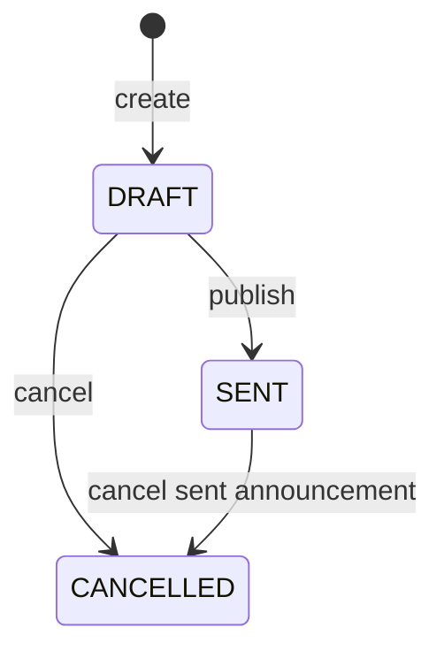
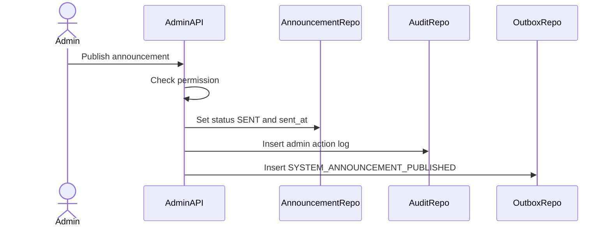

# System Announcement Flow

System Announcement handles platform-wide announcements such as maintenance, shipping delay, payment outage, and policy update.

## 1. Scope

In scope:

- Create announcement.
- Publish announcement.
- Cancel announcement.
- Pin/unpin announcement.
- Configure dismissible flag.
- Publish announcement events.

Out of scope:

- Per-user dismissal storage.
- Notification delivery internals.

## 2. Actors

- Admin/Super Admin.
- Notification Service.
- Frontend clients.
- Outbox Worker.

## 3. Announcement State Machine

## 4. Create Announcement Flow

Steps:

1. Admin submits title, content, severity, pinned and dismissible flags.
2. System checks permission.
3. System validates payload.
4. System inserts `system_announcements` with `DRAFT`.
5. System writes admin action log if configured.

## 5. Publish Flow

Rules:

- Only `DRAFT` announcement can be published.
- Publishing sets `sent_at`.
- Critical announcement should be audit logged.
- Notification Service can consume event for fan-out.

## 6. Cancel Flow

- `DRAFT -> CANCELLED`: never sent.
- `SENT -> CANCELLED`: remove/mark inactive on clients if supported.
- Write audit log and event if sent announcement is cancelled.

## 7. Acceptance Criteria

- Announcement lifecycle follows state machine.
- Publish requires permission.
- Published announcement has `sent_at`.
- Announcement event is written through outbox.

