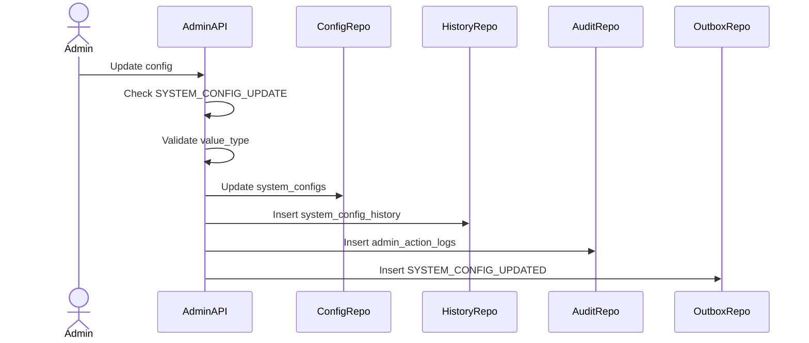

# System Config Management Flow

System Config Management controls runtime configuration values for platform behavior. Config changes are critical admin actions and must be auditable.

## 1. Scope

In scope:

- Create config.
- Update config value.
- Enable/disable config.
- View config history.
- Publish config update events.

Out of scope:

- Secret management.
- Feature flag rollout targeting.
- Service-side config cache implementation.

## 2. Actors

- Super Admin.
- Admin Service.
- Consumer services.
- Outbox Worker.

## 3. Config Examples

- `MAX_CART_ITEMS`
- `PAYMENT_EXPIRE_MINUTES`
- `AUTO_COMPLETE_ORDER_DAYS`
- `ALLOW_NEW_SELLER`
- `MAX_IMAGES_PER_PRODUCT`

## 4. Update Config Flow

## 5. Business Rules

- `config_key` is unique.
- `config_key` should be immutable.
- `config_value` must match `value_type`.
- Every update/toggle writes `system_config_history`.
- Every update/toggle writes `admin_action_logs`.
- Config events must not include secrets.

## 6. Toggle Config Flow

Steps:

1. Admin requests enable/disable.
2. System validates permission.
3. System updates `is_active`.
4. System writes history with old/new active state.
5. System logs action and publishes event.

## 7. View History Flow

- Query `system_config_history` by config key.
- Sort newest first.
- Include changed_by, old/new values, reason, created_at.

## 8. Acceptance Criteria

- Config update validates type.
- Config update writes history and audit log.
- Config update publishes outbox event.
- Disabled config remains queryable with history.

