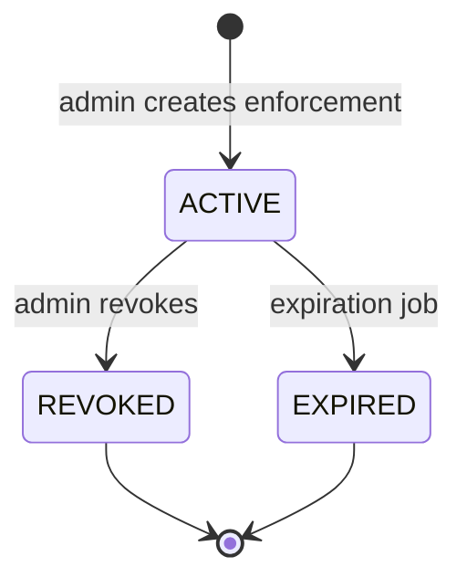
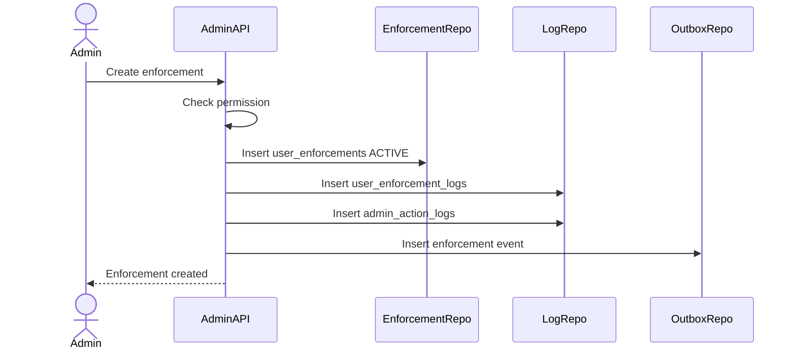

# User Enforcement Flow

User Enforcement handles admin decisions that affect a user's platform capabilities. Admin Service stores the enforcement decision and audit trail; Auth, Social, and Commerce apply the actual domain effects through API/event integration.

## 1. Scope

In scope:

- Suspend user.
- Ban user.
- Restrict user.
- Revoke enforcement.
- View current enforcement status.
- View enforcement history.
- Publish enforcement events.

Out of scope:

- User credential changes.
- Full risk scoring.
- Appeal/case management.

## 2. Actors

- Admin/Moderator.
- Auth Service.
- Social Service.
- Commerce Service.
- System enforcement expiration job.

## 3. Enforcement State Machine

## 4. Enforcement Type Effects

| Type | Auth effect | Social effect | Commerce effect |
|---|---|---|---|
| `SUSPEND` | User status `SUSPENDED`, revoke sessions | Block all user write actions | Block seller/buyer sensitive writes as policy |
| `BAN` | MVP same as suspended plus ban enforcement record | Block all user actions | Block all user actions |
| `RESTRICT` | Login allowed | Block post/comment/follow or configured writes | Block review/create product or configured writes |

## 5. Create Enforcement Flow

Rules:

- `user_id` target must exist in Auth Service or trusted user projection.
- `reason_code` and `description` are required.
- Temporary enforcement must have future `expires_at`.
- Permanent enforcement has `expires_at = null`.
- Every state transition writes `user_enforcement_logs`.

## 6. Revoke Enforcement Flow

Steps:

1. Admin requests revoke.
2. System checks permission.
3. System loads active enforcement.
4. System sets status `REVOKED`.
5. System writes enforcement log.
6. System writes admin action log.
7. System publishes `USER_ENFORCEMENT_REVOKED`.

## 7. Current Status And History

Current status:

- Query active enforcements by `user_id`.
- Return action type, reason, expiration and source admin.

History:

- Query `user_enforcements` and `user_enforcement_logs`.
- Sort newest first.

## 8. Transaction And Outbox

Write transaction includes:

- enforcement insert/update.
- enforcement log.
- admin action log.
- outbox event.

No external publish before DB commit.

## 9. Acceptance Criteria

- Admin can create enforcement only with permission.
- Enforcement transition always writes logs.
- Suspend/restrict events are available for other services.
- Expiring/revoking is idempotent for already terminal enforcement.

