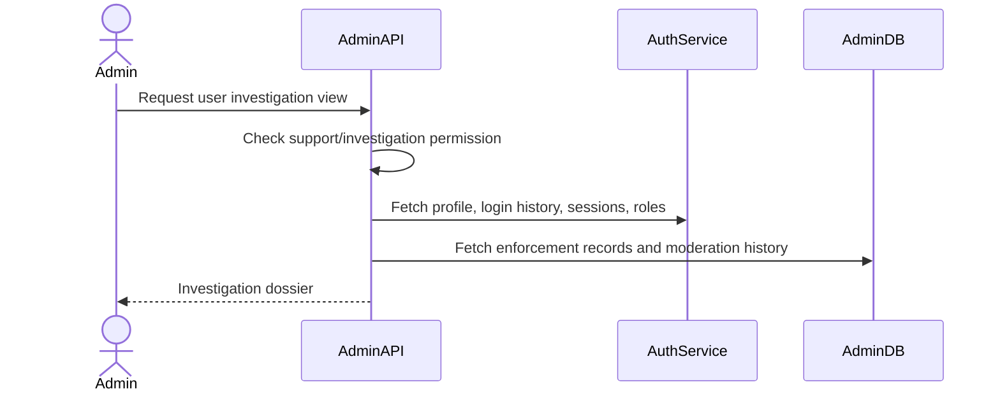

# User Investigation Flow

User Investigation is a support/admin read flow used to understand user behavior before moderation. Admin Service does not own Auth user data; it retrieves it from Auth Service or future projections.

## 1. Scope

In scope:

- View user profile.
- View login history.
- View active sessions.
- View OAuth accounts.
- View user roles/permissions.
- View current enforcement and enforcement history.

Out of scope:

- Mutating user profile.
- Resetting password.
- Direct session DB access.

## 2. Actors

- Support admin.
- Moderator.
- Super Admin.
- Auth Service.
- Admin Service.

## 3. Investigation Flow

## 4. Data Returned

Recommended sections:

- Basic profile: id, email/phone, status, created time.
- Login history: timestamp, ip, device, success/failure.
- Active sessions: session id, device, ip, created/last active.
- OAuth accounts: provider, linked time.
- Roles/permissions.
- Active enforcement.
- Enforcement history.
- Recent critical admin actions targeting user.

## 5. Business Rules

- Investigation view requires explicit permission.
- Sensitive data should be minimized.
- Support read can be audit logged.
- Admin Service must not expose password/token/OTP.
- Data from Auth is read-only.

## 6. Use Cases

- Detect spam account.
- Investigate suspicious login.
- Investigate abuse report.
- Decide whether to restrict/suspend/ban.

## 7. Failure Cases

- User not found in Auth -> 404.
- Auth Service unavailable -> return 503 or partial result with clear warning.
- Missing permission -> 403.

## 8. Acceptance Criteria

- Authorized admin can view investigation dossier.
- Unauthorized admin cannot access user investigation.
- No secrets/tokens are exposed.
- Enforcement history is included from Admin DB.

