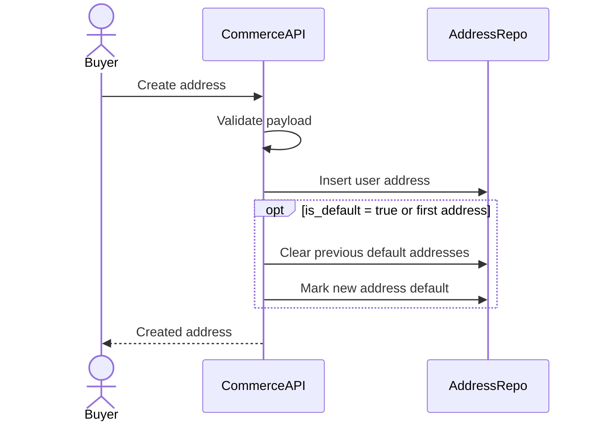
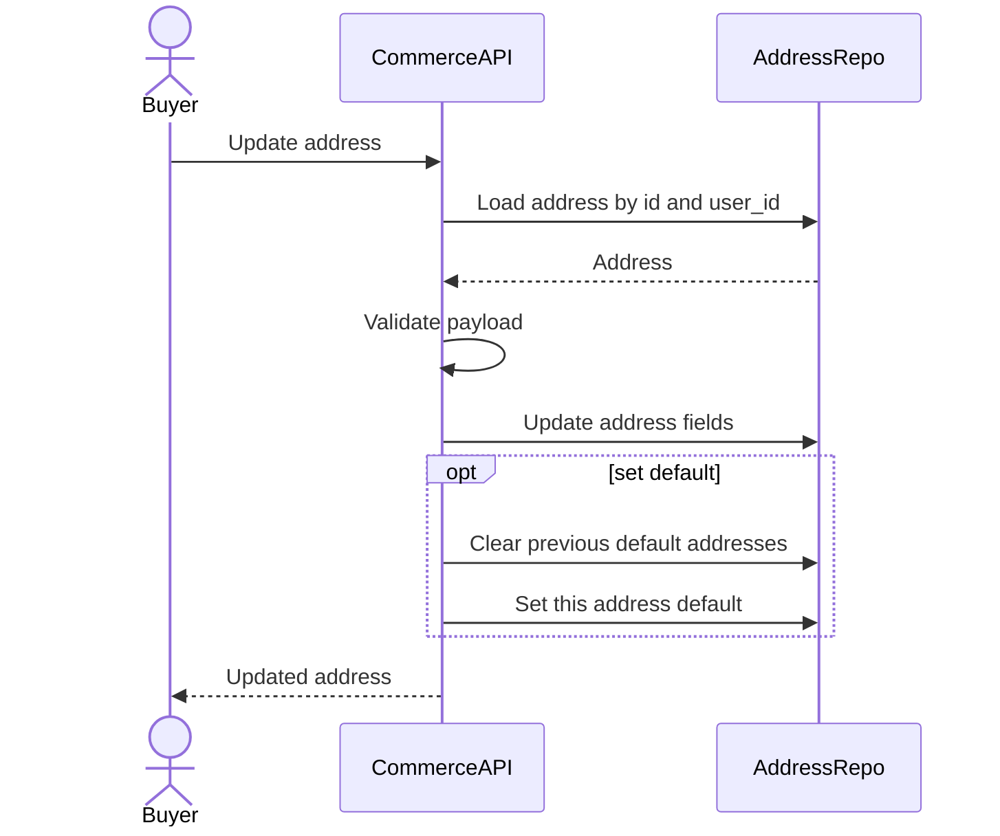
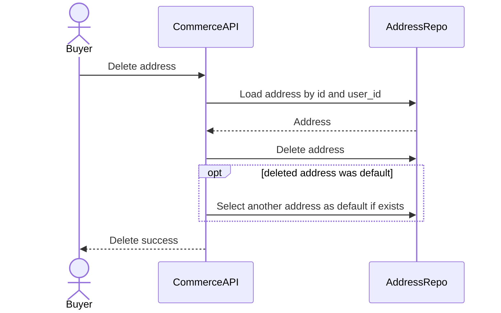
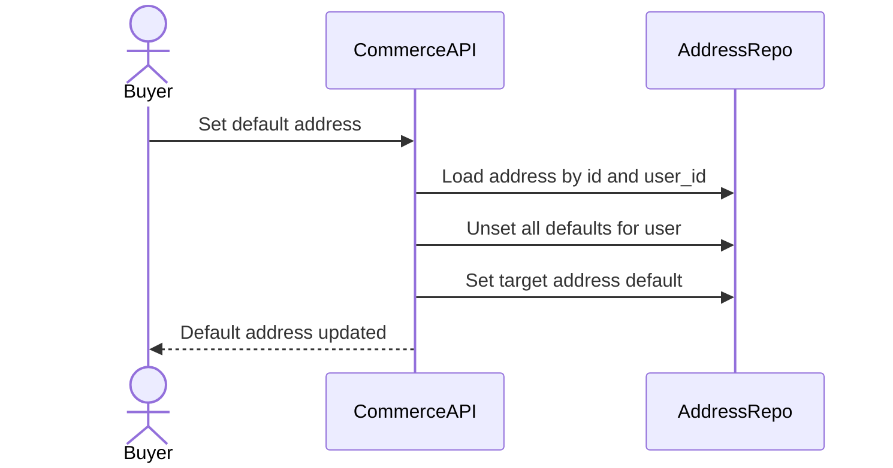
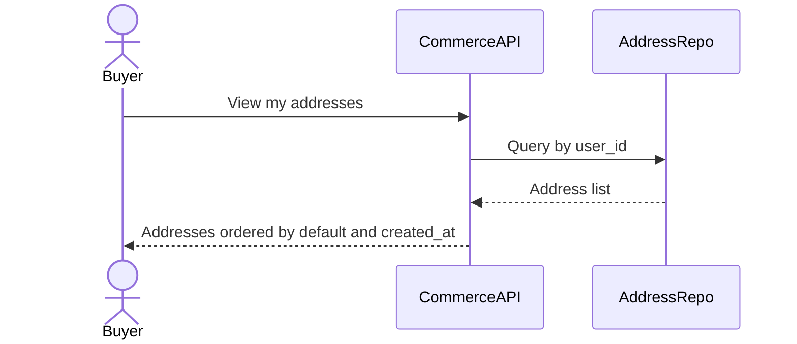
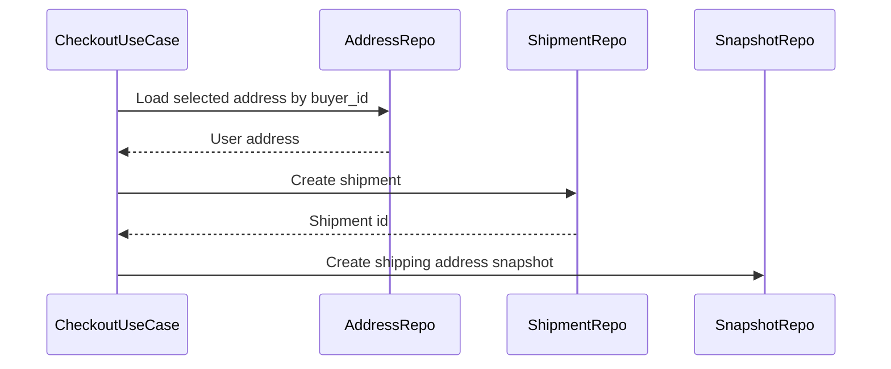

# Address Management Flow

Address Management cho phep buyer quan ly so dia chi giao hang. Dia chi trong `user_addresses` la du lieu mutable cua user; khi checkout tao shipment, Commerce Service phai tao `shipping_address_snapshots` de dong bang dia chi tai thoi diem mua hang.

## 1. Scope

In scope:

- Them dia chi.
- Cap nhat dia chi.
- Xoa dia chi.
- Chon dia chi mac dinh.
- Xem danh sach dia chi.
- Tao shipping address snapshot khi checkout/shipment.

Out of scope:

- Address geocoding nang cao.
- Address validation voi provider ben ngoai.
- Shipping fee provider logic chi tiet; flow do thuoc checkout/shipping.

## 2. Actors

- Buyer: quan ly dia chi cua minh.
- System: tao snapshot tu address khi checkout/shipment.

## 3. Source Tables

- `user_addresses`
- `shipping_address_snapshots`
- `shipments`
- `orders`

## 4. Data Model Meaning

`user_addresses`:

- La address book cua buyer.
- Co the them/sua/xoa.
- Co `is_default`.
- Khong nen duoc dung lam source truc tiep cho shipment da tao.

`shipping_address_snapshots`:

- La snapshot immutable gan voi `shipment_id`.
- Luu receiver, phone, province/district/ward, detail, full address.
- Bao ve lich su order khi buyer sua/xoa dia chi sau checkout.

## 5. Address Invariants

- Buyer chi quan ly address cua minh.
- Moi buyer co the co nhieu address.
- Moi buyer chi co toi da mot address default.
- Address default la convenience cho checkout, khong phai bat buoc neu buyer chon address khac.
- Snapshot shipment khong thay doi khi address book thay doi.

## 6. Address Lifecycle

```mermaid
stateDiagram-v2
    [*] --> CREATED: buyer creates address
    CREATED --> UPDATED: buyer updates address
    CREATED --> DEFAULT: set as default
    UPDATED --> DEFAULT: set as default
    DEFAULT --> UPDATED: edit default address
    DEFAULT --> CREATED: another address becomes default
    CREATED --> DELETED: buyer deletes address
    UPDATED --> DELETED: buyer deletes address
    DEFAULT --> DELETED: buyer deletes default address
```

Note: schema hien tai khong co `deleted_at`/`status` cho address. MVP co the hard delete address neu chua dung, hoac soft delete bang cach bo sung field sau nay. Neu hard delete, shipment history van an toan vi da co snapshot.

## 7. Create Address Flow



Validation:

- `receiver_name` required.
- `phone` required and valid by local phone format.
- `province_code`, `district_code`, `ward_code` required.
- `address_detail` required.
- `user_id` from JWT, not from client body.

Rules:

- If this is the first address of user, set `is_default = true`.
- If request asks `is_default = true`, unset default on all other addresses of same user in same transaction.
- Do not trust client-provided `user_id`.

Failure cases:

- Invalid phone -> 400.
- Missing location code -> 400.
- Duplicate default race -> handle by transaction/partial unique index.

## 8. Update Address Flow



Rules:

- Buyer can update only own address.
- Updating default address keeps it default unless explicitly changed.
- If setting address default, clear other defaults atomically.
- Updating address book never updates existing `shipping_address_snapshots`.

Failure cases:

- Address not found or not owned -> 404.
- Invalid payload -> 400.

## 9. Delete Address Flow



Rules:

- Delete is scoped by `user_id`.
- Deleting address used by old shipment is allowed because shipment uses snapshot.
- If deleted address was default:
  - If another address exists, optionally set latest/oldest address as default.
  - If no address remains, user simply has no default address.
- MVP can hard delete because snapshot protects order history.

Failure cases:

- Address not found -> idempotent success or 404. Recommended: 404 for explicit delete by id.

## 10. Set Default Address Flow



Transaction:

- Must be atomic.
- Partial unique index `UNIQUE(user_id) WHERE is_default = true` is recommended.

## 11. View Address List Flow



Sorting:

- Default address first.
- Then recently updated or created addresses.

Response should include:

- `id`
- `receiver_name`
- `phone`
- `province_code`
- `district_code`
- `ward_code`
- `address_detail`
- `full_address` if generated by service/frontend
- `is_default`
- `created_at`
- `updated_at`

## 12. Snapshot Creation Flow

Snapshot is created when order/shipment needs immutable shipping address.



Rules:

- Selected address must belong to buyer.
- Snapshot copies address data, not references mutable fields.
- `shipping_address_snapshots.shipment_id` is unique.
- Snapshot is not updated even if user address changes.

Snapshot fields:

- `receiver_name`
- `phone`
- `province_code`
- `district_code`
- `ward_code`
- `address_detail`
- `full_address`

## 13. Transaction And Consistency

Write operations should use application-layer transaction:

- Create address with default handling.
- Update address with default handling.
- Delete default address and assign new default.
- Set default address.
- Create shipment and shipping snapshot.

Consistency concerns:

- Concurrent set default requests can create two defaults without DB constraint; use transaction and partial unique index.
- Checkout must load selected address in same transaction section before snapshot creation.
- Do not accept address payload directly for order without either saving address or creating snapshot from validated data.

## 14. Events

No required external event for address MVP.

Optional internal events:

- `COMMERCE_ADDRESS_CREATED`
- `COMMERCE_ADDRESS_UPDATED`
- `COMMERCE_ADDRESS_DELETED`

Normally not needed unless Notification/Audit requires it.

## 15. Acceptance Criteria

- Buyer can create, update, delete and list only own addresses.
- First address becomes default automatically.
- Setting default clears previous default atomically.
- Checkout can use selected address only if it belongs to buyer.
- Shipment address remains unchanged after buyer edits/deletes address book.

