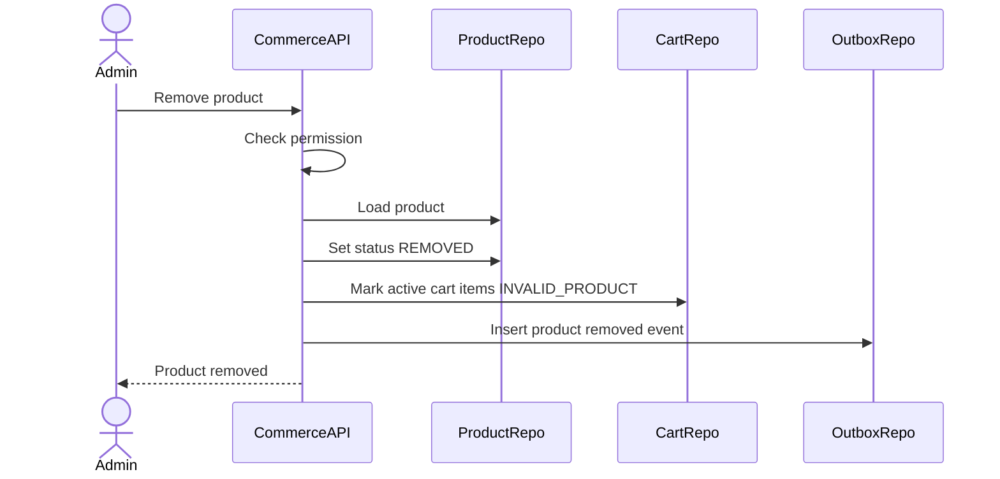
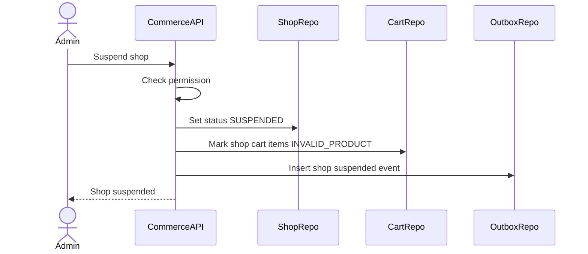
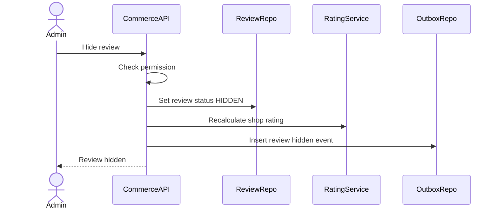

# Admin Moderation Flow

Admin Moderation mo ta cac thao tac quan tri trong Commerce MVP: remove product, suspend/close shop, hide/remove review va kiem tra shipment/order support. Admin action phai dua tren permission tu Auth Service, ghi audit/event can thiet, va khong pha vo lich su order da tao.

## 1. Scope

In scope:

- Admin remove product.
- Admin suspend/restore/close shop.
- Admin hide/restore review.
- Admin kiem tra shipment/order support.
- Tac dong moderation toi discovery/cart/checkout.
- Publish moderation events qua outbox.

Out of scope:

- Refund/dispute full workflow.
- Legal/audit case management chi tiet.
- Auto moderation ML.
- Admin direct DB repair.

## 2. Actors

- Admin/Moderator: thuc hien moderation action.
- Seller: bi tac dong boi product/shop moderation.
- Buyer: bi tac dong neu cart/order co product/shop bi moderate.
- System: sync cart invalid, publish notifications/events.

## 3. Source Tables

- `products`
- `seller_shops`
- `shop_settings`
- `reviews`
- `cart_items`
- `orders`
- `order_items`
- `shipments`
- `outbox_events`

## 4. Permission Model

Admin APIs require JWT authentication and permission from Auth Service.

Suggested permissions:

- `COMMERCE_PRODUCT_REMOVE`
- `COMMERCE_SHOP_SUSPEND`
- `COMMERCE_SHOP_CLOSE`
- `COMMERCE_REVIEW_HIDE`
- `COMMERCE_ORDER_SUPPORT_READ`
- `COMMERCE_SHIPMENT_SUPPORT_READ`

Rules:

- Do not trust client-provided admin identity.
- Admin id should come from JWT.
- Every moderation action should carry reason/note when possible.
- Do not log token/secret/provider credentials.

## 5. Product Moderation

### 5.1 Remove Product Flow

Rules:

- `REMOVED` product is hidden from buyer discovery.
- `REMOVED` product cannot be added to cart or checkout.
- Seller cannot republish `REMOVED` product.
- Existing order item snapshots remain unchanged.
- Active cart items for removed product become `INVALID_PRODUCT`.

Impact:

- Discovery: hidden.
- Cart view: item invalid.
- Checkout: rejected.
- Existing orders: remain visible for history/support.

## 6. Shop Moderation

### 6.1 Suspend Shop Flow

Rules:

- Suspended shop is hidden from buyer public APIs.
- Suspended shop products cannot be published/add-cart/checkout.
- Seller cannot create new product or shipment if policy blocks suspended seller operations.
- Existing paid/processing orders should not be auto-cancelled without support workflow.

### 6.2 Close Shop Flow

Close shop sets `seller_shops.status = CLOSED`.

Rules:

- Closed shop hidden from discovery.
- New checkout blocked.
- Existing order history preserved.
- Reopen/restore requires explicit admin/seller policy.

### 6.3 Restore Shop Flow

Restore from `SUSPENDED` to `ACTIVE` only by admin.

Rules:

- Before restore, verify violation resolved.
- Products do not automatically become active if they were archived/removed separately.
- Cart items can be revalidated lazily by cart sync/view.

## 7. Review Moderation

### 7.1 Hide Review Flow

Rules:

- Hidden review excluded from public product/shop review list.
- Hidden review can remain visible to admin support.
- If rating summary includes only visible reviews, recalculate `seller_shops.rating_avg` and `rating_count`.
- Do not physically delete review in MVP.

### 7.2 Restore Review Flow

Restore sets `reviews.status = VISIBLE`.

Rules:

- Recalculate rating summary.
- Publish event if notification/audit needs it.

## 8. Order And Shipment Support Read

Admin can inspect order/shipment for support:

- View order status.
- View payment status summary.
- View shipment status and provider response.
- View webhook logs if needed.
- View status history.

Rules:

- Read-only in MVP unless explicit support mutation flow exists.
- Admin should not manually force payment paid/cancelled in MVP.
- Refund/dispute is out of scope.

## 9. Moderation Impact Matrix

| Action | Discovery | Cart | Checkout | Existing orders |
|---|---|---|---|---|
| Product `REMOVED` | Hide product | `INVALID_PRODUCT` | Reject | Preserve snapshots |
| Shop `SUSPENDED` | Hide shop/products | `INVALID_PRODUCT` | Reject | Support policy |
| Shop `CLOSED` | Hide shop/products | `INVALID_PRODUCT` | Reject | Support policy |
| Review `HIDDEN` | Hide review | No impact | No impact | No impact |

## 10. Transaction And Consistency

Write operations needing transaction:

- Remove product + cart invalidation + outbox.
- Suspend/close/restore shop + outbox.
- Hide/restore review + rating recalculation + outbox.

Consistency:

- Checkout must always revalidate product/shop/review-independent rules live.
- Async cart invalidation improves UX but cannot be sole protection.
- Order item snapshots should not be mutated by product/shop moderation.

## 11. Events

Recommended outbox events:

- `COMMERCE_PRODUCT_REMOVED`
- `COMMERCE_SHOP_SUSPENDED`
- `COMMERCE_SHOP_CLOSED`
- `COMMERCE_SHOP_RESTORED`
- `COMMERCE_REVIEW_HIDDEN`
- `COMMERCE_REVIEW_RESTORED`

Event payload should include:

- `admin_id`
- `reason`
- `aggregate_id`
- `old_status`
- `new_status`
- `occurred_at`

## 12. Acceptance Criteria

- Admin action requires permission.
- Removed product is not buyer-visible and cannot checkout.
- Suspended/closed shop blocks new commerce activity.
- Hidden review is removed from public review lists.
- Existing order snapshots remain unchanged after moderation.
- Cart/checkout protection works even if async sync has not run yet.

