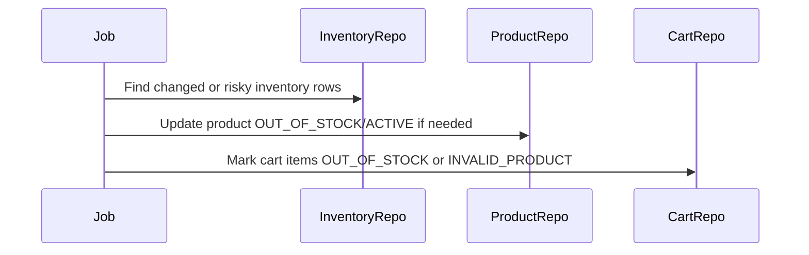
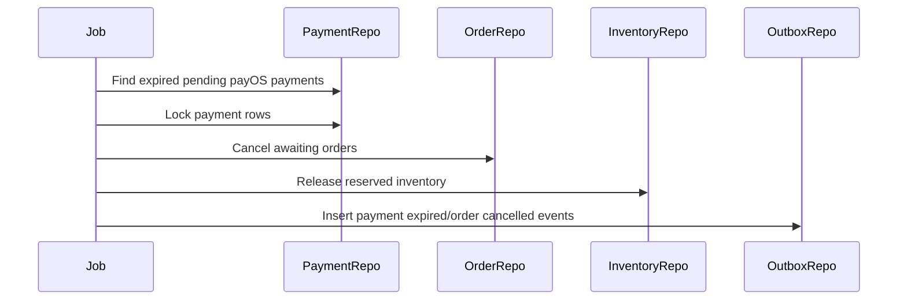
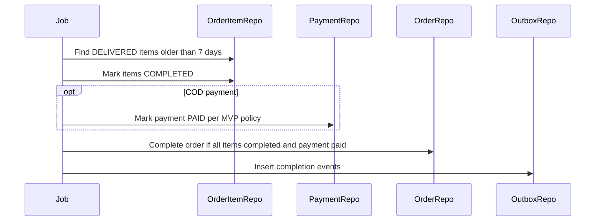

# Background Jobs Flow

Background Jobs trong Commerce Service xu ly cac tac vu bat dong bo: sync cart/inventory, expire payment, auto cancel unpaid order, auto complete delivered order, process webhook retry va publish outbox. Jobs phai idempotent, co lock/race protection, va khong duoc thay the validation synchronous trong checkout/cart APIs.

## 1. Scope

In scope:

- Inventory and cart sync.
- Payment expiration.
- Auto cancel unpaid order.
- Auto complete delivered order.
- Shipment tracking sync.
- Retry webhook processing.
- Outbox publishing.
- Cleanup old removed cart items/logs if policy allows.

Out of scope:

- Manual admin repair.
- Refund/dispute automation.
- Data warehouse/analytics batch jobs.

## 2. Actors

- System scheduler/worker.
- payOS/GHN webhook processors.
- Outbox publisher worker.
- Commerce database.
- External providers where needed.

## 3. Job Design Principles

- Idempotent: running same job twice should not corrupt state.
- Small batches: use pagination/limit to avoid long transactions.
- Row locking: use `FOR UPDATE SKIP LOCKED` or equivalent for concurrent workers.
- Status guarded updates: update only when current status matches expected status.
- Observable: log job count, failures, duration, retry count.
- Safe retry: failed provider/broker calls should be retryable.
- No cross-service DB access.

## 4. Inventory And Cart Sync Job

Purpose:

- Keep product/cart availability aligned with inventory/product/shop status.

Rules:

- If `stock_quantity = 0` and product `ACTIVE`, set product `OUT_OF_STOCK`.
- If `stock_quantity > 0` and product `OUT_OF_STOCK`, set `ACTIVE` if shop/category/product are otherwise valid.
- If product/shop invalid, active cart items become `INVALID_PRODUCT`.
- If stock insufficient for cart quantity, active cart items become `OUT_OF_STOCK`.
- If stock becomes sufficient and product/shop valid, `OUT_OF_STOCK` cart items can become `ACTIVE`.

Must not:

- Reserve stock.
- Create order.
- Release stock.

## 5. Payment Expiration Job

Purpose:

- Expire payOS payments/orders that stayed pending past `expired_at`.

Selection:

- `payments.status = PENDING`
- `payments.payment_method = PAYOS`
- `payments.expired_at < now()` or `checkout_url_expired_at < now()`

Rules:

- Do not expire COD payment by age.
- Transition payment `PENDING -> EXPIRED`.
- If order still `CREATED/AWAITING_PAYMENT`, set `CANCELLED`.
- Release reserved inventory once.
- Write status histories and outbox events.

Race handling:

- If webhook success marks payment `PAID` first, expiration job must no-op.
- Lock payment/order rows before transition.

## 6. Auto Cancel Unpaid Order Job

Purpose:

- Cancel stale orders waiting for payment.

Selection:

- `orders.status IN (CREATED, AWAITING_PAYMENT)`
- `orders.payment_status = PENDING`
- age exceeds configured TTL

Rules:

- For payOS, prefer payment expiration job as source.
- Cancel order, cancel payment if pending, release inventory.
- Do not cancel if shipment exists and not `PENDING`.

## 7. Auto Complete Delivered Order Job

Purpose:

- Complete delivered order items after buyer confirmation window passes.

Rules:

- Default window: 7 days after `delivered_at`.
- Skip if dispute/refund hold exists in future schema.
- Mark `order_items.status = COMPLETED`.
- For COD, MVP can mark payment `PAID` on auto completion.
- Order becomes `COMPLETED` only if all items completed and payment paid.

## 8. Shipment Tracking Sync Job

Purpose:

- Poll GHN or provider when webhook is delayed/missed.

Rules:

- Query active GHN shipments not terminal.
- Call GHN tracking API.
- Map raw status to domain status same as webhook flow.
- Update shipment/order items idempotently.
- Respect provider rate limits.

Terminal statuses:

- `DELIVERED`
- `FAILED`
- `CANCELLED`
- `RETURNED`

## 9. Webhook Retry Processing Job

Purpose:

- Retry logs that were received but not processed due transient error.

Payment webhook logs:

- Select `payment_webhook_logs.processed = false`
- Signature must be valid before processing domain state.

GHN webhook logs:

- Select `ghn_webhook_logs.processed = false`
- Re-resolve shipment by `ghn_order_code`.

Rules:

- Use batch locks.
- Idempotent state transition.
- If payload permanently invalid, mark/log failure according to future schema; current schema has no `last_error`, so rely on logs.

## 10. Outbox Publisher Job

Purpose:

- Publish `outbox_events` to broker reliably.

Detailed flow is defined in `outbox-event-flow.md`.

High-level:

1. Pick `PENDING` events.
2. Mark `PROCESSING`.
3. Publish to broker.
4. Mark `PUBLISHED` or `FAILED`.
5. Retry failed events with backoff.

## 11. Cleanup Job

Optional MVP cleanup:

- Remove or archive old `cart_items.status = REMOVED`.
- Archive old webhook logs after retention period.
- Archive published outbox events after retention period.

Rules:

- Do not delete data needed for audit/debug too early.
- Prefer retention config.
- Never delete order/payment/shipment history in MVP.

## 12. Scheduling Recommendations

Suggested intervals:

- Payment expiration: every 1-5 minutes.
- Auto cancel unpaid orders: every 5-15 minutes.
- Cart/inventory sync: every 5-15 minutes or event-driven.
- Auto complete delivered orders: daily/hourly.
- Shipment tracking sync: every 15-60 minutes for active shipments.
- Outbox publisher: continuous polling or short interval.

## 13. Transaction And Locking

For each job batch:

- Use small limit.
- Lock rows selected for processing.
- Update with expected current status.
- Commit per batch.
- Avoid holding transaction while calling slow external APIs where possible.

For provider polling:

- Option A: mark job claim, commit, call provider, then update result.
- Option B: call provider outside transaction after reading candidates; then lock/update each row conditionally.

## 14. Observability

Each job should log:

- job name
- batch size
- processed count
- success count
- failure count
- elapsed time
- last processed cursor/time

Metrics:

- pending payment count
- pending outbox count
- failed outbox count
- unprocessed webhook count
- inventory sync changed count

## 15. Acceptance Criteria

- Jobs are idempotent under retry.
- Payment expiration never expires COD by age.
- Auto complete does not complete order unless payment is paid.
- Shipment tracking sync uses same status mapping as webhook.
- Cart/inventory sync improves UX but checkout still validates synchronously.
- Outbox publishing can recover from broker downtime.

