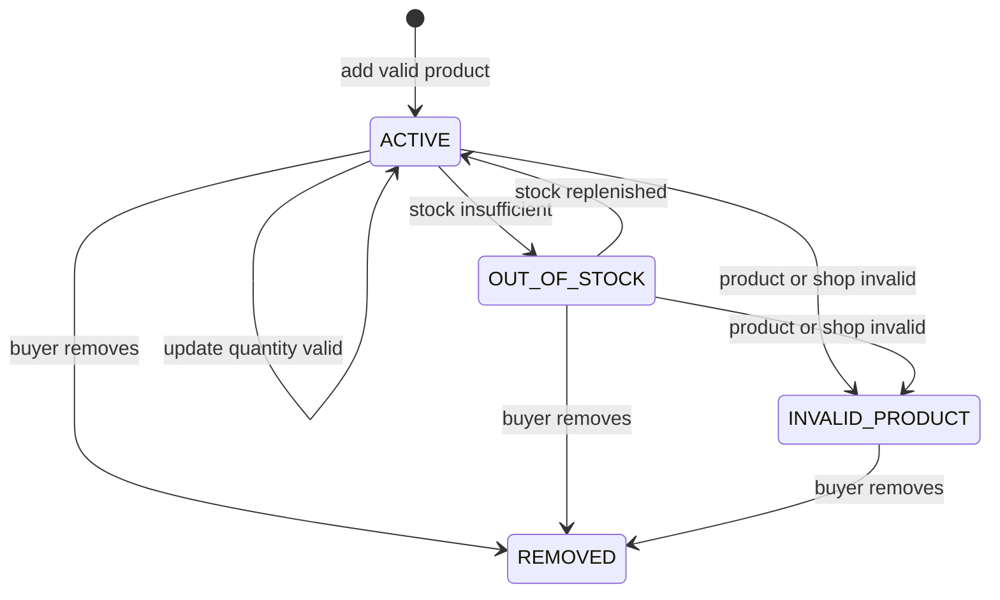
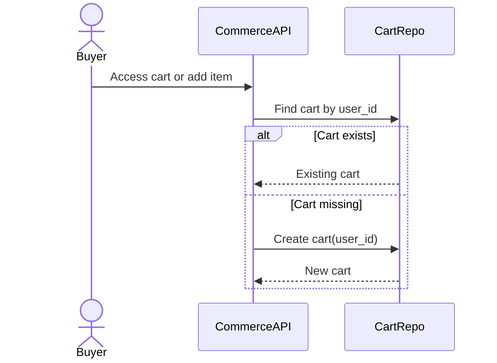
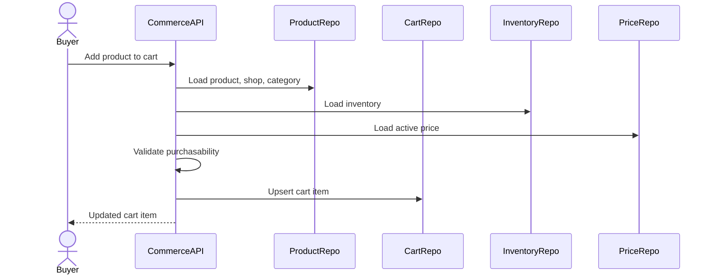
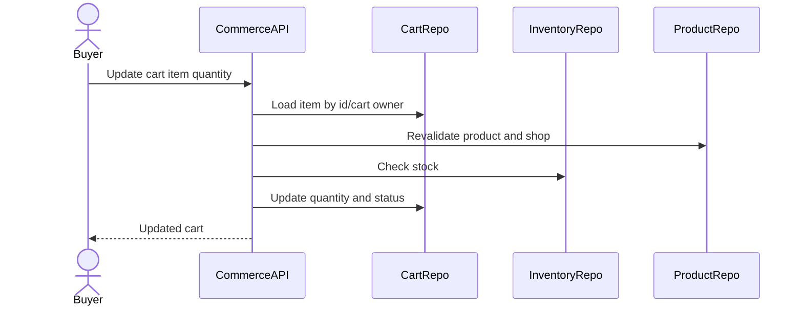
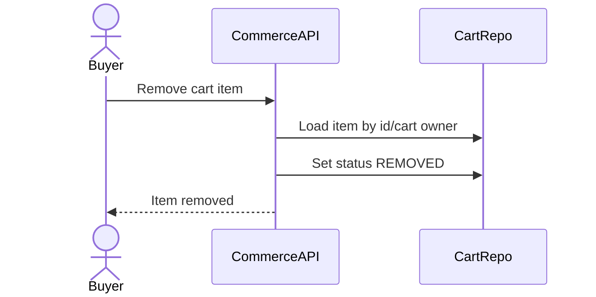
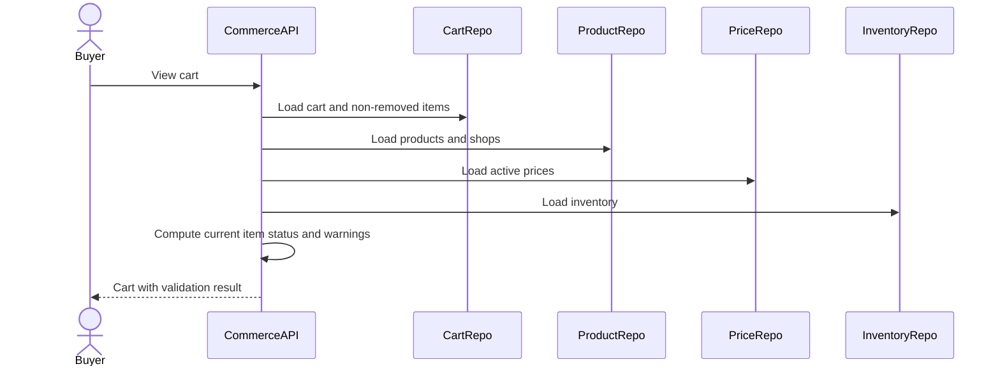

# Cart Lifecycle Flow

Cart Lifecycle mo ta cach buyer tao cart, them product, cap nhat quantity, xoa item, xem cart va validate cart truoc checkout. Cart la y dinh mua hang, khong phai stock reservation. Moi rule quan trong ve product status, shop status, price va stock phai duoc re-check khi xem cart va bat buoc re-check lai trong checkout.

## 1. Scope

In scope:

- Tao cart tu dong cho user.
- Them product vao cart.
- Cap nhat quantity cart item.
- Remove cart item.
- Xem cart.
- Kiem tra cart item status: `ACTIVE`, `OUT_OF_STOCK`, `REMOVED`, `INVALID_PRODUCT`.
- Detect product price change, product disabled, shop vacation/suspended, stock unavailable.

Out of scope:

- Reserve stock.
- Tao order.
- Payment.
- Shipping fee final calculation.

## 2. Actors

- Buyer: quan ly cart cua minh.
- System: background sync cart item status theo product/inventory changes.

## 3. Source Tables

- `carts`
- `cart_items`
- `products`
- `product_prices`
- `product_inventories`
- `seller_shops`
- `shop_settings`
- `product_media`

## 4. Cart Invariants

- Moi user co toi da mot cart: `carts.user_id` unique.
- Cart item unique theo `(cart_id, product_id)`.
- `cart_items.quantity > 0`.
- Cart item khong reserve stock.
- Cart item status chi phan anh tinh hop le hien tai cua item.
- Checkout phai validate lai cart, khong tin tuyet doi vao status da luu.

## 5. Cart Item Status Meaning

- `ACTIVE`: product/shop/stock hien tai hop le de tiep tuc checkout.
- `OUT_OF_STOCK`: product con ton tai nhung stock khong du cho quantity trong cart.
- `REMOVED`: buyer da xoa item khoi cart.
- `INVALID_PRODUCT`: product/shop khong con hop le, vi du product `PAUSED`, `ARCHIVED`, `REMOVED`, shop `SUSPENDED/CLOSED`, category inactive, hoac product bi disable.

## 6. State Machine

Important:

- `REMOVED` normally should not go back to `ACTIVE` automatically.
- If buyer adds same product again, implementation can either reactivate the removed row or create a new row if hard delete is used. MVP schema has unique `(cart_id, product_id)`, so reactivation is recommended.

## 7. Get Or Create Cart Flow

Rules:

- Cart creation is idempotent by `user_id`.
- Race condition can happen when two requests create cart at same time; handle unique violation by reloading cart.

## 8. Add Product To Cart Flow

Validation:

- User authenticated.
- Product exists.
- Product status must be `ACTIVE`.
- Shop status must be `ACTIVE`.
- Category active.
- Quantity > 0.
- Active price exists.
- Stock should be enough for desired quantity; if not, either reject add or add as `OUT_OF_STOCK`. MVP recommended: reject new add with business error if stock is 0, but allow existing cart sync to mark `OUT_OF_STOCK`.
- If shop vacation policy blocks new order, add can be rejected or allowed with warning. MVP recommended: allow add but checkout blocks if vacation is active.

Upsert behavior:

- If item does not exist: insert `ACTIVE`.
- If item exists and not removed: update quantity to requested quantity or add delta, depending API contract.
- If item exists as `REMOVED`: set status back to `ACTIVE` and update quantity.
- If item exists as `OUT_OF_STOCK/INVALID_PRODUCT`, revalidate before reactivating.

Failure cases:

- Product not found -> 404.
- Product not purchasable -> 409 business error.
- Quantity invalid -> 400.
- Active price missing -> 409.

## 9. Update Quantity Flow

Rules:

- Buyer can update only own cart.
- Quantity must be > 0.
- If quantity exceeds stock, update can:
  - reject with business error, or
  - accept and mark `OUT_OF_STOCK`.
- MVP recommended: reject direct update above stock for clearer UX, while background sync can mark existing items `OUT_OF_STOCK`.
- Updating `REMOVED` item should be rejected unless API is explicitly restore/add.

## 10. Remove Cart Item Flow

Rules:

- Remove is idempotent.
- Removing an already removed item returns success.
- No inventory change occurs because cart never reserves stock.

## 11. View Cart Flow

Response should include per item:

- `cart_item_id`
- `product_id`
- `seller_id`
- `shop_id`
- `product_name`
- `image_url`
- `quantity`
- `status`
- `current_price`
- `sale_price`
- `effective_price`
- `in_stock`
- `available_quantity`
- `price_changed`
- `unavailable_reason`

Cart summary should include:

- `active_item_count`
- `invalid_item_count`
- `subtotal`
- `can_checkout`
- warnings.

## 12. Price Change Detection

Cart schema khong luu price snapshot trong input schema. De detect price change tot hon, co 2 option:

1. Add `price_snapshot` vao `cart_items` sau nay.
2. MVP: detect only at checkout by comparing current price to client expectation or return current price every time view cart.

Recommended MVP behavior:

- Cart view always returns current active price.
- Checkout uses server current active price.
- Frontend can show "gia da cap nhat" neu cached UI price khac response moi.

## 13. Background Cart Sync

System job co the chay dinh ky hoac theo event product/inventory:

1. Find active cart items for changed product.
2. If product status invalid -> set `INVALID_PRODUCT`.
3. If shop invalid -> set `INVALID_PRODUCT`.
4. If stock insufficient -> set `OUT_OF_STOCK`.
5. If item was `OUT_OF_STOCK` and stock enough + product active -> set `ACTIVE`.

Job must not:

- Create order.
- Reserve stock.
- Remove buyer items without explicit cleanup policy.

## 14. Transaction And Locking

Write flows:

- Get/create cart.
- Add product.
- Update quantity.
- Remove item.

Use application-layer transaction for write operations.

No inventory row lock required for cart operations because cart does not reserve stock. Inventory locking belongs to checkout.

## 15. Events

No required external event for cart MVP.

Optional internal events:

- `COMMERCE_CART_ITEM_ADDED`
- `COMMERCE_CART_ITEM_UPDATED`
- `COMMERCE_CART_ITEM_REMOVED`

Only publish if there is a clear consumer. If published, use outbox.

## 16. Acceptance Criteria

- User always has at most one cart.
- Adding same product does not create duplicate cart item.
- Cart item quantity cannot be <= 0.
- Cart view reflects current product status, shop status, price and stock.
- Cart operations never reserve or release inventory.
- Checkout can only proceed with selected cart items that are currently valid.

