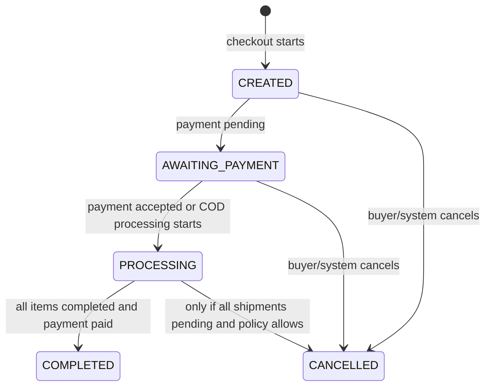
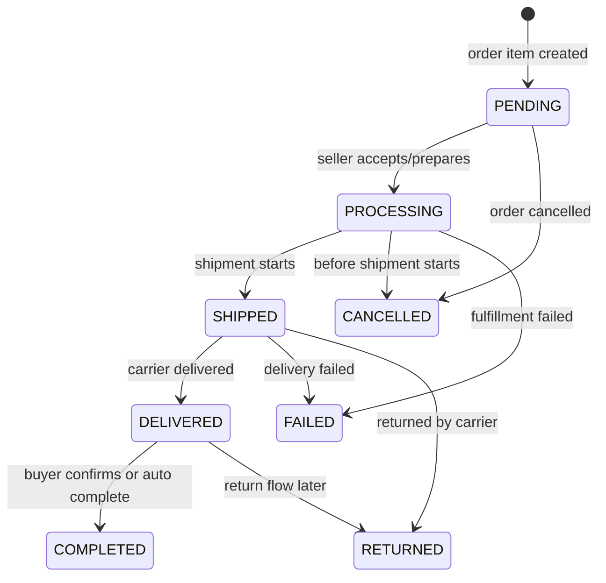
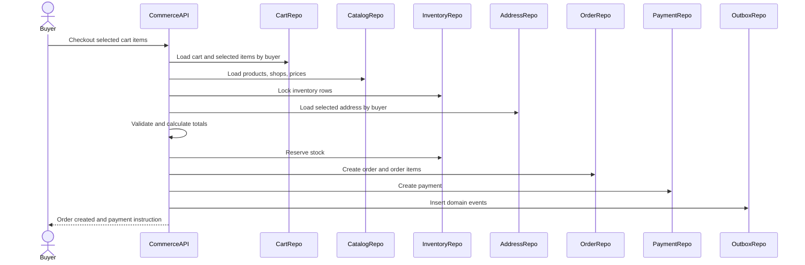
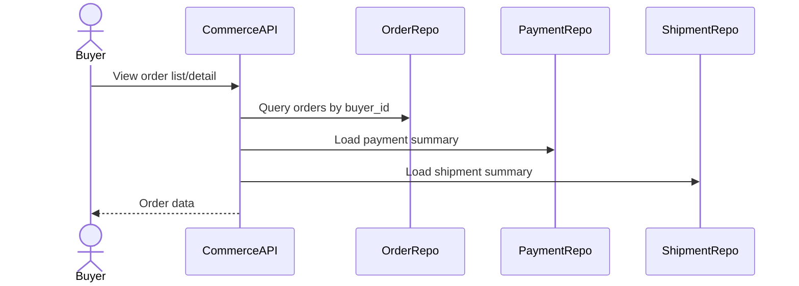
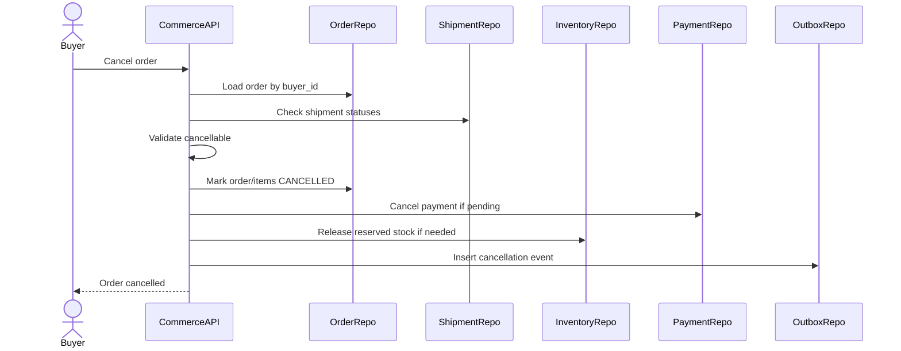
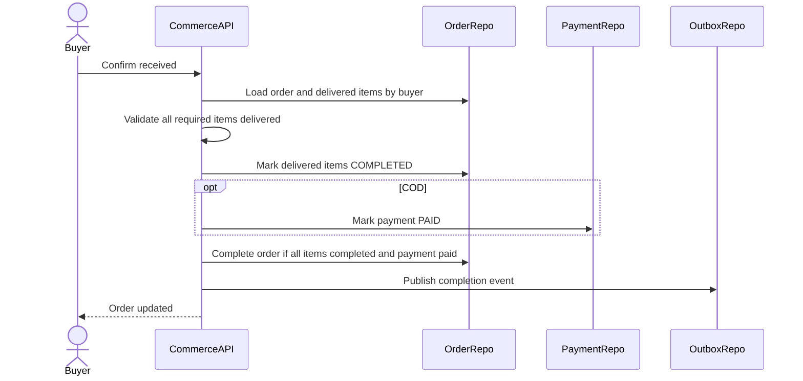

# Checkout And Order Flow

Checkout And Order Flow chuyen cart item hop le thanh order, order items, payment va fulfillment plan. Day la flow co rui ro cao nhat trong Commerce MVP vi lien quan den price snapshot, inventory reservation, payment method, shipment rule, cancellation va outbox event. Moi implementation phai uu tien atomicity va idempotency.

## 1. Scope

In scope:

- Checkout tu cart.
- Chon dia chi giao hang.
- Chon payment method `COD` hoac `PAYOS`.
- Revalidate product/shop/price/stock.
- Tinh total amount, shipping fee, final amount.
- Reserve inventory.
- Tao order, order items, payment.
- Tao shipping address snapshot khi co shipment.
- Xem order list/detail/status.
- Cancel order.
- Buyer confirm received.
- Complete order.

Out of scope:

- Refund/dispute day du.
- Voucher/promotion.
- Seller payout.
- Full GHN lifecycle chi tiet; xem shipping/payment flow rieng.

## 2. Actors

- Buyer: checkout, xem order, cancel order, confirm received.
- Seller: xu ly order item sau khi order vao `PROCESSING`.
- System: expire unpaid order, auto complete delivered order, recompute status.
- payOS/GHN: external providers qua payment/shipment flows.

## 3. Source Tables

- `carts`
- `cart_items`
- `user_addresses`
- `shipping_address_snapshots`
- `products`
- `product_prices`
- `product_inventories`
- `seller_shops`
- `shop_settings`
- `orders`
- `order_items`
- `payments`
- `shipments`
- `order_status_history`
- `payment_status_history`
- `shipment_status_history`
- `outbox_events`

## 4. Core Invariants

- Checkout must not trust client price, cart status, product status or stock.
- Checkout must revalidate everything server-side.
- Inventory reservation happens only during checkout/order creation.
- Cart does not reserve stock.
- Order item must snapshot product/shop/price data at purchase time.
- Payment is one-to-one with order.
- Order completed iff all order items are `COMPLETED` and order payment status is `PAID`.
- Shipment cannot be created unless order is `PROCESSING`.
- Cancel is allowed only before fulfillment starts.

## 5. Order State Machine



## 6. Order Item State Machine



## 7. Checkout Main Flow



Recommended implementation:

1. Receive selected `cart_item_ids`, `address_id`, `payment_method`, optional shipping option.
2. Load buyer cart by `buyer_id`.
3. Load selected cart items with status not `REMOVED`.
4. Revalidate product, shop, category, vacation policy.
5. Load active price.
6. Lock inventory rows for selected products.
7. Check `stock_quantity >= quantity`.
8. Load selected address by `buyer_id`.
9. Calculate item subtotal, shipping fee, final amount.
10. Reserve inventory:
    - `stock_quantity -= quantity`
    - `reserved_quantity += quantity`
11. Create `orders`.
12. Create `order_items` with snapshots.
13. Create `payments`.
14. Insert status history.
15. Insert outbox event(s).
16. Commit transaction.
17. For payOS, create payment link after commit or via payment use case/job.

## 8. Checkout Validation

Selected cart items:

- Belong to buyer cart.
- Not empty.
- Not `REMOVED`.
- Quantity > 0.

Product:

- Exists.
- `products.status = ACTIVE`.
- Category active.
- Has active price.
- Has inventory record.

Shop:

- `seller_shops.status = ACTIVE`.
- If vacation mode blocks checkout, reject with business error.

Inventory:

- `stock_quantity >= requested quantity`.
- Inventory row must be locked during reservation.

Address:

- Address exists.
- Address belongs to buyer.

Payment method:

- Must be `COD` or `PAYOS`.
- COD availability can depend on shop/shipping policy.

## 9. Amount Calculation

Item calculation:

```text
unit_price = active sale_price if exists else active price
item_final_price = unit_price * quantity
```

Order calculation:

```text
total_amount = sum(item_final_price)
shipping_fee = sum(shipping fees per seller/shipment group)
final_amount = total_amount + shipping_fee
```

MVP has no voucher/promotion, so `final_amount` can equal `total_amount + shipping_fee`.

Rules:

- `total_amount >= 0`.
- `final_amount >= 0`.
- `order_items.unit_price_snapshot` stores unit price at checkout.
- `order_items.final_price` stores item total at checkout.
- `order_items.shipping_fee_allocated` stores allocated shipping fee for item.

## 10. Shipping Fee During Checkout

Shipping fee can be calculated by:

- Mock calculator in MVP.
- GHN fee API if integrated.

Inputs:

- Seller pickup address from `seller_shipping_profiles`.
- Buyer selected address.
- Product weight sum per seller.
- Shipment type.

Rules:

- Multi-seller order should calculate shipping fee per seller group.
- `shipping_fee_allocated` should be distributed to order items for audit.
- Actual shipment is created only when order is `PROCESSING`; fee estimate is stored/used for order total.

## 11. Order Creation By Payment Method

### payOS

Initial state:

- `orders.status = AWAITING_PAYMENT`.
- `orders.payment_status = PENDING`.
- `payments.status = PENDING`.
- `payments.payment_method = PAYOS`.
- `shipments.cod_amount = 0` when shipments are later created.

After payOS success webhook:

- `payments.status = PAID`.
- `orders.payment_status = PAID`.
- `orders.status = PROCESSING`.
- `reserved_quantity -= quantity`.
- Seller can create shipment.

If payOS fails/expires/cancelled:

- Payment status becomes `FAILED`, `EXPIRED`, or `CANCELLED`.
- Order becomes `CANCELLED` if still `AWAITING_PAYMENT`.
- Reserved inventory is released.

### COD

Initial state:

- `orders.status = PROCESSING` or `AWAITING_PAYMENT` then immediately `PROCESSING` depending implementation.
- Recommended MVP: `PROCESSING`, because seller can prepare shipment before money is collected.
- `orders.payment_status = PENDING`.
- `payments.status = PENDING`.
- `payments.payment_method = COD`.
- Shipment later uses `cod_amount = order.final_amount`.

When buyer confirms received:

- `payments.status = PAID`.
- `orders.payment_status = PAID`.
- Delivered order items become `COMPLETED`.
- Order becomes `COMPLETED` if all items completed.

## 12. Order Detail And List Flow



Buyer can see:

- Own orders only.
- Order items with snapshots.
- Payment status.
- Shipment status/tracking.
- Shipping address snapshot.
- Status histories if API exposes them.

Seller order APIs should query by `order_items.seller_id`, not expose full buyer unrelated data beyond what fulfillment requires.

## 13. Cancel Order Flow



Allowed:

- `orders.status IN (CREATED, AWAITING_PAYMENT)`.
- Shipment does not exist or all shipments are `PENDING`.

Not allowed:

- Any shipment `PICKING_UP`, `READY_TO_SHIP`, `SHIPPED`, `DELIVERED`.

Cancel effects:

- `orders.status = CANCELLED`.
- Pending order items -> `CANCELLED`.
- Pending payment -> `CANCELLED`.
- Reserved inventory released if payment not successful.
- Write status histories.
- Publish `COMMERCE_ORDER_CANCELLED`.

## 14. Confirm Received Flow



Rules:

- Buyer can confirm only own order.
- Order item must be `DELIVERED` before confirm.
- For COD, confirm received marks payment paid.
- For payOS, payment should already be paid before shipment.
- Order completed only when all order items completed and payment paid.

## 15. Auto Complete Delivered Order

System job:

1. Find order items `DELIVERED` longer than configured window, default 7 days.
2. If no dispute/refund hold exists, mark items `COMPLETED`.
3. For COD, mark payment paid if policy treats carrier delivered as collect success.
4. Recompute order completion.
5. Write histories and outbox events.

MVP note:

- User requirement says `DELIVERED + 7d => auto COMPLETED`.
- If GHN later confirms COD settlement separately, payment paid can depend on carrier reconciliation.

## 16. Transaction And Consistency

Checkout transaction must include:

- Inventory reservation.
- Order creation.
- Order item creation.
- Payment creation.
- Status history.
- Outbox event creation.

External calls:

- payOS create link should happen after local payment exists.
- GHN create order should happen after order is `PROCESSING`, usually in shipping flow.
- Do not hold DB transaction while waiting for slow external provider if avoidable.

Idempotency:

- Checkout should accept client idempotency key to avoid duplicate order on retry.
- Payment has `idempotency_key`.
- Duplicate webhook must not duplicate stock release or state transition.

## 17. Events

Required or recommended outbox events:

- `COMMERCE_ORDER_CREATED`
- `COMMERCE_ORDER_CANCELLED`
- `COMMERCE_ORDER_COMPLETED`
- `COMMERCE_INVENTORY_RESERVED`
- `COMMERCE_INVENTORY_RELEASED`

Event key examples:

- `order:{order_id}:created`
- `order:{order_id}:cancelled`
- `inventory:{order_id}:reserved`

## 18. Acceptance Criteria

- Checkout rejects invalid cart item, inactive product, inactive shop, missing price or insufficient stock.
- Checkout atomically reserves inventory and creates order/payment/order items.
- Order items contain immutable product/shop/price snapshots.
- payOS order waits for payment before seller shipment.
- COD order can proceed to shipment with pending payment and COD amount.
- Cancel releases reserved stock when payment has not succeeded.
- Confirm received completes delivered items and handles COD payment paid.
- Order completed only when all items completed and payment paid.

