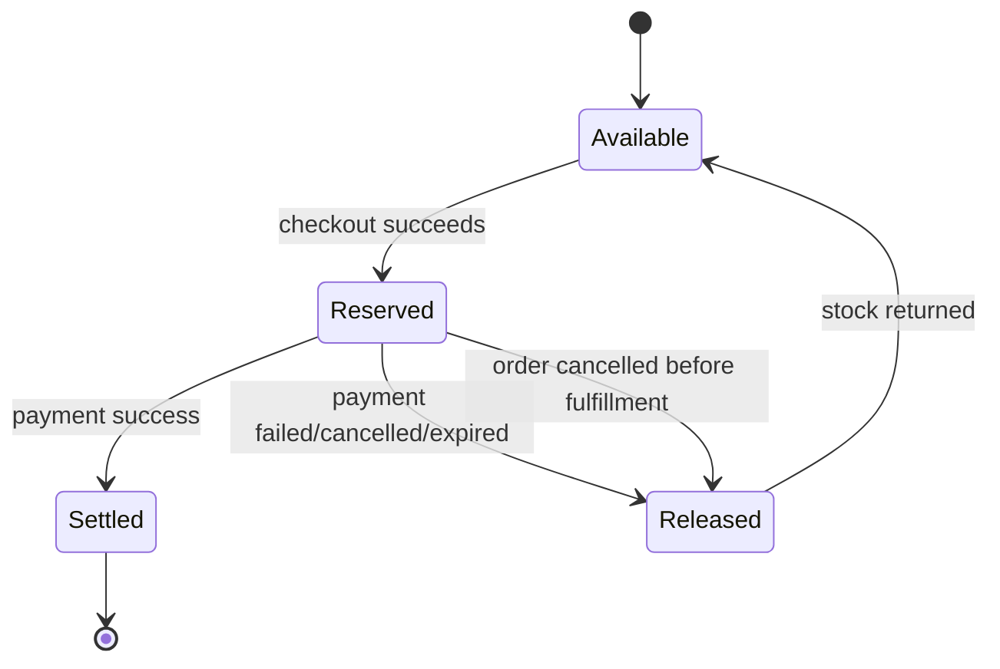
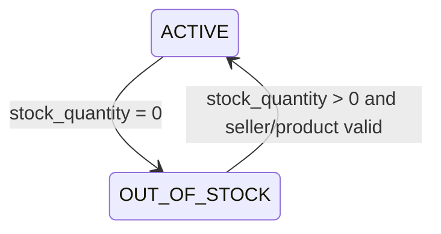
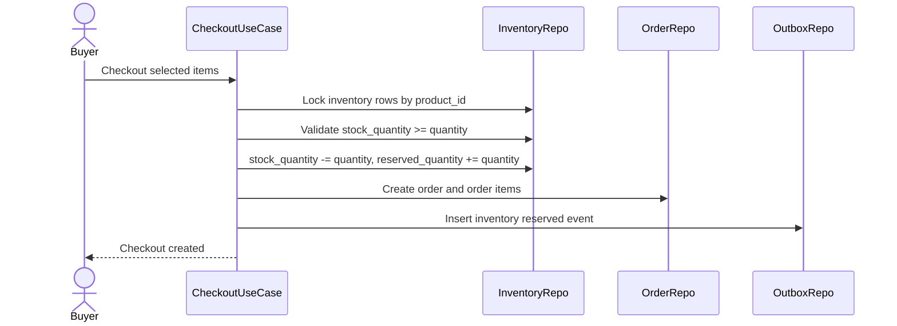
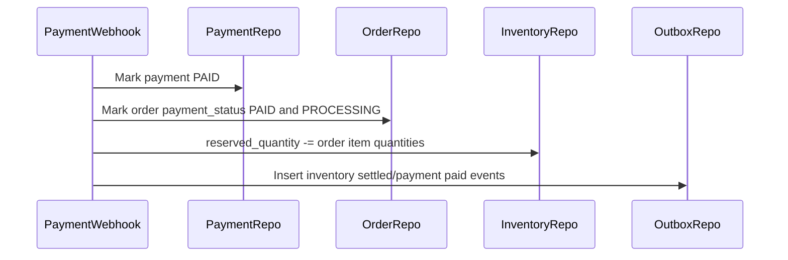
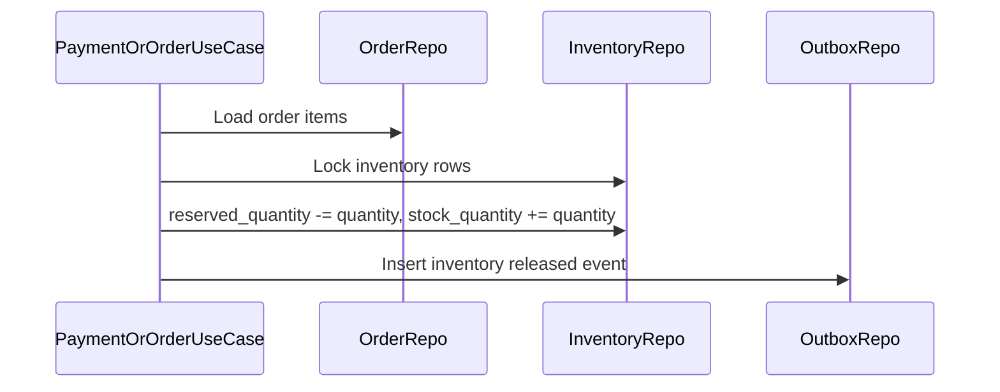
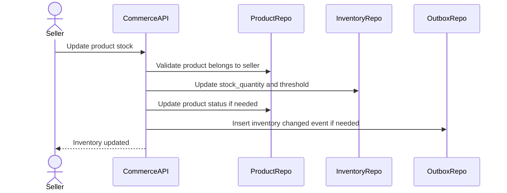
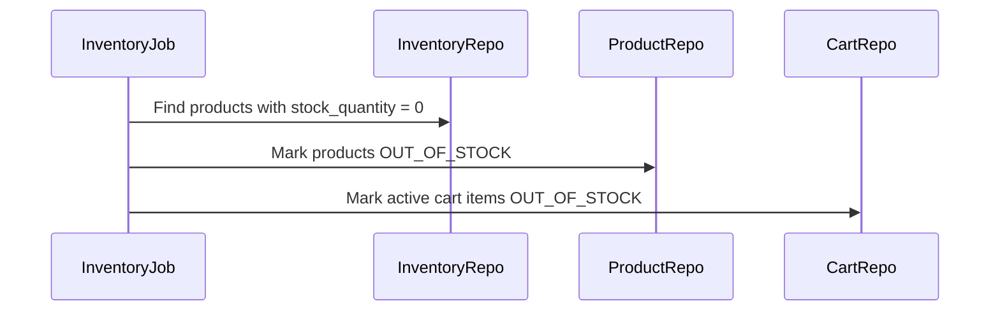

# Inventory Reservation Flow

Inventory Reservation Flow la source-of-truth cho stock locking trong Commerce MVP. Flow nay dam bao checkout khong oversell, payment success khong tru hang lan hai, payment fail/expire/cancel tra stock ve dung, va product/cart status duoc sync theo ton kho.

## 1. Scope

In scope:

- Cap nhat stock quantity.
- Reserve inventory khi checkout.
- Settle reserved inventory khi payment success.
- Release reserved inventory khi payment failed/cancelled/expired/order cancelled.
- Kiem tra low stock.
- Danh dau product out of stock.
- Sync cart item out of stock.

Out of scope:

- Multi-warehouse inventory.
- Batch/lot/serial inventory.
- Refund/return restock phuc tap.
- Seller payout/reconciliation.

## 2. Actors

- Buyer: indirectly triggers reserve/release through checkout/payment/cancel.
- Seller: updates stock quantity.
- System: payment webhook, expiration job, cart sync, product out-of-stock sync.
- Admin: optional inventory repair outside MVP.

## 3. Source Tables

- `product_inventories`
- `products`
- `cart_items`
- `orders`
- `order_items`
- `payments`
- `outbox_events`

## 4. Inventory Fields

`product_inventories.stock_quantity`:

- Available stock that can still be reserved.
- Decreased at checkout.
- Increased when pending reservation is released.

`product_inventories.reserved_quantity`:

- Quantity already taken from available stock but not finalized.
- Increased at checkout.
- Decreased on payment success or release.

`product_inventories.low_stock_threshold`:

- Used for seller/system low stock warning.

## 5. Core Invariants

- `stock_quantity >= 0`.
- `reserved_quantity >= 0`.
- Cart does not reserve stock.
- Checkout reserves stock.
- Payment success settles reservation by decreasing `reserved_quantity` only.
- Payment fail/cancel/expire releases reservation by decreasing `reserved_quantity` and increasing `stock_quantity`.
- Never decrease `stock_quantity` again on payment success.
- Inventory update in checkout must be atomic with order/payment creation.

## 6. Reservation State Machine

This state machine describes inventory quantity for a specific order item reservation.



Product stock status relation:



## 7. Checkout Reserve Flow



Rules:

- Lock all inventory rows for selected products before validation.
- Use deterministic lock ordering by `product_id` to avoid deadlock in multi-item checkout.
- If any product has insufficient stock, reject entire checkout and do not reserve partial stock.
- Reserve and order creation must be in the same transaction.
- If order creation fails after reserve operation, transaction rollback must restore quantities automatically.

SQL-level update pattern can be:

```sql
UPDATE product_inventories
SET stock_quantity = stock_quantity - :quantity,
    reserved_quantity = reserved_quantity + :quantity,
    updated_at = now()
WHERE product_id = :product_id
  AND stock_quantity >= :quantity;
```

Then verify affected row count is 1.

## 8. Payment Success Settle Flow

For payOS success webhook:



Rules:

- Only settle reservation once.
- Payment must transition from `PENDING` to `PAID`.
- If payment already `PAID`, webhook duplicate is no-op.
- `stock_quantity` does not change on success.
- If `reserved_quantity < quantity`, this is data corruption; stop, log error, require manual repair.

For COD:

- Checkout already reserved stock.
- Depending MVP policy, COD order can be considered stock-settled when shipment starts or when order completes.
- Recommended MVP: settle reserved inventory when COD order enters `PROCESSING` or shipment is created, because goods are committed to fulfillment.
- If COD order is cancelled before shipment, release reservation.

## 9. Release Reservation Flow

Release happens on:

- payOS failed.
- payOS cancelled.
- payOS expired.
- Order cancelled before fulfillment.



Rules:

- Release only if reservation is still active.
- Release must be idempotent; do not release twice for same order.
- Recommended implementation: derive release eligibility from order/payment state transition, not from repeated job attempts.
- If any shipment has started (`PICKING_UP`, `READY_TO_SHIP`, `SHIPPED`, `DELIVERED`), normal cancel release is not allowed.

## 10. Seller Stock Update Flow



Rules:

- Seller can update only products of own shop.
- New `stock_quantity` must be >= 0.
- New `low_stock_threshold` must be >= 0.
- Manual stock update should not directly overwrite `reserved_quantity`.
- If `stock_quantity = 0`, product can become `OUT_OF_STOCK`.
- If `stock_quantity > 0` and product was `OUT_OF_STOCK`, product can return to `ACTIVE` if seller/shop/category still valid.

Important:

- If seller reduces stock while reservations exist, the value being updated is available stock, not total physical stock. UI should explain this or expose total/reserved separately to seller.

## 11. Low Stock Flow

Low stock condition:

```text
stock_quantity > 0 AND stock_quantity <= low_stock_threshold
```

System behavior:

- Show warning in seller product/inventory list.
- Optional event `COMMERCE_INVENTORY_LOW_STOCK`.
- Do not auto pause product only because low stock.

## 12. Out Of Stock Sync Flow



Rules:

- Product becomes `OUT_OF_STOCK` when available stock reaches 0.
- Cart items become `OUT_OF_STOCK` if desired quantity > current `stock_quantity`.
- If stock replenished, product can return to `ACTIVE` and cart item can return to `ACTIVE` only if product/shop still valid.

## 13. Cart Sync Rule

Cart item status from inventory:

- If product invalid -> `INVALID_PRODUCT`.
- Else if `stock_quantity < cart_items.quantity` -> `OUT_OF_STOCK`.
- Else if product active and shop active -> `ACTIVE`.

Cart sync must not:

- Reserve stock.
- Create order.
- Release stock.

## 14. Transaction And Locking

Use transaction and row lock for:

- Checkout reserve.
- Payment success settle.
- Payment/order failure release.
- Manual inventory update if it can race with checkout.

Recommended lock strategy:

- Lock inventory rows by sorted `product_id`.
- Lock payment/order row before inventory release/settle to ensure state transition is single-writer.
- Use affected-row conditional updates for stock check when possible.

## 15. Idempotency And Failure Handling

Duplicate payment success webhook:

- Payment already `PAID` -> do not settle again.

Duplicate expiration job:

- Payment/order already terminal -> no-op.

Checkout retry:

- Use client idempotency key to avoid duplicate order and duplicate reservation.

Partial failure:

- Reserve and order creation in same DB transaction prevents partial reservation.
- External provider failure after checkout does not rollback order; payment remains pending and can be retried/expired.

Data corruption indicators:

- `reserved_quantity < 0`.
- `stock_quantity < 0`.
- Releasing an order with no active reservation.
- Settling a payment already terminal.

These should log error and require admin/system repair.

## 16. Events

Recommended outbox events:

- `COMMERCE_INVENTORY_RESERVED`
- `COMMERCE_INVENTORY_SETTLED`
- `COMMERCE_INVENTORY_RELEASED`
- `COMMERCE_INVENTORY_LOW_STOCK`
- `COMMERCE_PRODUCT_OUT_OF_STOCK`
- `COMMERCE_PRODUCT_RESTOCKED`

Event key examples:

- `inventory:{order_id}:reserved`
- `inventory:{order_id}:released`
- `inventory:{product_id}:low-stock`

## 17. Acceptance Criteria

- Checkout cannot oversell stock under concurrent requests.
- Cart operations never change inventory quantities.
- Checkout atomically moves stock from `stock_quantity` to `reserved_quantity`.
- Payment success decreases only `reserved_quantity`.
- Payment failure/cancel/expire increases `stock_quantity` and decreases `reserved_quantity`.
- Duplicate webhook/job does not double-settle or double-release stock.
- Product/cart out-of-stock status reflects current available stock.

