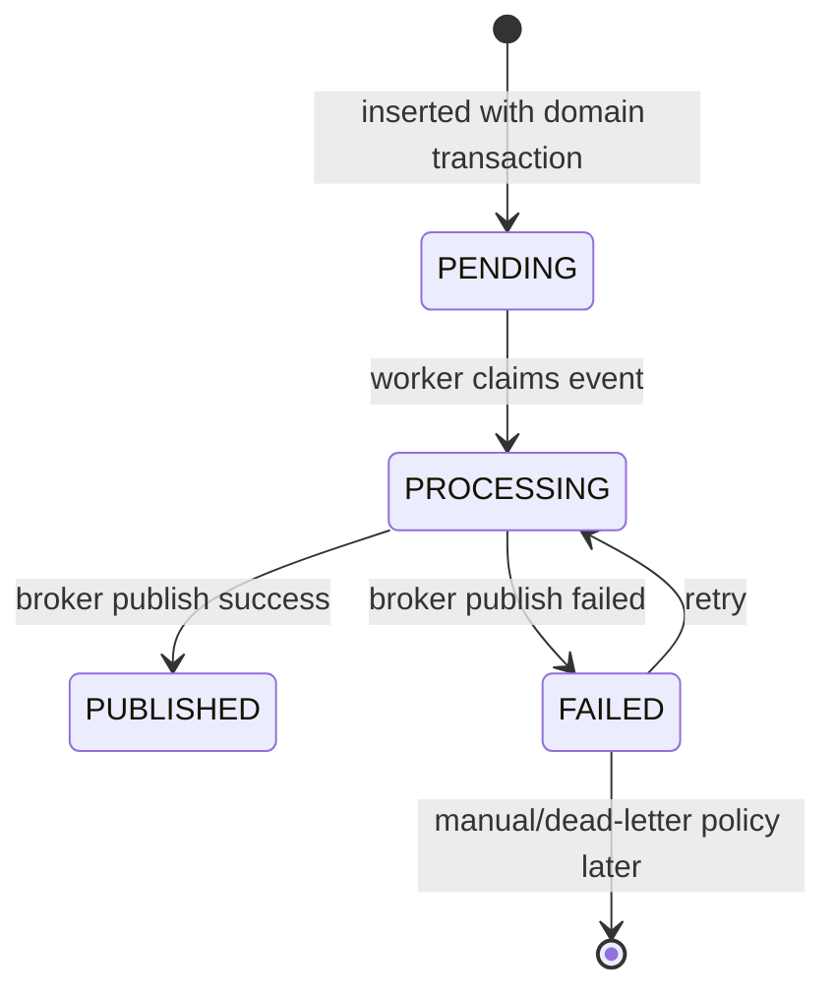
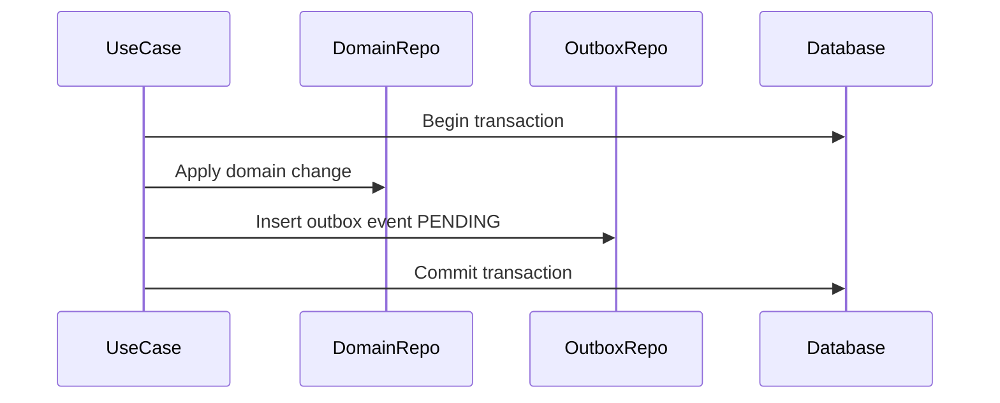
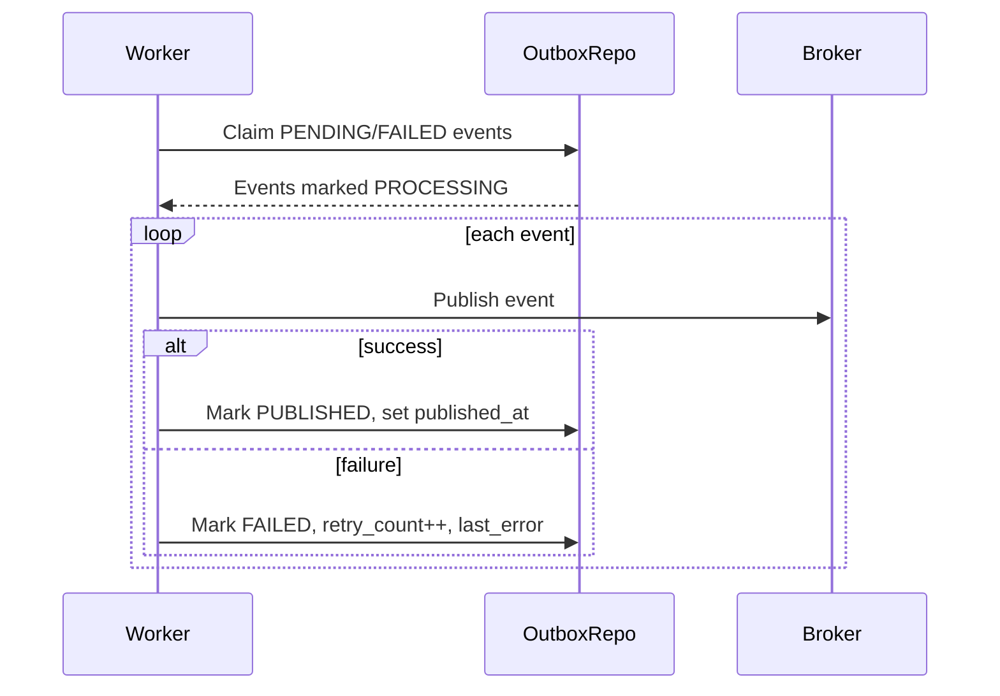

# Outbox Event Flow

Outbox Event Flow mo ta cach Commerce Service publish domain events an toan theo Outbox Pattern. Moi event publish ra broker phai duoc ghi vao `outbox_events` trong cung transaction voi domain change, sau do background worker moi publish. Muc tieu la khong mat event khi DB commit thanh cong nhung broker/API gap loi.

## 1. Scope

In scope:

- Ghi outbox event trong transaction domain.
- Poll pending/failed events.
- Publish event ra message broker.
- Retry failed publish.
- Dam bao idempotency qua `event_key`.
- Quan ly status `PENDING`, `PROCESSING`, `PUBLISHED`, `FAILED`.

Out of scope:

- Consumer implementation cua service khac.
- Kafka/RabbitMQ topic infrastructure chi tiet.
- Dead-letter queue policy nang cao.

## 2. Actors

- Application use cases: checkout, payment, shipment, product, review, moderation.
- Outbox worker: poll va publish events.
- Message broker: Kafka/RabbitMQ/etc.
- Consumer services: Notification, Admin, Analytics, future services.

## 3. Source Table

`outbox_events`:

- `id`
- `event_type`
- `event_key`
- `aggregate_id`
- `source`
- `payload`
- `status`
- `retry_count`
- `last_error`
- `created_at`
- `published_at`

## 4. Core Invariants

- Domain change and outbox insert must be atomic.
- Never publish event directly from controller/use case before DB commit.
- Outbox worker is the only component that publishes to broker.
- Event payload must be self-contained enough for consumers.
- `event_key` should be deterministic for idempotency.
- Publishing is at-least-once; consumers must be idempotent.

## 5. Outbox State Machine



## 6. Write Event With Domain Change Flow



Rules:

- Use case writes event only after domain rule passes.
- If transaction rolls back, event rolls back too.
- Event should include the final committed domain state or enough identifiers to fetch it.
- Do not call broker inside this transaction.

## 7. Event Payload Standard

Recommended envelope:

```json
{
  "event_id": "uuid",
  "event_type": "COMMERCE_ORDER_CREATED",
  "event_key": "order:{order_id}:created",
  "aggregate_id": "uuid",
  "source": "commerce",
  "occurred_at": "2026-05-20T00:00:00Z",
  "payload": {}
}
```

Required fields:

- `event_id`: same as `outbox_events.id`.
- `event_type`: stable uppercase event type.
- `event_key`: deterministic idempotency key.
- `aggregate_id`: aggregate root id.
- `source`: `commerce`, `payment`, or `shipment`.
- `occurred_at`: event creation time.
- `payload`: domain-specific data.

## 8. Event Key Rules

Event key should be deterministic for events that must not duplicate:

- `order:{order_id}:created`
- `order:{order_id}:cancelled`
- `payment:{payment_id}:paid`
- `payment:{payment_id}:expired`
- `shipment:{shipment_id}:created`
- `shipment:{shipment_id}:status:{new_status}`
- `inventory:{order_id}:reserved`
- `inventory:{order_id}:released`
- `review:{review_id}:created`

If same event may occur multiple times naturally, include version/timestamp/state transition id.

## 9. Publish Worker Flow



Claim query should:

- Select limited batch.
- Prefer oldest `created_at`.
- Use row lock / `SKIP LOCKED`.
- Set status `PROCESSING` before publish.

## 10. Retry Policy

Recommended:

- Retry failed events with exponential backoff.
- Keep `retry_count`.
- Store `last_error`.
- Stop retry after max retry threshold only if dead-letter/manual handling exists.
- Alert when `FAILED` count grows.

Retryable failures:

- Broker unavailable.
- Network timeout.
- Serialization temporary issue if code fixed later.

Non-retryable failures:

- Invalid payload schema due code bug; still keep `FAILED` for manual/code fix and retry after deploy.

## 11. Topic Naming Guidance

Workspace rule suggests Kafka topic style `{service}.{domain}.{action}`.

Suggested topics:

- `commerce.order.created`
- `commerce.order.cancelled`
- `commerce.order.completed`
- `commerce.payment.paid`
- `commerce.payment.failed`
- `commerce.payment.expired`
- `commerce.shipment.created`
- `commerce.shipment.status_changed`
- `commerce.inventory.reserved`
- `commerce.inventory.released`
- `commerce.product.published`
- `commerce.product.removed`
- `commerce.review.created`

Event type stays uppercase in payload:

- `COMMERCE_ORDER_CREATED`
- `COMMERCE_PAYMENT_PAID`
- etc.

## 12. Commerce Event Catalog

Order:

- `COMMERCE_ORDER_CREATED`
- `COMMERCE_ORDER_CANCELLED`
- `COMMERCE_ORDER_COMPLETED`
- `COMMERCE_ORDER_READY_FOR_PROCESSING`

Payment:

- `COMMERCE_PAYMENT_CREATED`
- `COMMERCE_PAYMENT_PAID`
- `COMMERCE_PAYMENT_FAILED`
- `COMMERCE_PAYMENT_CANCELLED`
- `COMMERCE_PAYMENT_EXPIRED`

Shipment:

- `COMMERCE_SHIPMENT_CREATED`
- `COMMERCE_SHIPMENT_STATUS_CHANGED`
- `COMMERCE_SHIPMENT_DELIVERED`
- `COMMERCE_SHIPMENT_FAILED`

Inventory:

- `COMMERCE_INVENTORY_RESERVED`
- `COMMERCE_INVENTORY_SETTLED`
- `COMMERCE_INVENTORY_RELEASED`
- `COMMERCE_INVENTORY_LOW_STOCK`

Product/shop/review:

- `COMMERCE_PRODUCT_PUBLISHED`
- `COMMERCE_PRODUCT_REMOVED`
- `COMMERCE_SHOP_SUSPENDED`
- `COMMERCE_REVIEW_CREATED`
- `COMMERCE_REVIEW_HIDDEN`

## 13. Transaction Examples

Checkout transaction:

1. Reserve inventory.
2. Create order/order items/payment.
3. Insert:
   - `COMMERCE_ORDER_CREATED`
   - `COMMERCE_PAYMENT_CREATED`
   - `COMMERCE_INVENTORY_RESERVED`
4. Commit.

Payment success transaction:

1. Mark payment `PAID`.
2. Mark order `PROCESSING`.
3. Settle reserved inventory.
4. Insert:
   - `COMMERCE_PAYMENT_PAID`
   - `COMMERCE_ORDER_READY_FOR_PROCESSING`
   - `COMMERCE_INVENTORY_SETTLED`
5. Commit.

Shipment delivered transaction:

1. Mark shipment `DELIVERED`.
2. Mark order items `DELIVERED`.
3. Insert:
   - `COMMERCE_SHIPMENT_STATUS_CHANGED`
   - `COMMERCE_SHIPMENT_DELIVERED`
4. Commit.

## 14. Idempotency And Consumer Safety

Producer side:

- Use unique `event_key` where possible.
- Do not insert duplicate event for same transition.
- If duplicate insert happens due retry, unique constraint should protect.

Consumer side expectation:

- Consumers should deduplicate by `event_id` or `event_key`.
- Events are at-least-once, not exactly-once.
- Event ordering is not guaranteed across aggregates.

## 15. Error Handling

If publish fails:

- Mark event `FAILED`.
- Increment `retry_count`.
- Store `last_error`.
- Do not rollback the original domain transaction; it has already committed.

If worker crashes after broker publish but before marking `PUBLISHED`:

- Event remains `PROCESSING`.
- Recovery job should reset stale `PROCESSING` to `FAILED` or `PENDING`.
- Republish can duplicate event; consumer idempotency handles it.

Stale processing recovery:

- Find `PROCESSING` events older than configured timeout.
- Mark `FAILED` with `last_error = stale processing timeout`.
- Worker retries later.

## 16. Observability

Metrics:

- outbox pending count.
- outbox failed count.
- publish latency from `created_at` to `published_at`.
- retry count distribution.
- broker publish failure rate.

Logs:

- event id/key/type.
- aggregate id.
- status transition.
- broker error.

Do not log sensitive payment payload fields if provider response contains secrets.

## 17. Acceptance Criteria

- Every external domain event is inserted through `outbox_events`.
- Domain mutation and event insert are atomic.
- Worker publishes pending events and marks them published.
- Failed publish is retried without losing event.
- Duplicate publish is tolerated through event id/key.
- Stale processing events can recover.
- Event topic/type naming is consistent with Commerce domain.

