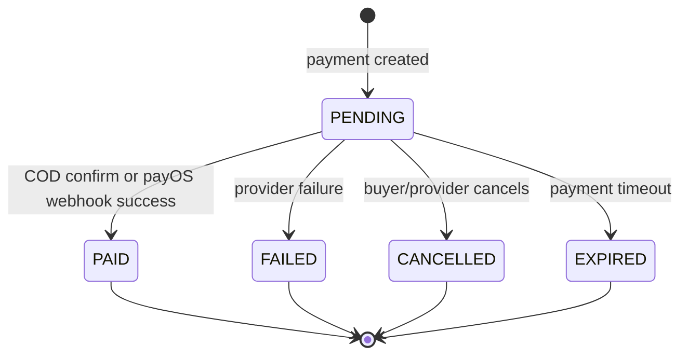
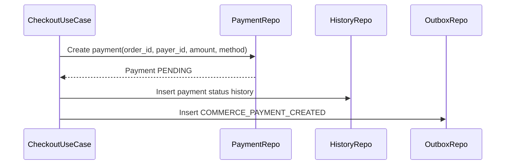
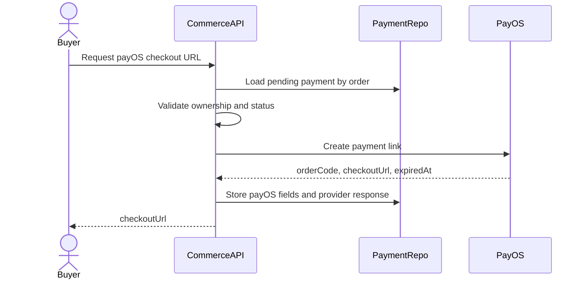
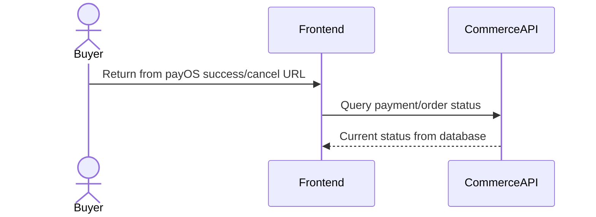
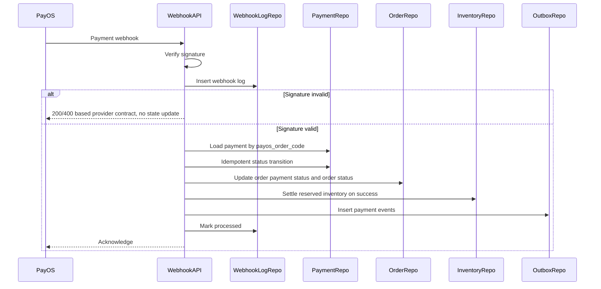
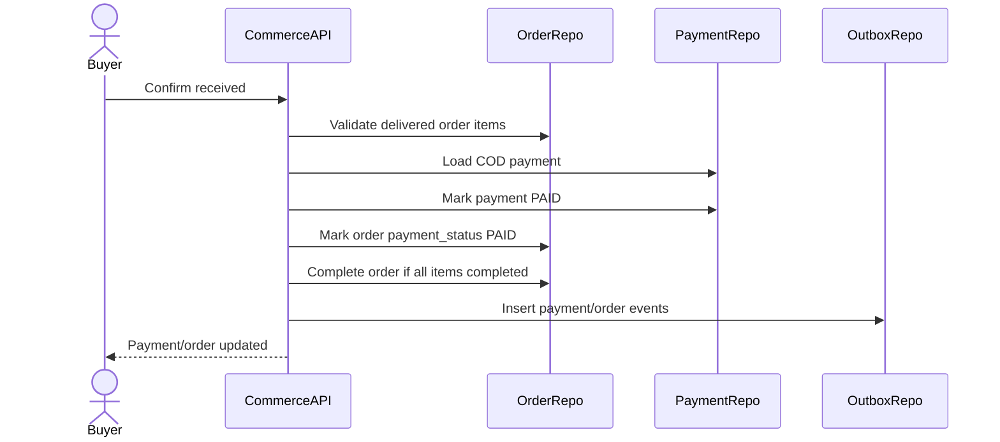
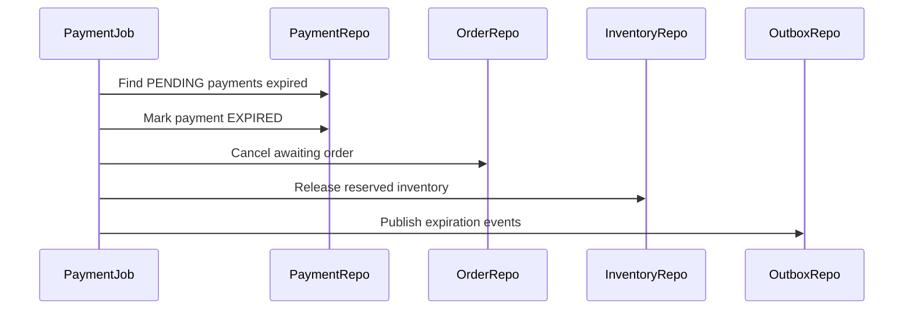
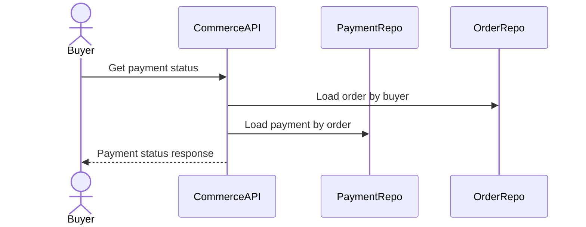

# Payment Lifecycle Flow

Payment Lifecycle mo ta cach Commerce Service xu ly thanh toan COD va payOS trong MVP. Commerce Service own bang `payments`, `payment_webhook_logs`, `payment_status_history` va cap nhat `orders.payment_status`. Payment khong la service rieng trong MVP.

## 1. Scope

In scope:

- Tao payment cho order.
- Thanh toan COD.
- Tao payOS checkout URL.
- Xu ly redirect success/cancel tu payOS.
- Xu ly payOS webhook.
- Kiem tra trang thai thanh toan.
- Expire payment pending.
- Cap nhat order/payment status.
- Release/settle reserved inventory theo payment result.

Out of scope:

- Refund/dispute day du.
- Seller payout thuc te.
- Reconciliation nang cao voi provider.
- Multi-payment per order.

## 2. Actors

- Buyer: chon payment method, thanh toan online, xem payment status.
- System: expire pending payment, process webhook, retry failed callback.
- payOS: external payment provider.
- Seller: khong thao tac payment truc tiep trong MVP.

## 3. Source Tables

- `orders`
- `order_items`
- `payments`
- `payment_webhook_logs`
- `payment_status_history`
- `product_inventories`
- `outbox_events`

## 4. Payment Invariants

- Moi order co mot payment.
- `payments.order_id` unique.
- Payment amount phai bang `orders.final_amount` tai thoi diem tao payment.
- Payment status va `orders.payment_status` phai dong bo theo domain transition.
- payOS webhook phai verify signature truoc khi update state.
- Webhook processing phai idempotent.
- Payment failed/cancelled/expired phai release reserved inventory neu stock dang reserved.
- Payment success voi payOS release reserved quantity theo rule: stock da tru khi checkout, success chi giam `reserved_quantity`.

## 5. Payment Method Rules

### COD

COD means buyer pays when goods are delivered.

Initial state:

- `payments.payment_method = COD`.
- `payments.status = PENDING`.
- `orders.payment_status = PENDING`.
- Shipment later has `cod_amount = orders.final_amount`.

Paid condition:

- Shipment/order item delivered.
- Buyer confirms received, or system auto-completes after configured window if policy allows.

Effects when paid:

- `payments.status = PAID`.
- `orders.payment_status = PAID`.
- Order can become `COMPLETED` if all order items are completed.

### payOS

payOS means buyer pays online before seller ships.

Initial state:

- `payments.payment_method = PAYOS`.
- `payments.status = PENDING`.
- `orders.payment_status = PENDING`.
- `orders.status = AWAITING_PAYMENT`.

Payment link:

- Commerce calls payOS create payment link.
- Store `payos_order_code`, `payos_checkout_url`, `checkout_url_expired_at`, `provider_response`.

Paid condition:

- Valid payOS webhook success.

Effects when paid:

- `payments.status = PAID`.
- `orders.payment_status = PAID`.
- `orders.status = PROCESSING`.
- `product_inventories.reserved_quantity -= quantity`.
- Publish payment/order events.

## 6. Payment State Machine

Only `PENDING` payment should transition in MVP. Terminal statuses should not change except via explicit admin repair/reconciliation flow outside MVP.

## 7. Create Payment Flow

Payment is usually created inside checkout transaction.

Rules:

- Payment amount must be > 0.
- Currency default `VND`.
- Method must match `orders.payment_method`.
- `payer_id` must equal order buyer.
- `idempotency_key` should be stored when client provides one.

## 8. payOS Checkout URL Flow

Rules:

- Buyer can request checkout URL only for own order.
- Order must be `AWAITING_PAYMENT`.
- Payment must be `PENDING`.
- If a valid non-expired checkout URL already exists, return existing URL instead of creating a duplicate.
- External request should use idempotency key if payOS/provider supports it.
- If provider call fails, keep payment `PENDING` and allow retry.

Failure cases:

- Payment not found -> 404.
- Payment not pending -> 409.
- Provider unavailable -> 502/503.
- Provider returns invalid payload -> 502 and store error if useful.

## 9. payOS Redirect Flow

Redirect is browser/user-facing and should not be trusted as final source of truth.

Rules:

- Redirect success does not directly mark payment `PAID`.
- Redirect cancel does not directly mark payment `CANCELLED` unless provider/webhook/API verification confirms.
- Frontend should call payment status API and show waiting state if webhook has not arrived.

## 10. payOS Webhook Flow

Webhook processing steps:

1. Receive raw payload and headers.
2. Verify signature.
3. Insert `payment_webhook_logs` with `signature_valid`.
4. If signature invalid, do not update domain state.
5. Resolve payment by `payos_order_code`.
6. If payment already terminal, treat duplicate webhook as processed/no-op.
7. Map event type to target payment status.
8. Update payment, order payment status, order status if needed.
9. Update inventory reservation if needed.
10. Write `payment_status_history`.
11. Write outbox events.
12. Mark webhook log processed.

Idempotency:

- `payment_webhook_logs` has unique `(provider, payos_order_code, event_type)`.
- If duplicate insert conflicts, load existing log and avoid duplicate state changes.
- Payment terminal status prevents double inventory release/settlement.

## 11. payOS Event Mapping

Recommended mapping:

| payOS event | Payment status | Order effect | Inventory effect |
|---|---|---|---|
| `PAYMENT_SUCCESS` | `PAID` | `orders.payment_status = PAID`, `orders.status = PROCESSING` | `reserved_quantity -= quantity` |
| `PAYMENT_FAILED` | `FAILED` | cancel order if still awaiting payment | release reserved stock |
| `PAYMENT_CANCELLED` | `CANCELLED` | cancel order if still awaiting payment | release reserved stock |
| Expiration job | `EXPIRED` | cancel order if still awaiting payment | release reserved stock |

If provider event names differ, map them in infrastructure layer and keep domain event names stable.

## 12. COD Payment Flow

Rules:

- COD payment can become `PAID` only after delivery confirmation or auto-completion policy.
- Buyer must own order.
- Shipment/order item must be `DELIVERED` before confirm.
- COD shipment `cod_amount` must equal order final amount according to MVP policy.

## 13. Payment Expiration Flow

Steps:

1. Find `payments.status = PENDING` and `expired_at < now`.
2. Lock payment/order rows.
3. If payment still pending, set `EXPIRED`.
4. If order is `CREATED/AWAITING_PAYMENT`, set `CANCELLED`.
5. Release reserved inventory.
6. Write status history.
7. Insert outbox events.

Rules:

- Do not expire COD payment just because it is old; COD pending can last until delivery/confirm.
- Expiration mainly applies to payOS checkout links/orders awaiting online payment.

## 14. View Payment Status Flow

Response should include:

- `payment_id`
- `order_id`
- `payment_method`
- `amount`
- `currency`
- `status`
- `paid_at`
- `expired_at`
- `payos_checkout_url` only if payment pending and URL still valid
- `order_status`
- `order_payment_status`

Security:

- Buyer can view only own payment.
- Seller should not see buyer payment provider details, only fulfillment-safe payment summary.

## 15. Transaction And Consistency

Write flows needing transaction:

- Create payment.
- Store payOS checkout URL/provider response.
- Process webhook.
- Expire payment.
- Mark COD payment paid.

Webhook transaction should include:

- Payment update.
- Order update.
- Inventory settlement/release.
- Status history insert.
- Webhook log processed update.
- Outbox insert.

Do not:

- Mark payment paid from redirect alone.
- Release inventory twice.
- Decrease `stock_quantity` on payment success because checkout already did it.
- Create shipment for payOS order before payment success.

## 16. Events

Outbox events:

- `COMMERCE_PAYMENT_CREATED`
- `COMMERCE_PAYMENT_PAID`
- `COMMERCE_PAYMENT_FAILED`
- `COMMERCE_PAYMENT_CANCELLED`
- `COMMERCE_PAYMENT_EXPIRED`
- `COMMERCE_ORDER_READY_FOR_PROCESSING`
- `COMMERCE_INVENTORY_RELEASED`

Event key examples:

- `payment:{payment_id}:created`
- `payment:{payment_id}:paid`
- `payment:{payment_id}:expired`

## 17. Failure Handling

Provider call failure:

- Keep payment `PENDING`.
- Return retryable error.
- Store provider error if available.

Invalid webhook signature:

- Log payload with `signature_valid = false`.
- Do not update payment/order/inventory.
- Do not publish event.

Payment not found for webhook:

- Log webhook.
- Mark unprocessed or processed with error note if schema supports later.
- Return acknowledgement according to payOS retry contract.

Duplicate webhook:

- No-op if payment already terminal with same status.
- Do not duplicate status history unless useful for audit.
- Do not duplicate outbox event.

Race: expiration vs success webhook:

- Lock payment row.
- First terminal transition wins.
- If success arrives after expired, handle by reconciliation policy; MVP should log warning and avoid automatic reversal.

## 18. Acceptance Criteria

- payOS checkout URL is created only for buyer's own pending payOS payment.
- Redirect never directly marks payment paid.
- Valid payOS success webhook marks payment paid, order processing, and settles reserved inventory.
- Failed/cancelled/expired payOS payment cancels awaiting order and releases reserved stock.
- COD payment becomes paid only after delivery confirmation or auto-complete policy.
- Webhook processing is idempotent and signature-protected.
- Payment/order status history and outbox events are written with domain transitions.

