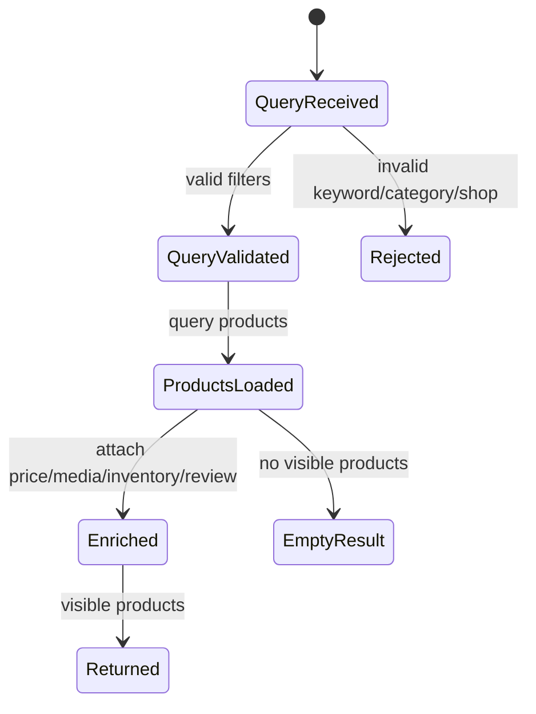
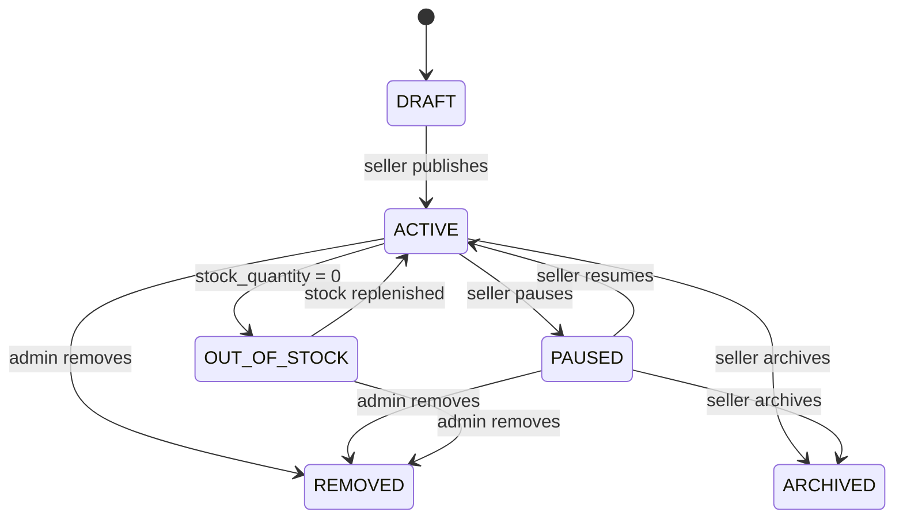
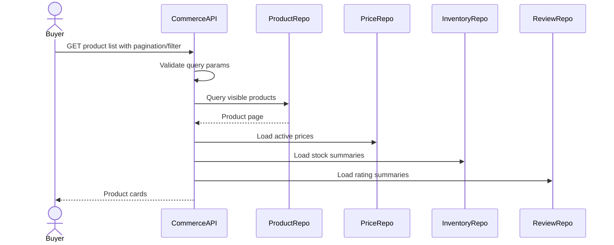
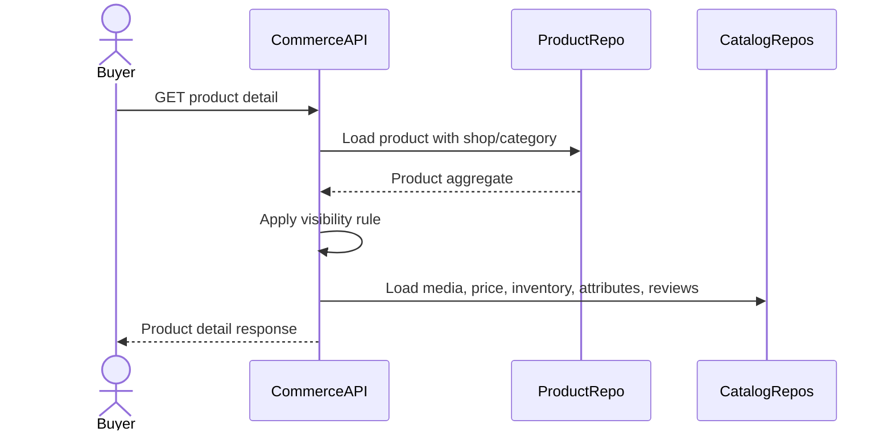

# Product Discovery Flow

Product Discovery la nhom flow cho buyer xem, tim kiem, loc va doc thong tin san pham truoc khi them vao cart hoac checkout. Flow nay la read-heavy, khong thay doi stock/order/payment, nhung phai ton trong product status, shop status, category status, price validity va inventory visibility.

## 1. Scope

In scope:

- Xem danh sach san pham.
- Xem chi tiet san pham.
- Tim kiem san pham theo keyword.
- Loc san pham theo category.
- Xem san pham theo shop.
- Xem gia active, sale price, ton kho kha dung, attributes, media va review summary.

Out of scope:

- Add to cart.
- Checkout.
- Personalized recommendation.
- Search engine nang cao ngoai PostgreSQL/basic query trong MVP.

## 2. Actors

- Buyer: nguoi xem/search/filter product.
- Guest: co the xem discovery neu product public, tuy API policy; MVP uu tien Buyer da dang nhap.
- Seller: co the xem danh sach product cua shop minh qua Seller Product Management, khong nam trong buyer discovery flow.
- System: tinh rating summary, sync product status, cap nhat out-of-stock.

## 3. Source Tables

- `products`
- `product_categories`
- `product_media`
- `product_prices`
- `product_inventories`
- `product_attributes`
- `seller_shops`
- `shop_settings`
- `reviews`
- `review_media`
- `review_replies`

## 4. Product Visibility Rule

Mot product duoc hien thi trong buyer discovery khi:

- `products.status IN (ACTIVE, OUT_OF_STOCK)`.
- `seller_shops.status = ACTIVE`.
- `product_categories.is_active = true`.
- Product khong bi admin remove.
- Shop khong bi suspend/closed.

Mac dinh MVP:

- `ACTIVE`: hien thi va co the mua neu stock du.
- `OUT_OF_STOCK`: co the hien thi nhung khong add cart/checkout duoc.
- `DRAFT`, `PAUSED`, `ARCHIVED`, `REMOVED`: khong hien thi trong buyer discovery.

Vacation mode policy:

- Neu `shop_settings.is_vacation = true`, product van co the hien thi de buyer xem.
- Add cart/checkout co the bi chan o flow cart/checkout.
- Response nen include `shop_vacation = true` va `vacation_message` de frontend hien thi.

## 5. Price Selection Rule

Active price cua product la record trong `product_prices` thoa:

- `start_at <= now`.
- `end_at IS NULL OR end_at > now`.
- Neu nhieu record hop le do data issue, chon record co `start_at` moi nhat va log warning.

Displayed price:

- `price`: gia goc.
- `sale_price`: gia sale neu khac null va `sale_price <= price`.
- `effective_price`: `sale_price` neu co, nguoc lai `price`.

Product khong co active price:

- Khong nen hien trong listing buyer discovery.
- Detail API co the tra 409/422 business error hoac hide product tuy policy; MVP nen hide khoi listing va tra product unavailable trong detail.

## 6. Inventory Visibility Rule

Inventory visible cho buyer:

- `stock_quantity > 0`: con hang.
- `stock_quantity = 0`: out of stock.
- `reserved_quantity` khong nen hien raw cho buyer.

Buyer-facing field nen la:

- `in_stock`: boolean.
- `available_quantity`: co the tra so luong neu product policy cho phep; neu khong, chi tra `in_stock`.
- `low_stock`: true neu `stock_quantity <= low_stock_threshold` va `stock_quantity > 0`.

## 7. State Machine

Discovery khong doi state truc tiep, nhung doc product theo lifecycle:

Product lifecycle lien quan:

## 8. Product List Flow

Steps:

1. Receive pagination, keyword, category, shop, sort params.
2. Validate limit, cursor/page, category id/slug, shop id.
3. Apply visibility rule.
4. Query product page.
5. Enrich each product with main media, active price, inventory summary, shop info, rating summary.
6. Return stable pagination metadata.

Default sorting:

- Newest first: `products.created_at DESC`.
- Optional MVP sort: price ascending/descending using active effective price.

Failure cases:

- Invalid pagination -> 400.
- Invalid category/shop id format -> 400.
- Category/shop not found -> empty list or 404 depending endpoint.
- DB timeout -> 500.

## 9. Product Detail Flow

Steps:

1. Load product by id/slug.
2. Check product exists.
3. Check buyer visibility.
4. Load media ordered by `sort_order`.
5. Load active price.
6. Load inventory summary.
7. Load attributes.
8. Load visible reviews and seller replies with pagination.
9. Return product detail.

Failure cases:

- Product not found -> 404.
- Product exists but not visible to buyer -> 404 or 403; MVP should use 404 to avoid leaking removed/private data.
- Product has no active price -> return unavailable state.

## 10. Search Flow

Search MVP co the dung PostgreSQL query tren `products.title`, `products.description`, category/shop context.

Steps:

1. Normalize keyword: trim, collapse spaces, lowercase if needed.
2. Reject empty keyword.
3. Apply visibility rule.
4. Query product title/description and optional attribute/category matching.
5. Enrich response like product list.

Business rules:

- Keyword rong hoac qua ngan -> 400.
- Search khong duoc tra product removed/paused/draft.
- Search should be read-only; khong fail request neu analytics/search-history sau nay loi.

## 11. Category Filter Flow

Steps:

1. Load category by id/slug.
2. Check `is_active = true`.
3. If category has children, include descendants by `path` or recursive category ids.
4. Query visible products in category subtree.
5. Return product cards.

Rules:

- Inactive category khong tra product trong buyer discovery.
- Parent category filter nen include child categories neu `path` da ho tro.

## 12. Shop Products Flow

Steps:

1. Load shop by id.
2. Check shop `ACTIVE`.
3. Query visible products by `shop_id`.
4. Include shop public summary and vacation info.

Failure cases:

- Shop not found -> 404.
- Shop suspended/closed -> 404 for buyer discovery.

## 13. API Response Shape Guidance

Product card should include:

- `product_id`
- `title`
- `thumbnail_url`
- `shop_id`
- `shop_name`
- `category_id`
- `condition`
- `status`
- `price`
- `sale_price`
- `effective_price`
- `in_stock`
- `low_stock`
- `rating_avg`
- `rating_count`

Product detail should additionally include:

- `description`
- `weight_gram`
- `media`
- `attributes`
- `inventory_summary`
- `reviews`
- `shop_vacation`
- `vacation_message`

## 14. Transaction And Consistency

- Product discovery is read-only.
- No transaction required unless repository pattern mandates read-only transaction.
- Do not lock inventory rows in discovery.
- Do not mutate cart item status here; cart sync belongs to cart lifecycle/background jobs.
- Data can be eventually stale between discovery and checkout. Checkout must revalidate everything.

## 15. Events

No required domain event for normal product discovery MVP.

Optional future events:

- `COMMERCE_PRODUCT_VIEWED`
- `COMMERCE_PRODUCT_SEARCHED`

If implemented, publish through outbox or analytics pipeline without blocking the response.

## 16. Acceptance Criteria

- Buyer sees only visible products.
- Product listing includes active price and stock summary.
- Product detail includes media, attributes, inventory summary and visible reviews.
- `DRAFT`, `PAUSED`, `ARCHIVED`, `REMOVED` never appear in buyer discovery.
- `OUT_OF_STOCK` can appear but is clearly marked not purchasable.
- Checkout still revalidates product, price, shop and stock even if discovery said available.

