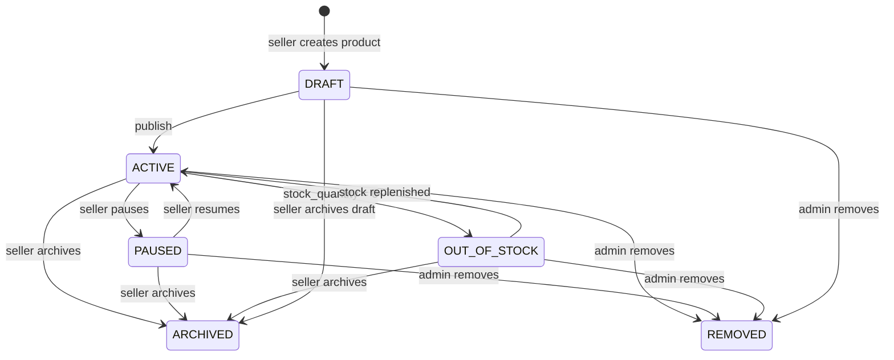
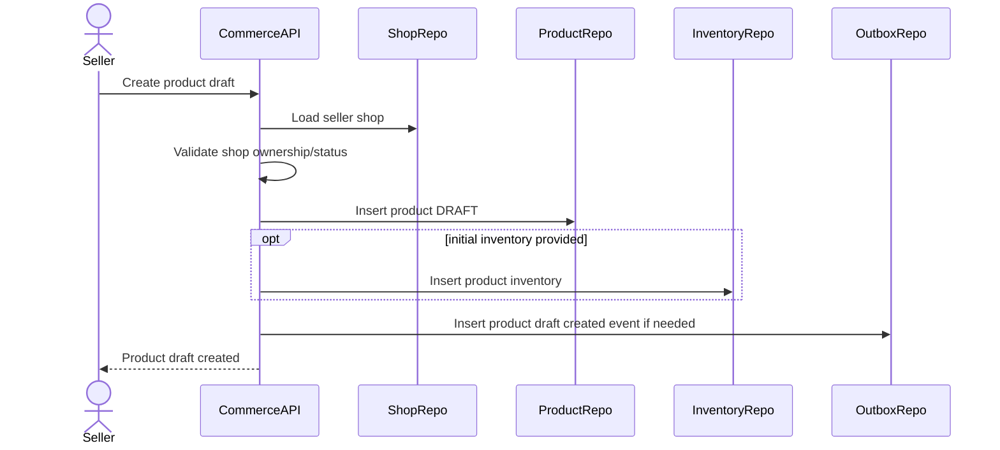
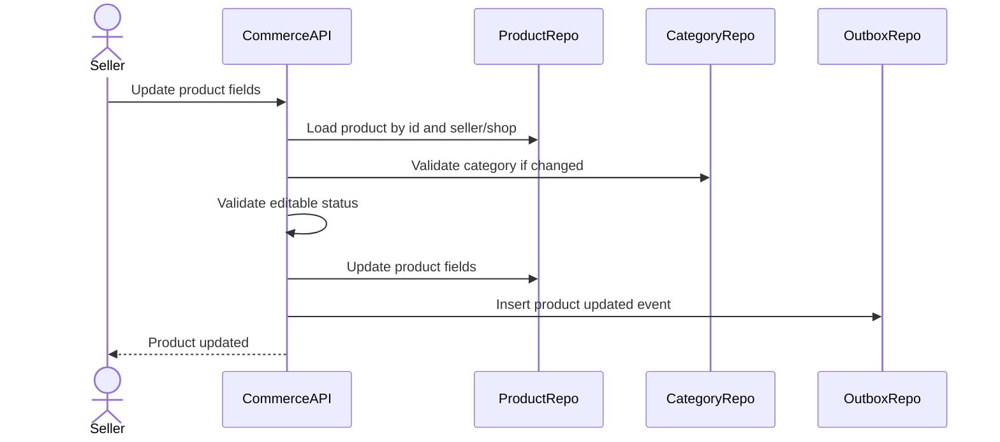
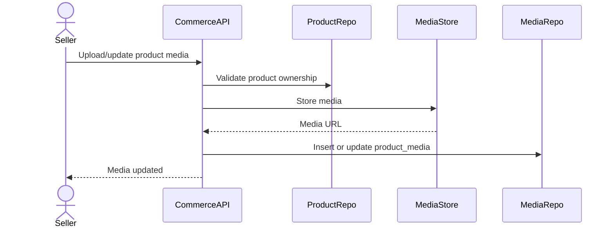
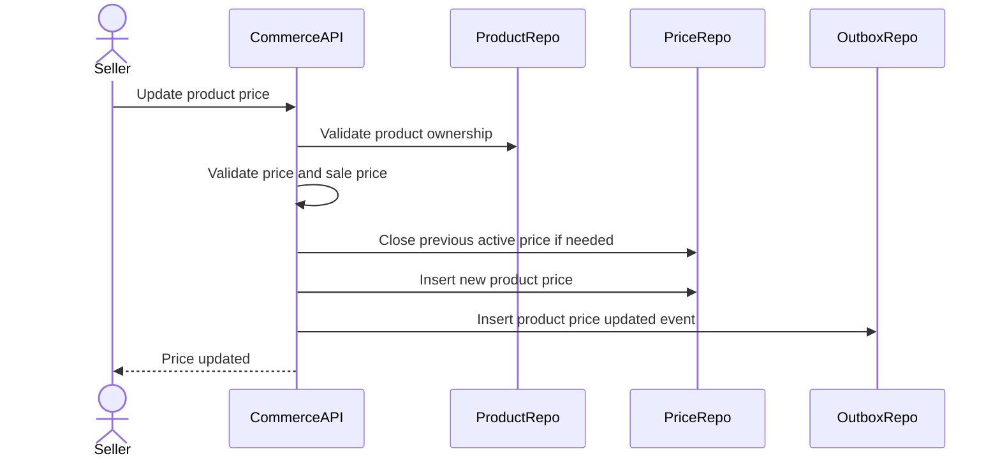
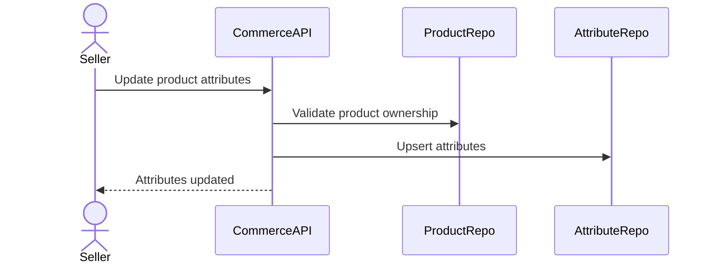
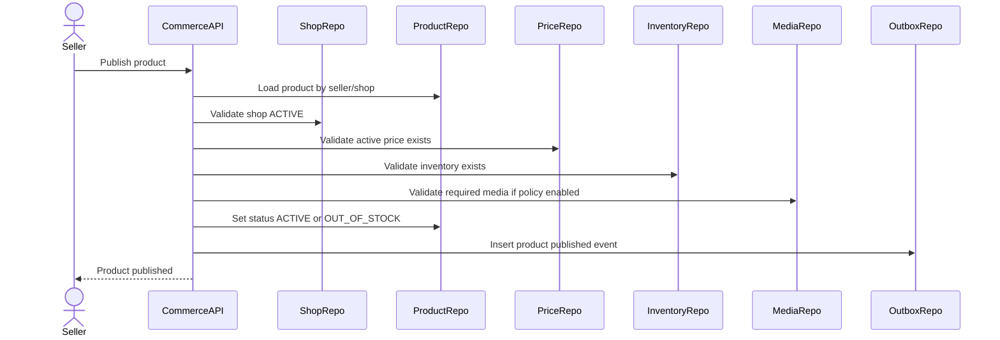
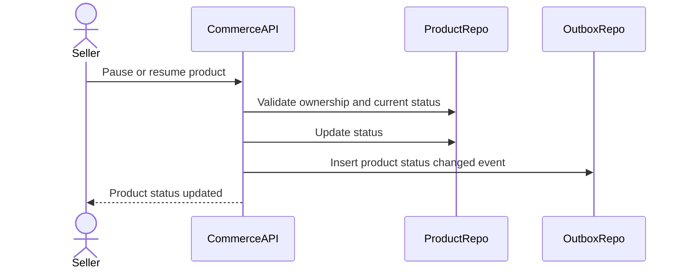
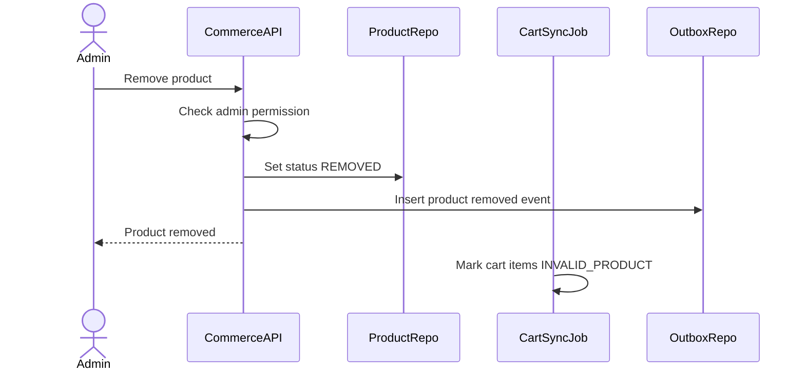

# Product Management Flow

Product Management mo ta cach seller tao, cap nhat, publish, pause, archive va quan ly product catalog cua shop. Product Management la seller-facing flow, khac voi Product Discovery la buyer-facing read flow. Moi thay doi product phai ton trong shop ownership, category validity, price/inventory readiness va moderation status.

## 1. Scope

In scope:

- Tao product draft.
- Cap nhat product core fields.
- Cap nhat category.
- Cap nhat media.
- Cap nhat price/sale price.
- Cap nhat attributes.
- Cap nhat inventory qua inventory flow.
- Publish product.
- Pause/resume product.
- Archive product.
- Admin remove product.
- Xem danh sach product cua shop.

Out of scope:

- Variant/SKU matrix phuc tap.
- Brand management chi tiet.
- Bulk import.
- Product approval workflow nang cao.
- Search indexing pipeline rieng.

## 2. Actors

- Seller: quan ly product cua shop minh.
- Admin: remove product vi pham.
- System: sync out-of-stock status, cart invalidation, outbox publish.
- Buyer: khong nam trong management flow, xem qua discovery.

## 3. Source Tables

- `products`
- `product_categories`
- `product_media`
- `product_prices`
- `product_attributes`
- `product_inventories`
- `seller_shops`
- `shop_settings`
- `cart_items`
- `outbox_events`

## 4. Product Invariants

- Product belongs to one seller shop.
- Seller can manage only products of own shop.
- Product must have active shop to be published.
- Product must have active category to be published.
- Product must have valid price to be purchasable.
- Product must have inventory record to be purchasable.
- Product `REMOVED` by admin should not be seller-restorable.
- Product `ARCHIVED` is seller soft delete and not buyer-visible.
- Buyer checkout must revalidate product status live.

## 5. Product State Machine

Status meaning:

- `DRAFT`: seller dang soan, chua ban.
- `ACTIVE`: buyer co the xem va mua neu stock du.
- `OUT_OF_STOCK`: het hang, co the hien thi nhung khong mua.
- `PAUSED`: seller tam dung ban.
- `ARCHIVED`: seller ngung ban/soft delete.
- `REMOVED`: admin remove do vi pham.

## 6. Create Product Draft Flow

Rules:

- Seller must have shop.
- Shop cannot be `SUSPENDED` or `CLOSED` for new product creation.
- Product starts as `DRAFT`.
- Required minimal draft fields can be looser than publish fields.
- `seller_id` and `shop_id` are derived from authenticated seller/shop, not client trust.

## 7. Update Product Core Flow

Editable fields:

- `product_type`
- `category_id`
- `brand_id`
- `condition`
- `title`
- `description`
- `weight_gram`

Rules:

- Seller can update `DRAFT`, `ACTIVE`, `OUT_OF_STOCK`, `PAUSED`.
- Seller should not update `REMOVED`.
- Updating `ARCHIVED` can be blocked; MVP recommended block except maybe restore flow.
- `weight_gram > 0`.
- Category must exist and be active if product is or will be active.

## 8. Media Management Flow

Rules:

- Seller can manage media only for own product.
- Media type must be allowed.
- `sort_order` controls display order.
- Buyer discovery uses first/main media by sort order.
- If media storage succeeds but DB fails, cleanup orphan object if possible.

## 9. Price Management Flow

Rules:

- `price >= 0`.
- `sale_price <= price` when present.
- Active price window should not overlap for same product.
- Prefer inserting a new `product_prices` row instead of overwriting historical price.
- Cart view and checkout must use current active price.
- Order item stores price snapshot during checkout.

## 10. Attribute Management Flow

Rules:

- Attribute name unique per product.
- Empty attribute name/value rejected.
- Attributes are snapshotted into order item at checkout.

## 11. Publish Product Flow

Publish preconditions:

- Shop status is `ACTIVE`.
- Product not `REMOVED`.
- Category active.
- Required fields present:
  - `title`
  - `description`
  - `category_id`
  - `condition`
  - `weight_gram`
- Active price exists.
- Inventory record exists.
- Media exists if UI/business requires product image.

Publish result:

- If `stock_quantity > 0`: `status = ACTIVE`.
- If `stock_quantity = 0`: `status = OUT_OF_STOCK`.

## 12. Pause And Resume Flow

Seller pause:

- `ACTIVE -> PAUSED`.
- `OUT_OF_STOCK -> PAUSED` can be allowed if seller wants hide/suspend manually.
- Product hidden from buyer discovery and checkout.
- Active cart items become `INVALID_PRODUCT` or unavailable warning through cart sync.

Seller resume:

- `PAUSED -> ACTIVE` if publish preconditions still valid and stock > 0.
- `PAUSED -> OUT_OF_STOCK` if stock = 0.

## 13. Archive Product Flow

Archive is seller soft delete.

Rules:

- Seller can archive own `DRAFT`, `ACTIVE`, `PAUSED`, `OUT_OF_STOCK`.
- Archived product hidden from buyer discovery.
- Archived product cannot be added to cart or checkout.
- Existing orders keep order item snapshots.
- Active cart items become `INVALID_PRODUCT`.
- Restore from archive is optional; MVP can require creating new product or explicit restore endpoint.

## 14. Admin Remove Product Flow

Rules:

- Admin permission required.
- `REMOVED` is stronger than seller archive.
- Seller cannot republish removed product.
- Removed product hidden from buyer discovery and checkout.

## 15. Seller Product List Flow

Seller can view all own products, including draft/paused/archived/out-of-stock.

Filters:

- status
- category
- keyword
- low stock
- created/updated sort

Seller response should include:

- product id/title/status
- category
- active price
- stock quantity/reserved quantity
- media thumbnail
- created/updated time
- publish readiness warnings

## 16. Product Status Impact Matrix

| Product status | Buyer discovery | Add cart | Checkout | Seller editable |
|---|---|---|---|---|
| `DRAFT` | Hidden | Blocked | Blocked | Yes |
| `ACTIVE` | Visible | Allowed | Allowed if stock/shop valid | Yes |
| `OUT_OF_STOCK` | Visible as unavailable | Blocked | Blocked | Yes |
| `PAUSED` | Hidden | Blocked | Blocked | Yes |
| `ARCHIVED` | Hidden | Blocked | Blocked | Limited/no |
| `REMOVED` | Hidden | Blocked | Blocked | No |

## 17. Transaction And Consistency

Write operations needing transaction:

- Create product + initial inventory.
- Update product core fields.
- Price update.
- Attribute bulk upsert.
- Publish/pause/archive/remove.
- Media metadata update.

Consistency:

- Product publish status depends on shop, category, price, inventory, media.
- Checkout must revalidate product live, even if cart says active.
- Product status changes should trigger cart sync or be checked lazily in cart view/checkout.
- Order item snapshots preserve old product data after product changes.

## 18. Events

Recommended outbox events:

- `COMMERCE_PRODUCT_CREATED`
- `COMMERCE_PRODUCT_UPDATED`
- `COMMERCE_PRODUCT_PUBLISHED`
- `COMMERCE_PRODUCT_PAUSED`
- `COMMERCE_PRODUCT_ARCHIVED`
- `COMMERCE_PRODUCT_REMOVED`
- `COMMERCE_PRODUCT_PRICE_UPDATED`
- `COMMERCE_PRODUCT_MEDIA_UPDATED`
- `COMMERCE_PRODUCT_ATTRIBUTES_UPDATED`

Event key examples:

- `product:{product_id}:created`
- `product:{product_id}:published`
- `product:{product_id}:removed`

## 19. Acceptance Criteria

- Seller can manage only own products.
- Product starts as `DRAFT`.
- Product cannot publish without active shop, active category, active price and inventory.
- `ACTIVE` product with zero stock becomes `OUT_OF_STOCK`.
- `PAUSED`, `ARCHIVED`, `REMOVED` products are not buyer-visible and cannot checkout.
- Price updates preserve checkout/order snapshot correctness.
- Admin removed product cannot be republished by seller.

