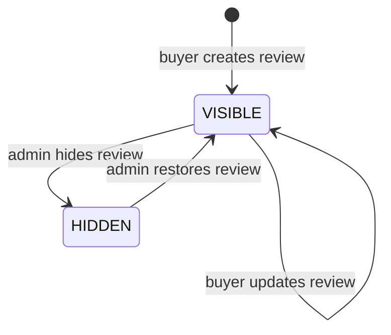
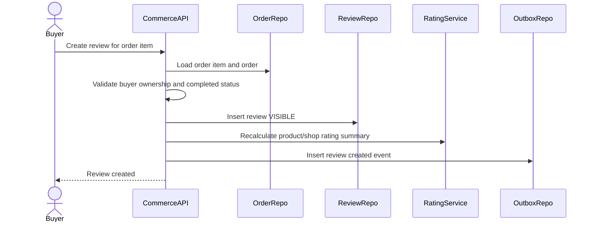
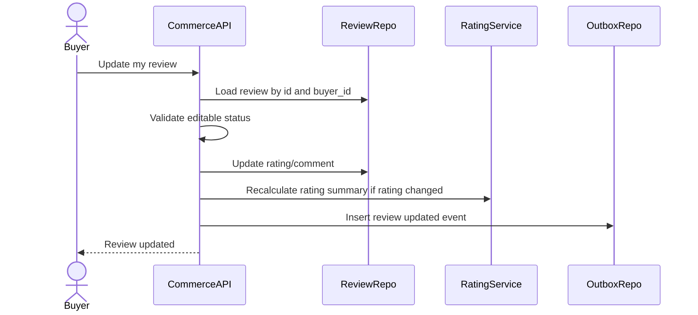
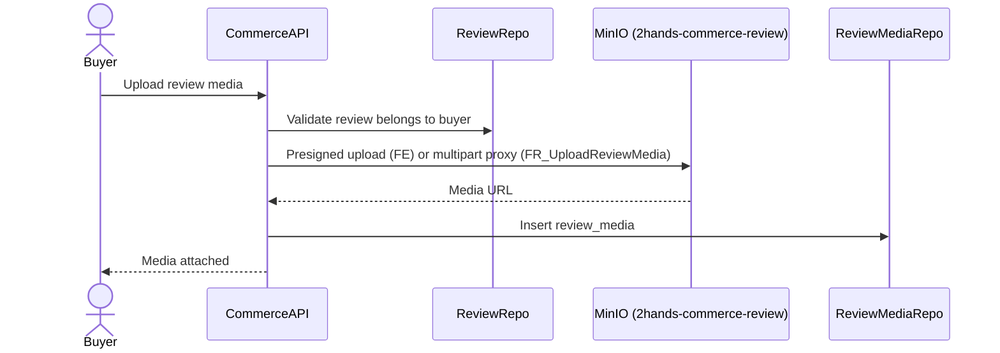
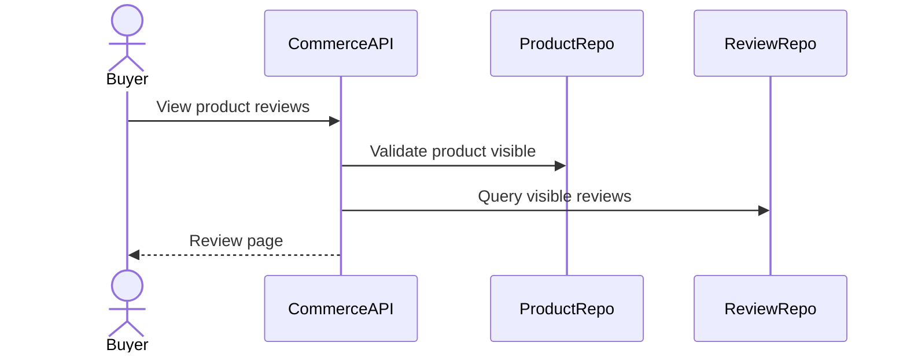
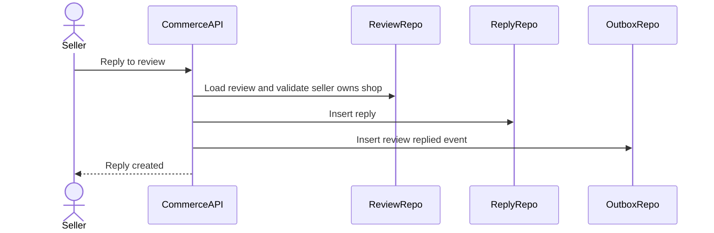
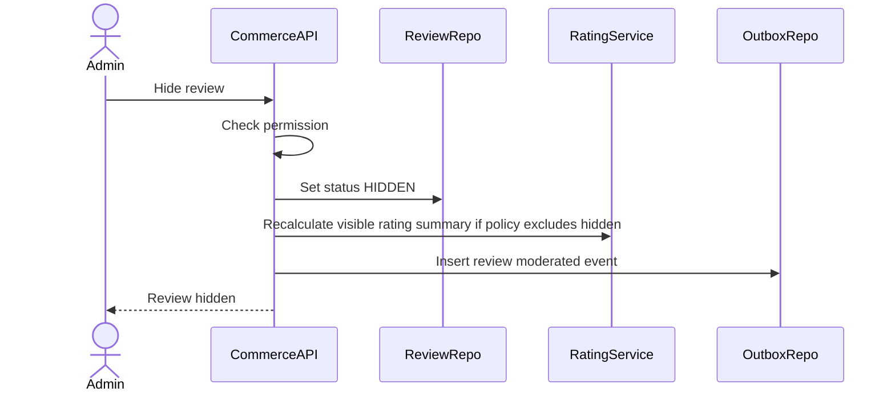

# Review Lifecycle Flow

Review Lifecycle mo ta cach buyer danh gia san pham sau khi order item completed, seller reply review, buyer xem review, va admin moderation review. Review la bang chung social proof cho product/shop, nhung permission phai dua tren order item da mua that.

## 1. Scope

In scope:

- Buyer tao review sau khi order item `COMPLETED`.
- Buyer cap nhat review cua minh.
- Buyer upload media cho review.
- Xem review product/shop.
- Seller reply review.
- Tinh/cap nhat rating average/count.
- Admin hide/remove review bang status `HIDDEN`.

Out of scope:

- Review vote/helpful.
- Multi-reply thread.
- Dispute review nang cao.
- Auto moderation ML.

## 2. Actors

- Buyer: tao/cap nhat/xem review.
- Seller: xem review shop va reply review.
- Admin: hide/remove review vi pham.
- System: cap nhat rating summary.

## 3. Source Tables

- `reviews`
- `review_media`
- `review_replies`
- `order_items`
- `orders`
- `products`
- `seller_shops`
- `outbox_events`

## 4. Core Invariants

- Review chi duoc tao khi `order_items.status = COMPLETED`.
- `reviews.buyer_id` must match `orders.buyer_id`.
- `reviews.seller_id` must match order item seller.
- One review per order item: `UNIQUE(order_item_id)`.
- Rating must be between 1 and 5.
- Seller cannot edit buyer rating/comment.
- Seller can reply only review belonging to own shop.
- Hidden review should not appear in public product review list.

## 5. Review State Machine



MVP schema uses `VISIBLE` and `HIDDEN`. If future hard remove is required, prefer soft status first for audit.

## 6. Create Review Flow



Preconditions:

- Buyer authenticated.
- Order item exists.
- Order belongs to buyer.
- Order item status is `COMPLETED`.
- No review exists for order item.
- Rating is 1..5.

Create payload:

- `order_item_id`
- `rating`
- `comment`
- `media` optional depending upload design.

Rules:

- Product and seller are derived from order item, not trusted from client.
- `buyer_id` is derived from JWT/order.
- Review starts as `VISIBLE`.
- If media upload is separate, create review first then attach media.

Failure cases:

- Order item not found -> 404.
- Order item not completed -> 409.
- Buyer mismatch -> 403/404.
- Duplicate review -> 409.
- Invalid rating -> 400.

## 7. Update Review Flow



Rules:

- Buyer can update only own review.
- Hidden review update can be rejected or allowed but remain hidden; MVP recommended: reject update if `HIDDEN` until moderation resolved.
- If rating changes, recalculate product/shop rating summary.
- Update does not change `order_item_id`, `buyer_id`, `seller_id`.

## 8. Review Media Flow



Rules:

- Buyer can upload media only to own review.
- Media type must be allowed.
- Limit media count per review according to API policy.
- `review_media.url` stores MinIO public URL (`2hands-commerce-review`).
- If MinIO upload succeeds but DB insert fails, cleanup orphan object when possible.

## 9. View Product Reviews Flow



Rules:

- Public product review list includes only `reviews.status = VISIBLE`.
- Sort newest first by default.
- Include media and seller reply.
- Include rating summary.
- Hidden reviews excluded from buyer/public list.

## 10. View Shop Reviews Flow

Seller can view reviews of their shop:

- Include visible reviews.
- Include hidden reviews only if seller/admin policy allows; MVP recommended seller sees visible reviews only, admin sees all.
- Seller cannot see unrelated shop reviews.

## 11. Seller Reply Flow



Rules:

- Seller can reply only reviews belonging to own shop.
- One reply per review in MVP.
- Reply content required.
- Seller reply does not change review rating/status.
- Seller cannot reply hidden review unless policy allows; MVP recommended reject hidden review reply.

Failure cases:

- Review not found -> 404.
- Seller not owner -> 403/404.
- Duplicate reply -> 409.

## 12. Admin Moderation Flow



Rules:

- Admin permission comes from Auth role/permission.
- Hide review sets `status = HIDDEN`, not physical delete.
- If rating summary should reflect only visible reviews, recalculate after hide/restore.
- Moderation should be auditable; if audit table is not in Commerce, publish event or rely on Admin Service audit.

## 13. Rating Summary Rule

Seller shop has:

- `rating_avg`
- `rating_count`

Recommended calculation:

- Include only `VISIBLE` reviews.
- Use reviews for completed order items belonging to that seller/shop.
- Recalculate synchronously for MVP after create/update/hide, or asynchronously through event/job if performance requires.

Formula:

```text
rating_count = count(visible reviews)
rating_avg = avg(visible reviews.rating)
```

Product rating summary is not stored in provided schema, but API can calculate from reviews/order items or add denormalized fields later.

## 14. Transaction And Consistency

Write operations needing transaction:

- Create review + media metadata if same request.
- Update review + rating summary.
- Seller reply.
- Admin hide/restore review + rating summary.

Do not:

- Trust `buyer_id`, `seller_id`, `product_id` from client for review ownership.
- Allow review before order item completed.
- Create multiple reviews for same order item.

Concurrency:

- Unique constraint on `order_item_id` prevents duplicate review from double submit.
- Unique constraint on `review_replies.review_id` recommended for one seller reply.

## 15. Events

Recommended outbox events:

- `COMMERCE_REVIEW_CREATED`
- `COMMERCE_REVIEW_UPDATED`
- `COMMERCE_REVIEW_REPLIED`
- `COMMERCE_REVIEW_HIDDEN`
- `COMMERCE_SHOP_RATING_UPDATED`

Event key examples:

- `review:{review_id}:created`
- `review:{review_id}:replied`

## 16. Acceptance Criteria

- Buyer can review only own completed order item.
- One order item can have only one review.
- Rating outside 1..5 is rejected.
- Seller can reply only own shop reviews.
- Public review list excludes hidden reviews.
- Shop rating summary updates after visible review changes.
- Review ownership is derived from order/order item, not client-provided IDs.

