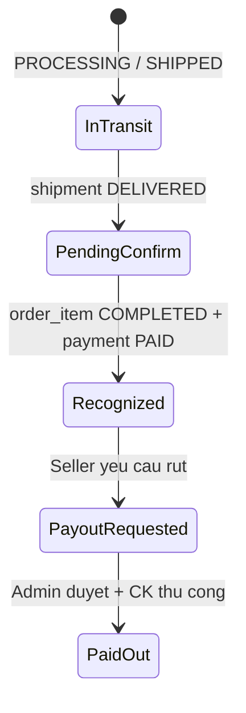
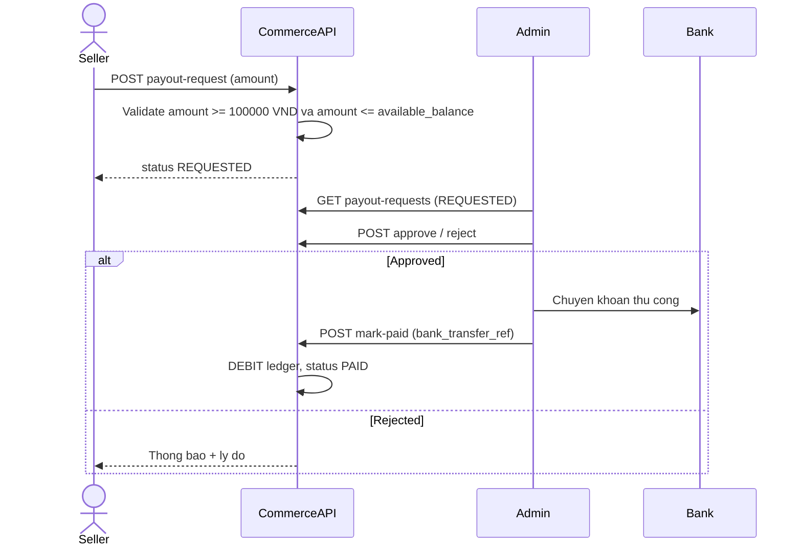

# Seller Finance - COD-Only Model & Manual Payout Flow

Tai lieu mo ta mo hinh tai chinh seller cho giai doan **PayOS chua on dinh**: customer chi dat hang **COD**, doanh thu seller ghi nhan theo vong doi don hang, admin **duyet tay** payout. Khong co vi noi bo cho customer.

**Lien quan:**

- `docs/business_flow/commerce_business_flow/payment-lifecycle-flow.md`
- `docs/business_flow/commerce_business_flow/shipping-lifecycle-flow.md`
- `docs/business_flow/commerce_business_flow/seller-order-management-flow.md`
- `docs/business-spec/commerce-service-spec.md`
- `docs/business-spec/admin-service-spec.md`
- `docs/database/commerce-schema.md` (section `seller_payout_accounts`, `order_items`, `shipments`)

---

## 1. Boi canh & pham vi

### 1.1 Van de hien tai

- PayOS chua hoat dong on dinh -> tam thoi **chi cho phep COD** o checkout.
- Chua co dashboard doanh thu / analytics cho seller.
- Chua co ledger, so du, payout cho seller.
- Admin chua co flow duyet rut tien seller.
- Admin chua co man **Tai chinh / Thong ke san** (GMV, phi san, payout pending, top seller).

### 1.2 Pham vi tai lieu nay

**In scope:**

- Mo hinh COD-only (customer).
- Luong tien GHN -> san -> seller.
- Trang thai doanh thu seller (cho / da ghi nhan).
- Payout do admin duyet tay (chuyen khoan ngan hang).
- Vai tro admin (oversight + duyet payout + cau hinh hoa hong + dashboard tai chinh san).
- Man admin **Finance / Analytics** (platform-wide, khac seller dashboard).

**Out of scope (giai doan nay):**

- Vi noi bo customer.
- PayOS checkout / PayOS Payout tu dong.
- Refund / dispute day du.
- Doi soat GHN COD tu dong qua API (co the lam phase sau).

---

## 2. Actors

| Actor | Vai tro |
|-------|---------|
| **Buyer** | Dat hang COD, nhan hang, xac nhan da nhan (hoac he thong auto-complete). |
| **Seller** | Xem doanh thu, so du, yeu cau rut tien. |
| **Admin** | Cau hinh hoa hong, duyet/tu choi payout, chuyen khoan tay, xem dashboard tai chinh san, drill-down seller, doi soat noi bo. |
| **GHN** | Thu ho COD tu buyer, doi soat, chuyen khoan ve TK ngan hang GHN shop cua san. |
| **Commerce Service** | Own order/payment/shipment/ledger/payout. |
| **Admin Service** | Proxy oversight UI, cau hinh `system_config`, audit log - khong mutate Commerce DB truc tiep. |

---

## 3. Mo hinh COD & GHN

### 3.1 Customer chi COD

Trong giai doan nay:

- Checkout **chi chap nhan** `payment_method = COD`.
- PayOS tat o FE (an/disable) va/hoac BE (`COMMERCE_PAYOS_ENABLED=false` + validate checkout).
- Giu code PayOS de bat lai sau khi on dinh.

### 3.2 GHN thu ho va chuyen tien ve san

Commerce dung **mot GHN shop cua san** (`COMMERCE_GHN_SHOP_ID`), khong phai GHN shop rieng tung seller.

Khi seller tao shipment GHN voi don COD:

- `cod_amount` = tong `final_price` cac `order_items` cua seller trong shipment + `shipping_fee_allocated` cua shipment do.
- GHN shipper thu tien mat tu buyer khi giao.
- GHN **doi soat COD** theo chu ky (thuong T2-T6) va chuyen khoan ve **tai khoan ngan hang** dang ky tren GHN shop cua san.

**Luu y quan trong:**

- GHN chuyen tien ve ngan hang san **khong dong thoi** voi `shipment DELIVERED` hay `order_item COMPLETED`.
- Co do tre doi soat (1-5 ngay lam viec tuy ngan hang).
- He thong MVP **chua track** trang thai "GHN da chuyen khoan COD ve san" - chi track trang thai giao hang qua webhook GHN.

### 3.3 Multi-seller order

Mot order co nhieu seller -> moi seller co shipment rieng, `cod_amount` rieng. GHN thu/chuyen theo tung van don. Seller chi thay doanh thu phan `order_items.seller_id` cua minh.

---

## 4. Vong doi thanh toan COD (da co trong codebase)

### 4.1 Trang thai ban dau (checkout)

- `payments.payment_method = COD`
- `payments.status = PENDING`
- `orders.payment_status = PENDING`
- `orders.status = PROCESSING` (seller co the chuan bi hang)

### 4.2 Fulfillment

- Seller tao shipment -> GHN giao -> webhook cap nhat `shipment DELIVERED`
- `order_items.status = DELIVERED`

**`DELIVERED` khac hoan tat don.** Buyer chua xac nhan -> payment van `PENDING`.

### 4.3 Hoan tat & danh dau da thu COD

Khi buyer **xac nhan da nhan hang** hoac **job auto-complete** (~7 ngay sau DELIVERED):

- `order_items.status = COMPLETED`
- `payments.status = PAID` (COD)
- `orders.payment_status = PAID`
- Order co the `COMPLETED` khi tat ca items completed

Day la **diem ghi nhan doanh thu seller** trong mo hinh nay.

---

## 5. Trang thai doanh thu seller

Seller dashboard hien thi **3 bucket** (aggregate tu `order_items` + `shipments` + `payments`):

| Bucket | Dieu kien `order_item` | Y nghia UI |
|--------|------------------------|------------|
| **Doanh thu dang van chuyen** | `PROCESSING`, `SHIPPED` | Hang dang xu ly / dang giao |
| **Doanh thu cho xac nhan** | `DELIVERED` (chua `COMPLETED`) | Da giao, cho buyer xac nhan |
| **Doanh thu da ghi nhan** | `COMPLETED` + payment `PAID` | Du dieu kien tinh vao so du (sau tru phi san) |

**Khong ghi ledger** cho bucket 1 va 2 - chi hien thi thong ke.

**Ghi ledger** (phase ledger): khi item chuyen sang `COMPLETED`.



---

## 6. Cong thuc tien & hoa hong

### 6.1 Cong thuc (MVP)

```
gross_revenue     = order_item.final_price
platform_fee      = gross_revenue x commission_rate_snapshot
net_seller_credit = gross_revenue - platform_fee
```

- `gross_revenue` **chi** gom gia hang (`final_price`). **Khong** gom `shipping_fee_allocated`.
- `shipping_fee_allocated`: customer chiu - thu qua COD tren shipment (`cod_amount` = gia hang + phi ship). Khong tinh vao doanh thu / gross seller.
- `commission_rate_snapshot`: luu tai thoi diem ghi ledger (mac dinh **10%**), khong tinh lai khi admin doi rate sau.

### 6.2 Chinh sach da chot (MVP)

| Tham so | Gia tri | `system_config` key (Admin) | Ghi chu |
|---------|---------|------------------------------|---------|
| Hoa hong san | **10%** tren `final_price` | `COMMERCE_PLATFORM_COMMISSION_RATE` | Mac dinh `0.10`; admin co the doi sau qua config |
| Rut toi thieu | **100.000 VND** | `COMMERCE_MIN_PAYOUT_AMOUNT` | Reject payout request neu `amount` < nguong |
| Hold sau COMPLETED | **0 ngay** | — | Khong co ky cho them; du dieu kien `available_balance` la rut duoc (tru khi admin chua duyet) |
| Phi ship trong doanh thu seller | **Khong** | — | Customer chiu; chi `final_price` vao gross |
| Block payout cho GHN settlement | **Khong** | — | Khong can GHN da CK ve TK san moi cho rut; admin chiu float ngan han |

Commerce doc cac tham so tu Admin `system_config` khi ghi ledger / validate payout (HTTP internal hoac cache/event).

### 6.3 So du seller

```
available_balance = sum(net CREDIT tu COMPLETED items)
                    - sum(DEBIT payout da PAID)
                    - sum(payout REQUESTED/APPROVED chua PAID)
```

Phase dau (chua co ledger): `available_balance` co the tinh realtime tu `order_items` COMPLETED tru payout da duyet.

---

## 7. Payout - admin duyet tay

### 7.1 Tai sao khong dung PayOS Payout ngay

- PayOS checkout chua on dinh.
- Tien COD ve **TK ngan hang san** qua GHN - admin chuyen khoan tay cho seller du cho MVP.
- Kiem soat rui ro tot hon khi moi trien khai module tai chinh.

### 7.2 Du lieu

**Da co (schema placeholder):**

- `seller_payout_accounts` - TK ngan hang seller

**Can them (de xuat):**

```text
seller_ledger_entries
  id, seller_id, order_item_id, entry_type, gross_amount,
  platform_fee_amount, net_amount, commission_rate_snapshot,
  status, created_at

seller_payout_requests
  id, seller_id, payout_account_id, amount, status,
  admin_note, bank_transfer_ref, requested_at, approved_at, paid_at, rejected_at
```

### 7.3 Flow payout



**Trang thai payout request:**

| Status | Y nghia |
|--------|---------|
| `REQUESTED` | Seller vua gui yeu cau |
| `APPROVED` | Admin duyet, cho CK |
| `PAID` | Da chuyen khoan, tru so du |
| `REJECTED` | Admin tu choi |
| `CANCELLED` | Seller huy (neu con REQUESTED) |

---

## 8. API de xuat (tom tat)

### 8.1 Seller (`/commerce/api/v1/seller/finance/...`)

| Method | Endpoint | Mo ta |
|--------|----------|-------|
| GET | `/summary?from=&to=` | Tong doanh thu 3 bucket + so du |
| GET | `/revenue-trend` | Bieu do theo ngay/tuan/thang |
| GET | `/ledger` | Lich su ghi nhan (sau phase ledger) |
| GET | `/balance` | available / pending payout |
| GET/POST/PUT | `/payout-accounts` | Quan ly TK ngan hang |
| POST | `/payout-requests` | Yeu cau rut tien |
| GET | `/payout-requests` | Lich su yeu cau |

### 8.2 Admin Commerce support (`/commerce/api/v1/admin/finance/...`)

| Method | Endpoint | Permission goi y |
|--------|----------|------------------|
| GET | `/sellers/{sellerId}/summary` | `FINANCE_SUPPORT_READ` |
| GET | `/sellers/{sellerId}/ledger` | `FINANCE_SUPPORT_READ` |
| GET | `/payout-requests` | `PAYOUT_SUPPORT_READ` |
| POST | `/payout-requests/{id}/approve` | `PAYOUT_SUPPORT_APPROVE` |
| POST | `/payout-requests/{id}/reject` | `PAYOUT_SUPPORT_APPROVE` |
| POST | `/payout-requests/{id}/mark-paid` | `PAYOUT_SUPPORT_APPROVE` |
| GET | `/platform/summary` | `FINANCE_SUPPORT_READ` |
| GET | `/platform/revenue-trend?from=&to=&granularity=` | `FINANCE_SUPPORT_READ` |
| GET | `/platform/cod-pipeline` | `FINANCE_SUPPORT_READ` |
| GET | `/platform/top-sellers?limit=&from=&to=` | `FINANCE_SUPPORT_READ` |
| GET | `/platform/payout-overview` | `PAYOUT_SUPPORT_READ` |

Admin Service proxy cac API tren cho admin UI (pattern giong order support hien tai).

**Ghi chu API analytics:**

- `platform/summary`: snapshot KPI trong khoang `from`/`to` (GMV da ghi nhan, tong phi san, so don COMPLETED, tong payout pending).
- `platform/revenue-trend`: chuoi theo ngay/tuan/thang cho bieu do GMV + phi san.
- `platform/cod-pipeline`: tong gia tri 3 bucket toan san (dang giao / cho xac nhan / da ghi nhan) - mirror logic seller nhung aggregate platform.
- `platform/top-sellers`: xep hang seller theo doanh thu da ghi nhan (`COMPLETED` items).
- `platform/payout-overview`: dem va tong tien theo `payout_requests.status` (REQUESTED, APPROVED, PAID, ...).

---

## 9. Admin Finance UI & Analytics

Admin **co man rieng** ve tai chinh san. Khac seller dashboard: admin nhin **toan bo marketplace**, khong chi mot shop.

### 9.1 Phan biet Seller Analytics vs Admin Finance Analytics

| Khia canh | Seller (Commerce FE) | Admin (Admin FE) |
|-----------|----------------------|------------------|
| Pham vi du lieu | Chi `seller_id` cua minh | Toan san + drill-down tung seller |
| Muc tieu | Theo doi doanh thu ca nhan, rut tien | Giam sat san, duyet payout, dieu tra |
| Menu goi y | Commerce sidebar: **Thong ke** | Admin: tab **Tai chinh** (hoac **Commerce Finance**) |
| Bieu do | Doanh thu 3 bucket + trend ca nhan | GMV san, phi san, COD pipeline, top seller |
| Thao tac ghi | Tao payout request | Duyet/tu choi/mark-paid payout |

### 9.2 Man Admin - de xuat (MVP)

**A. Finance Overview (landing)**

KPI cards trong khoang thoi gian chon (mac dinh 30 ngay):

| KPI | Nguon tinh toan |
|-----|-----------------|
| GMV da ghi nhan | Sum `order_items.final_price` where `COMPLETED` + payment `PAID` |
| Tong phi san | Sum `platform_fee` tu ledger (hoac gross x rate truoc ledger) |
| Doanh thu dang pipeline COD | Sum 3 bucket platform (chua ghi nhan day du) |
| Payout cho duyet | Count + tong `amount` where status `REQUESTED` |
| Payout da tra (ky) | Sum `amount` where status `PAID` trong ky |

Bieu do: `platform/revenue-trend` (GMV + platform fee theo ngay).

**B. COD Pipeline (toan san)**

Bang hoac stacked bar 3 bucket giong seller (section 5) nhung aggregate:

- Dang van chuyen (`PROCESSING`, `SHIPPED`)
- Cho buyer xac nhan (`DELIVERED`)
- Da ghi nhan (`COMPLETED` + `PAID`)

Muc dich: admin thay tien COD "dang luu thong" truoc khi ve TK san qua GHN.

**C. Top Sellers**

Bang `platform/top-sellers`: shop name, seller_id, gross da ghi nhan, phi san, so don completed. Link sang drill-down.

**D. Payout Queue (van hanh)**

Man rieng hoac sub-tab trong Tai chinh:

- Danh sach `payout_requests` filter theo status
- Hanh dong: approve / reject / mark-paid (permission `PAYOUT_SUPPORT_APPROVE`)
- Truoc khi duyet: xem nhanh `sellers/{sellerId}/summary` + ledger

**E. Seller Finance Drill-down**

Tu top sellers hoac tim seller_id:

- Summary 3 bucket + balance + lich su payout
- Ledger entries (sau phase ledger)
- Khong hien thi thong tin buyer nhay cam (chi order_item_id, amount, status)

**F. Cau hinh hoa hong**

Link hoac sub-section toi `system_config` hien co cua Admin (`COMMERCE_PLATFORM_COMMISSION_RATE` = 10%, `COMMERCE_MIN_PAYOUT_AMOUNT` = 100000).

### 9.3 Hien trang Admin (chua co)

- Order / payment / shipment support detail (tab Order Support hien tai)
- Webhook logs (PayOS, GHN)
- `reconciliation_status` tren payment PayOS - **khong ap dung COD**
- **Chua co** tab/man Tai chinh, Finance Overview, payout queue, platform analytics

### 9.4 Can implement (theo phase)

| Man / chuc nang | Phase | Permission goi y |
|-----------------|-------|-------------------|
| Finance Overview + revenue trend | 5 | `FINANCE_SUPPORT_READ` |
| COD Pipeline + Top Sellers | 5 | `FINANCE_SUPPORT_READ` |
| Payout Queue (duyet CK) | 4 | `PAYOUT_SUPPORT_READ`, `PAYOUT_SUPPORT_APPROVE` |
| Seller drill-down | 4-5 | `FINANCE_SUPPORT_READ` |
| Cau hinh hoa hong | 3-5 | `SYSTEM_CONFIG_UPDATE` |
| (Sau) Doi soat GHN COD | 6 | `FINANCE_SUPPORT_READ` |

**Admin khong can (giai doan nay):** vi customer, refund execution, PayOS payout tu dong, BI/export phuc tap ngoai CSV don gian.

---

## 10. Lo trinh trien khai

| Phase | Noi dung | Phu thuoc |
|-------|----------|-----------|
| **1** | COD-only: FE default COD, an PayOS; BE validate chi COD | Khong |
| **2** | Seller Analytics: API summary 3 bucket + trend; bat menu Thong ke | Phase 1 |
| **3** | Ledger + commission: migration, ghi nhan khi COMPLETED | Phase 2 |
| **4** | Payout account + payout request; **Admin Payout Queue** UI | Phase 3 |
| **5** | **Admin Finance Overview**: platform summary, revenue trend, COD pipeline, top sellers; seller drill-down; audit | Phase 4 |
| **6** | (Sau) Doi soat GHN COD, tu dong hoa payout | Tuy nhu cau |

**Khong nen** lam payout truoc ledger - khong co `available_balance` ro rang.

---

## 11. Quyet dinh nghiep vu da chot

Cac quyet dinh sau **da chot** cho MVP (chi tiet key config: section 6.2).

| # | Cau hoi | Quyet dinh |
|---|---------|------------|
| 1 | Hoa hong % tren `final_price`? | **10%** - luu `COMMERCE_PLATFORM_COMMISSION_RATE` trong `system_config` |
| 2 | So tien rut toi thieu? | **100.000 VND** - luu `COMMERCE_MIN_PAYOUT_AMOUNT` |
| 3 | Hold them sau COMPLETED? | **Khong** (0 ngay) - admin duyet payout la lop kiem soat |
| 4 | Shipping fee trong doanh thu seller? | **Khong** - customer chiu; chi `final_price` tinh gross |
| 5 | Cho GHN CK ve san truoc khi rut? | **Khong** - payout khong phu thuoc GHN settlement |

---

## 12. Invariants & rang buoc

- Seller chi thay du lieu `seller_id = JWT user_id`.
- Ghi nhan doanh thu **mot lan** moi `order_item` khi `COMPLETED` (idempotent).
- Payout amount >= **100.000 VND** va <= `available_balance` tai thoi diem request.
- Platform fee mac dinh **10%** tren `order_item.final_price` (snapshot khi ghi ledger).
- `shipping_fee_allocated` **khong** nam trong gross seller; customer chiu phi ship.
- Khong co hold period sau `COMPLETED` - `available_balance` tinh ngay khi ghi ledger.
- Payout **khong** bi block boi trang thai GHN da chuyen khoan COD ve TK san.
- Admin approve payout phai co permission + audit log (`admin_action_logs`).
- Commerce khong expose thong tin buyer/payment provider nhay cam cho seller.
- GHN COD settlement va ghi nhan doanh thu seller la **hai lop doc lap** - khong dong bo thoi gian.

---

## 13. Mapping voi codebase hien tai

| Thanh phan | File / vi tri |
|------------|---------------|
| COD payment lifecycle | `payment-lifecycle-flow.md`, `DeliveredOrderCompletionRepositoryAdapter` |
| `cod_amount` tren shipment | `CreateShipmentUseCase`, `GhnShipmentGatewayAdapter` |
| GHN shop san | `COMMERCE_GHN_SHOP_ID`, `application.yml` |
| Seller order list (gia tung dong) | `SellerOrderTableRow.jsx`, `ViewSellerOrdersUseCase` |
| Menu Analytics (commented) | `CommerceHomeSidebar.jsx` |
| Payout account schema | `V1__init_commerce_tables.sql` -> `seller_payout_accounts` |
| Admin order support | `order-support-flow.md`, `AdminOrderSupportController` |
| Admin FE (order support tabs) | `frontend/src/fe-module/features/auth/pages/AdminPage.jsx` |
| Admin finance / analytics UI | **Chua co** - de xuat tab Tai chinh trong Admin FE |
| Stitch reference (Financials label) | `frontend/stitch/ViewWebhookLogsForSupport/code.html` |
| MVP out of scope payout | `commerce-backend-standards.mdc` section 16 |

---

## 14. Acceptance criteria (tong)

- [ ] Customer chi checkout COD khi feature flag bat.
- [ ] Seller thay 3 bucket doanh thu dung theo trang thai order item.
- [ ] Doanh thu ghi nhan chi khi `order_item COMPLETED` + payment `PAID`.
- [ ] Seller co the them TK ngan hang va gui yeu cau rut tien.
- [ ] Admin duyet/tu choi payout; mark-paid co `bank_transfer_ref`.
- [ ] So du seller giam dung sau payout PAID.
- [ ] Khong co vi customer; PayOS checkout tat trong giai doan nay.
- [ ] Admin co tab **Tai chinh** voi Finance Overview (KPI + revenue trend).
- [ ] Admin xem COD pipeline va top sellers toan san (read-only, permission-gated).
- [ ] Admin Payout Queue tach biet hoac sub-tab; drill-down seller truoc khi duyet.
- [ ] Admin analytics khong expose buyer PII / payment provider secrets.
- [ ] Hoa hong 10% tren `final_price`; phi ship khong tinh vao gross seller.
- [ ] Payout toi thieu 100.000 VND; khong hold sau COMPLETED; khong block theo GHN settlement.
