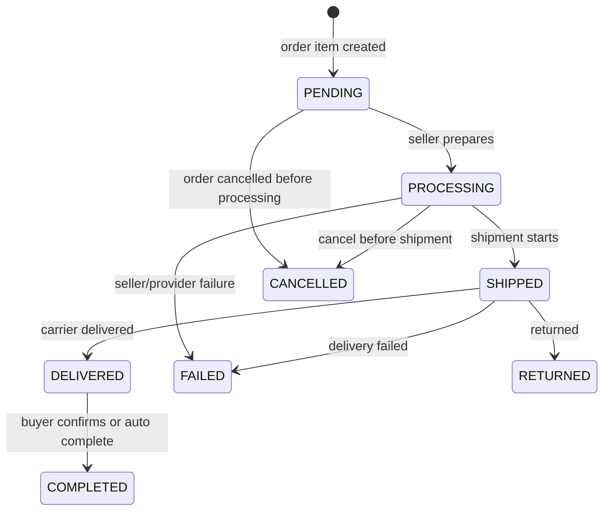
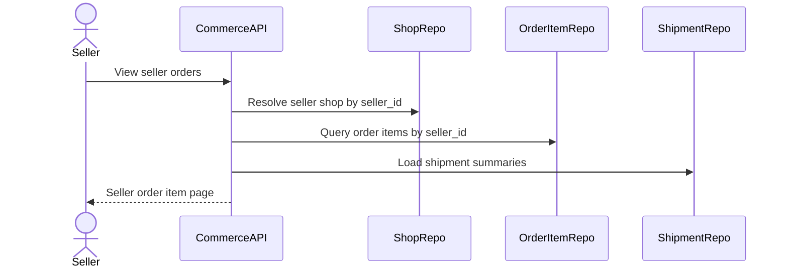
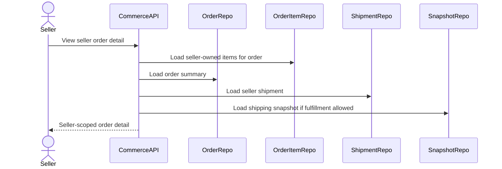
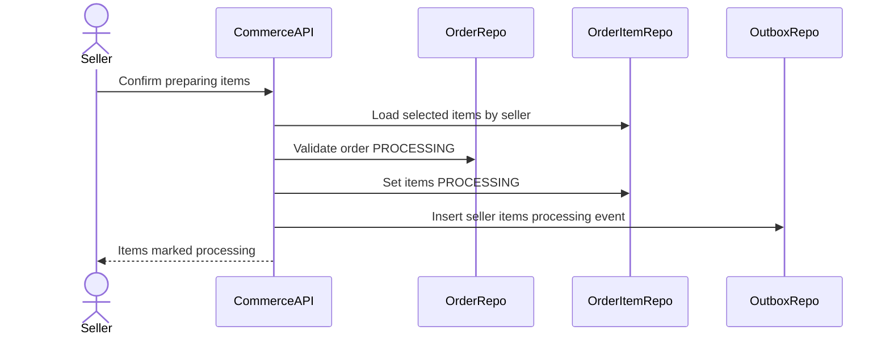
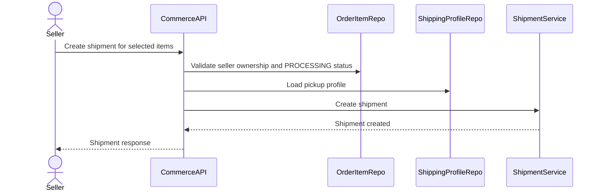
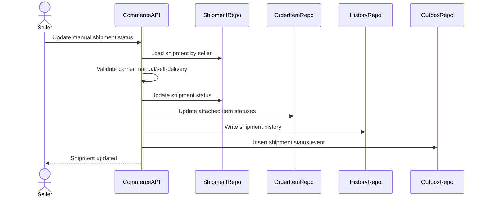

# Seller Order Management Flow

Seller Order Management mo ta cach seller xem va xu ly phan don hang thuoc shop minh. Order co the gom nhieu seller, vi vay seller khong quan ly toan bo order theo buyer, ma quan ly `order_items` va `shipments` gan voi `seller_id` cua shop minh.

## 1. Scope

In scope:

- Seller xem danh sach order/order items cua shop.
- Seller xem chi tiet phan order can fulfill.
- Seller xac nhan chuan bi hang.
- Cap nhat order item status.
- Tao shipment cho order items cua seller.
- Cap nhat tracking number voi manual/self-delivery.
- Theo doi shipment theo seller.
- Xem buyer shipping snapshot can thiet cho fulfillment.

Out of scope:

- Seller refund/dispute.
- Seller payout.
- Seller xem provider payment details cua buyer.
- Seller sua order amount.

## 2. Actors

- Seller: xu ly order items va shipments cua shop minh.
- Buyer: tao order va theo doi delivery, khong thao tac trong seller flow.
- System: cap nhat status tu payment/shipment jobs.
- GHN: provider shipment neu seller dung GHN.

## 3. Source Tables

- `orders`
- `order_items`
- `shipments`
- `shipping_address_snapshots`
- `payments`
- `seller_shops`
- `seller_shipping_profiles`
- `shipment_status_history`
- `order_status_history`
- `outbox_events`

## 4. Core Invariants

- Seller chi duoc xem/thao tac `order_items.seller_id` thuoc shop/user cua minh.
- Seller khong duoc xem/chinh sua order items cua seller khac trong cung order.
- Shipment phai gan dung `seller_id`.
- Shipment cannot be created unless order is `PROCESSING`.
- For payOS, order/payment must be paid before shipment.
- For COD, payment can remain `PENDING`, shipment carries COD amount.
- Seller cannot cancel shipment/order after carrier starts pickup/delivery without support flow.

## 5. Seller Fulfillment State Machine

Order item fulfillment from seller perspective:

Seller-controlled transitions in MVP:

- `PENDING -> PROCESSING`
- Create shipment for `PROCESSING` items.
- Manual/self-delivery status update if carrier is `MANUAL` or `SELF_DELIVERY`.

Provider/system-controlled transitions:

- `SHIPPED -> DELIVERED`
- `SHIPPED -> FAILED`
- `SHIPPED -> RETURNED`
- `DELIVERED -> COMPLETED`

## 6. View Seller Orders Flow

Filters:

- order item status
- shipment status
- created date
- product keyword
- order id

Response should include:

- `order_id`
- `order_item_id`
- product snapshot
- quantity
- final price
- shipping fee allocated
- buyer delivery area summary
- payment method
- payment status summary
- order item status
- shipment summary

Security:

- Query must be scoped by seller/shop ownership.
- Do not return unrelated order items from other sellers.
- Do not expose payOS transaction/provider details.

## 7. Seller Order Detail Flow

Rules:

- Seller can see only the subset of order items they own.
- Shipping address snapshot is visible only when fulfillment requires it and order is at least `PROCESSING`.
- Buyer personal/payment details should be minimized.

## 8. Prepare Order Items Flow

Preconditions:

- Order status `PROCESSING`.
- For payOS: `orders.payment_status = PAID`.
- For COD: order status allows fulfillment.
- Order item status `PENDING`.
- Seller owns all selected items.

Rules:

- Transition is idempotent: if item already `PROCESSING`, return success/no-op.
- Seller cannot process cancelled/failed/returned/completed items.

## 9. Create Seller Shipment Flow

This flow delegates provider details to `shipping-lifecycle-flow.md`, but seller entry point is here.

Rules:

- Selected items must belong to same seller and same order.
- Selected items should not already have shipment.
- Shipment carrier can be `GHN`, `MANUAL`, or `SELF_DELIVERY`.
- `weight_gram` can be computed from product snapshots/current product data or seller input, depending API.
- For GHN, seller shipping profile is required.
- After shipment starts, order items should become `SHIPPED` when carrier/provider status confirms.

## 10. Manual/Self Delivery Status Flow

Allowed seller manual transitions:

- `PENDING -> READY_TO_SHIP`
- `READY_TO_SHIP -> SHIPPED`
- `SHIPPED -> DELIVERED`
- `SHIPPED -> FAILED`

Rules:

- Seller cannot mark item `COMPLETED`; buyer confirm/system auto-complete controls completion.
- Seller cannot move delivered shipment back to shipped.
- Manual status update should write history.

## 11. Seller Cancellation Boundary

Seller can request/cancel fulfillment only before shipment starts:

Allowed:

- Order item `PENDING` or `PROCESSING`.
- Shipment not created or shipment `PENDING`.

Not allowed:

- Shipment `PICKING_UP`, `READY_TO_SHIP`, `SHIPPED`, `DELIVERED`.

MVP recommendation:

- Seller cancellation after buyer order should be an admin/support flow, not direct seller action, because it may require refund/stock/payment handling.

## 12. Transaction And Consistency

Write operations needing transaction:

- Mark items processing.
- Create local shipment and attach order items.
- Manual shipment status update.
- Write status history.
- Insert outbox events.

Concurrency:

- Lock selected order items when creating shipment to avoid duplicate shipment.
- Check `shipment_id IS NULL`.
- Status transitions should be conditional on current status.

## 13. Events

Recommended outbox events:

- `COMMERCE_SELLER_ORDER_ITEM_PROCESSING`
- `COMMERCE_SELLER_SHIPMENT_CREATED`
- `COMMERCE_SELLER_SHIPMENT_UPDATED`
- `COMMERCE_ORDER_ITEM_SHIPPED`
- `COMMERCE_ORDER_ITEM_DELIVERED`

## 14. Acceptance Criteria

- Seller sees only order items belonging to their shop.
- Seller can mark pending items as processing only when order is `PROCESSING`.
- Seller can create shipment only for own processing items.
- Shipment cannot be created twice for same order item.
- Seller cannot complete order item directly.
- Manual delivery updates are restricted to manual/self-delivery shipments.

