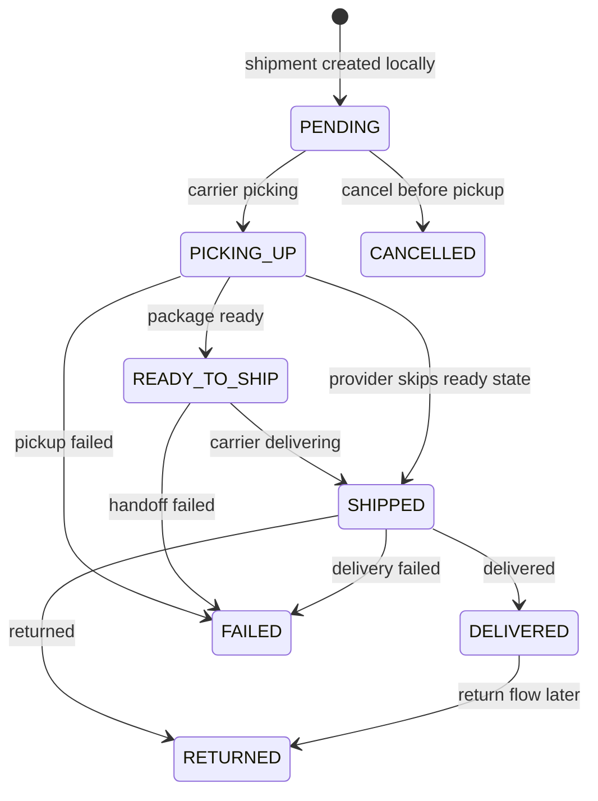
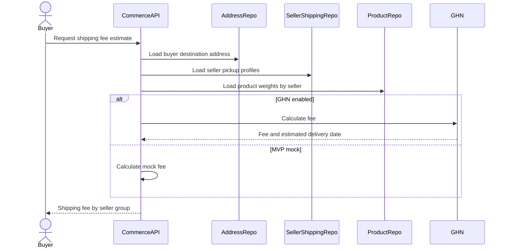
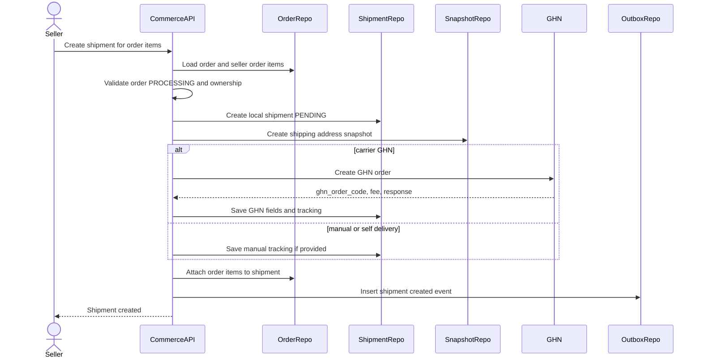
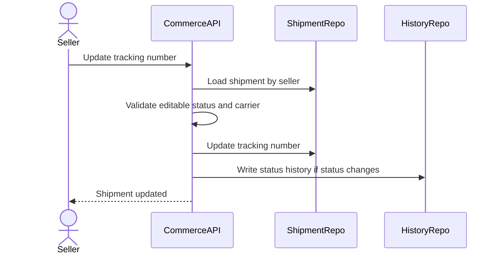
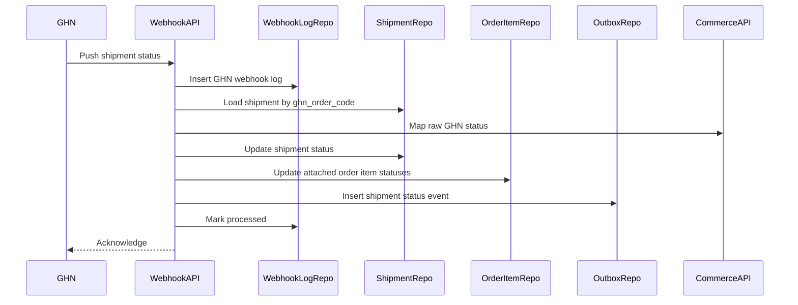
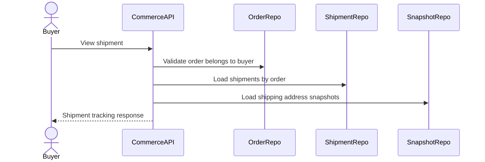

# Shipping Lifecycle Flow

Shipping Lifecycle mo ta cach Commerce Service tinh phi ship, tao shipment, luu shipping address snapshot, tich hop GHN, nhan webhook va cap nhat order item theo trang thai giao hang. Shipment la fulfillment unit theo seller trong order; mot order co the co nhieu shipment neu co nhieu seller.

## 1. Scope

In scope:

- Tinh shipping fee truoc checkout.
- Tao shipment sau khi order du dieu kien `PROCESSING`.
- Luu shipping address snapshot.
- Tich hop GHN create order.
- Ho tro carrier `GHN`, `MANUAL`, `SELF_DELIVERY`.
- Cap nhat tracking number.
- Nhan GHN webhook.
- Cap nhat shipment status/history.
- Cap nhat order item status tu shipment status.
- Buyer/seller xem shipment.

Out of scope:

- Refund/dispute khi giao that bai.
- Full return/refund workflow.
- GHN reconciliation nang cao.
- Seller payout lien quan COD.

## 2. Actors

- Buyer: xem shipment, tracking, estimated delivery date va shipping address snapshot.
- Seller: tao shipment, nhap weight, theo doi shipment cua shop minh.
- Admin: ho tro kiem tra shipment.
- System: xu ly GHN webhook, polling tracking neu can.
- GHN: external shipping provider.

## 3. Source Tables

- `orders`
- `order_items`
- `shipments`
- `shipping_address_snapshots`
- `seller_shipping_profiles`
- `shipment_status_history`
- `ghn_webhook_logs`
- `payments`
- `outbox_events`

## 4. Core Invariants

- Shipment cannot be created unless order is `PROCESSING`.
- Shipment belongs to exactly one order and one seller.
- Shipment should group order items of the same seller.
- Shipment has exactly one `shipping_address_snapshot`.
- For GHN shipment, `tracking_number` should equal `ghn_order_code`.
- Shipment `DELIVERED` does not automatically complete order.
- Order item becomes `DELIVERED` when its shipment is delivered, then waits buyer confirm or auto-complete job.
- For COD, `cod_amount` must represent amount carrier should collect according to MVP policy.

## 5. Shipment State Machine

## 6. Shipping Fee Estimate Flow

Rules:

- Buyer can estimate only for selected products/cart items that belong to them or public product detail.
- Shipping fee should be calculated per seller group.
- Weight should use sum of `products.weight_gram * quantity`.
- Destination is buyer selected address.
- Pickup address is `seller_shipping_profiles`.
- If GHN is unavailable in MVP, return deterministic mock fee so checkout is testable.

Failure cases:

- Buyer address not found -> 404.
- Seller shipping profile missing -> 409.
- Product weight missing/invalid -> 409.
- GHN timeout -> fallback to mock only if configured, otherwise 503.

## 7. Create Shipment Flow

Preconditions:

- Seller owns the selected order items.
- Order status is `PROCESSING`.
- Selected order items are `PENDING` or `PROCESSING`.
- Order items have no existing `shipment_id`.
- Seller has shipping profile if carrier requires pickup address.
- Buyer shipping address snapshot source exists from checkout/order context.

Rules:

- Create shipment in application-layer transaction.
- For payOS order, payment must be `PAID`.
- For COD order, payment can be `PENDING`, shipment `cod_amount = order.final_amount` or seller allocated COD amount.
- For GHN, store `ghn_order_code`, `ghn_shop_id`, provider response and `tracking_number`.
- For MANUAL/SELF_DELIVERY, seller/admin can provide `tracking_number`.
- Link `order_items.shipment_id` after shipment is created.

Important implementation note:

- Avoid long DB transaction around slow GHN call if possible. A robust approach is:
  1. Create local shipment `PENDING`.
  2. Commit local transaction.
  3. Call GHN with idempotency/reference key.
  4. Update shipment provider fields.
  5. If GHN call fails, keep shipment pending with provider error or mark failed according to policy.

## 8. Update Tracking Flow

Rules:

- Seller can update only own shipment.
- GHN tracking should normally come from GHN response/webhook, not manual edit.
- Manual tracking can be updated before shipment is `DELIVERED`.
- `tracking_number` must be unique when present.

## 9. GHN Webhook Flow

Processing steps:

1. Receive raw payload.
2. Insert `ghn_webhook_logs`.
3. Resolve shipment by `ghn_order_code`.
4. Map raw GHN status to domain `shipment_status`.
5. If status is unchanged, mark webhook processed and no-op.
6. Update shipment status and timestamp fields.
7. Write `shipment_status_history`.
8. Update attached order items:
   - `PICKING_UP/READY_TO_SHIP/SHIPPED` -> order items `SHIPPED` when carrier actually delivering.
   - `DELIVERED` -> order items `DELIVERED`.
   - `FAILED` -> order items `FAILED`.
   - `RETURNED` -> order items `RETURNED`.
9. Insert outbox event.
10. Mark webhook processed.

## 10. GHN Status Mapping

Recommended mapping:

| GHN/raw meaning | Shipment status |
|---|---|
| picking | `PICKING_UP` |
| ready_to_pick / picked / sorting | `READY_TO_SHIP` |
| delivering / transport | `SHIPPED` |
| delivered | `DELIVERED` |
| delivery_fail / exception | `FAILED` |
| cancel | `CANCELLED` |
| return / returned | `RETURNED` |

Raw status must be stored in `shipment_status_history.raw_status` for debugging.

## 11. Buyer View Shipment Flow

Buyer response should include:

- `shipment_id`
- `order_id`
- `carrier`
- `tracking_number`
- `shipment_type`
- `shipping_fee`
- `estimated_delivery_date`
- `status`
- `shipped_at`
- `delivered_at`
- attached order items summary
- shipping address snapshot

## 12. Seller View Shipment Flow

Seller can view only shipments where `shipments.seller_id` belongs to their shop/user.

Seller response can include:

- buyer shipping snapshot needed for fulfillment.
- package/tracking details.
- attached order item snapshots.
- GHN code/provider response summary if useful.

Do not expose unrelated buyer payment provider details.

## 13. Transaction And Consistency

Write operations needing transaction:

- Create local shipment and attach order items.
- Create shipping snapshot.
- Update shipment status from webhook.
- Update order item statuses from shipment.
- Write shipment history.
- Insert outbox events.

Idempotency:

- GHN webhook can be duplicated.
- Same raw status should not duplicate business transition.
- GHN create order should use local shipment id/order id as idempotency/reference if provider supports.

Concurrency:

- Prevent two shipments for same order item using row lock or check `order_items.shipment_id IS NULL`.
- Status transitions should be monotonic enough to avoid moving `DELIVERED` back to `SHIPPED` from delayed webhook.

## 14. Events

Recommended outbox events:

- `COMMERCE_SHIPMENT_CREATED`
- `COMMERCE_SHIPMENT_STATUS_CHANGED`
- `COMMERCE_SHIPMENT_DELIVERED`
- `COMMERCE_SHIPMENT_FAILED`
- `COMMERCE_ORDER_ITEM_DELIVERED`

Event key examples:

- `shipment:{shipment_id}:created`
- `shipment:{shipment_id}:status:{new_status}`

## 15. Acceptance Criteria

- Shipment cannot be created before order is `PROCESSING`.
- Seller can create shipment only for own order items.
- Each shipment has one shipping address snapshot.
- GHN webhook updates shipment status idempotently.
- Delivered shipment changes attached order items to `DELIVERED`, not `COMPLETED`.
- Buyer confirm/auto-complete is required before order item becomes `COMPLETED`.
- Tracking number is unique when present.

