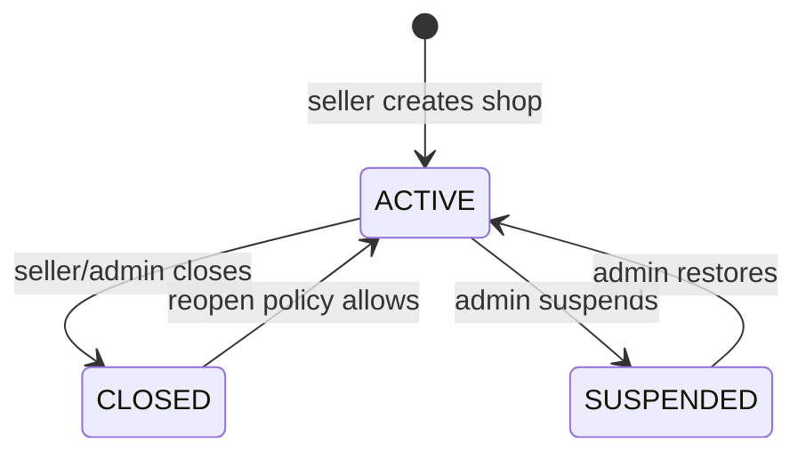
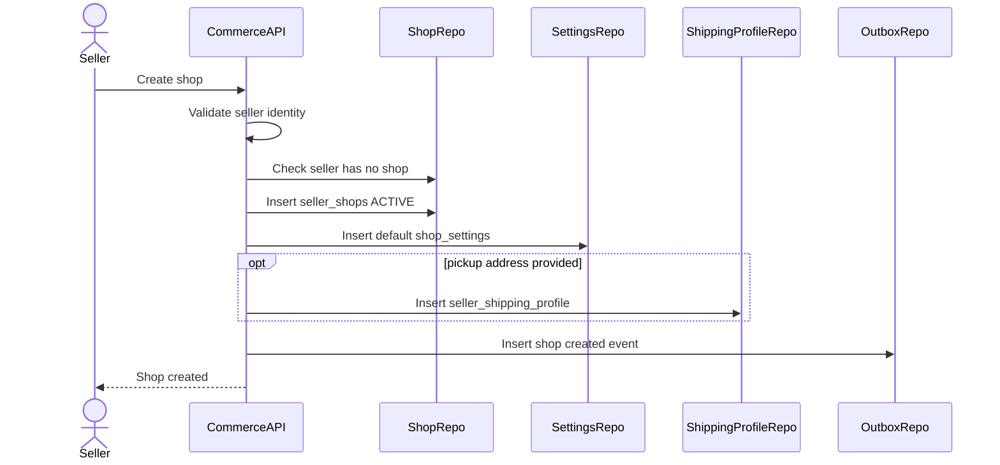
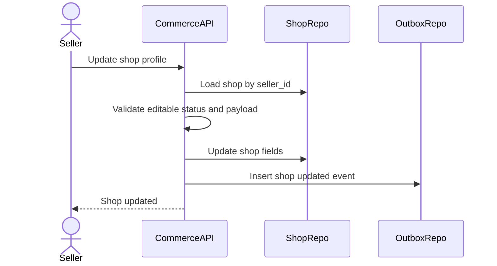
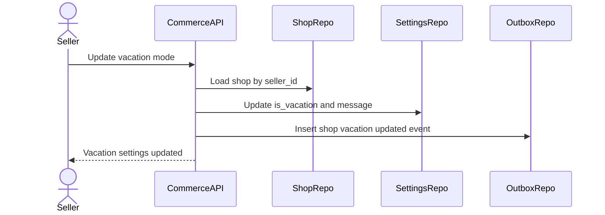
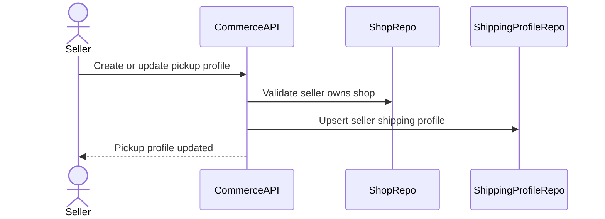
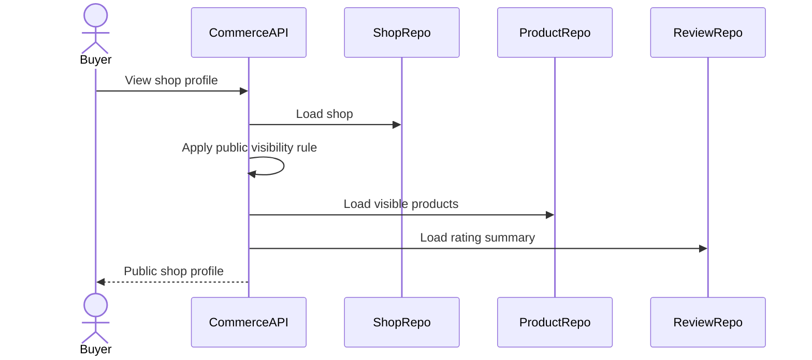
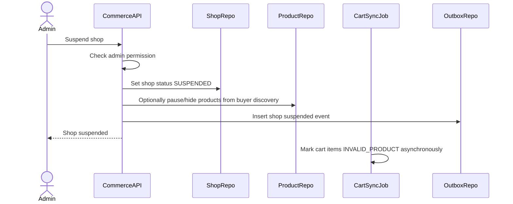

# Shop Management Flow

Shop Management mo ta cach seller tao va quan ly shop trong Commerce Service. Shop la root aggregate cho seller commerce capability: product listing, fulfillment profile, vacation mode, rating va moderation status. Product/cart/checkout phai ton trong shop status.

## 1. Scope

In scope:

- Tao shop.
- Cap nhat shop profile.
- Cap nhat avatar/cover.
- Cap nhat vacation mode va vacation message.
- Xem shop public/internal status.
- Tao/cap nhat seller shipping profile.
- Admin suspend/close shop.
- Tac dong cua shop status toi product discovery/cart/checkout.

Out of scope:

- Seller onboarding/KYC phuc tap.
- Payout verification.
- Multi-shop per user.
- Shop analytics nang cao.

### Object Storage (MinIO)

- `avatar_url` va `cover_url` tro object tren bucket **`2hands-commerce-shop`** (MinIO shared, khong instance rieng commerce-service).
- Upload: FE presigned → MinIO → API luu URL (giong Auth avatar). Xem `docs/engineering_rules/commerce-object-storage.md`.

## 2. Actors

- Seller: tao va quan ly shop cua minh.
- Buyer: xem shop public profile va product list.
- Admin: suspend/close shop.
- System: sync product/cart availability khi shop status thay doi.

## 3. Source Tables

- `seller_shops`
- `shop_settings`
- `seller_shipping_profiles`
- `products`
- `cart_items`
- `reviews`
- `outbox_events`

## 4. Core Invariants

- Moi seller/user co toi da mot shop trong MVP.
- `seller_shops.seller_id` unique.
- Shop status controls sellability.
- Seller can manage only own shop.
- Buyer discovery shows only `ACTIVE` shops.
- `SUSPENDED` or `CLOSED` shop cannot publish product or accept checkout.
- Vacation mode can allow browsing but should block or warn checkout depending policy.

## 5. Shop State Machine

Status meaning:

- `ACTIVE`: shop hoat dong binh thuong.
- `CLOSED`: shop dong theo seller/admin policy.
- `SUSPENDED`: shop bi admin suspend do vi pham.

## 6. Create Shop Flow

Create payload:

- `shop_name`
- `description`
- `avatar_url` optional
- `cover_url` optional
- optional pickup profile:
  - `pickup_name`
  - `phone`
  - `province_code`
  - `district_code`
  - `ward_code`
  - `address_detail`

Rules:

- Seller/user id comes from JWT, not client body.
- Reject if seller already has shop.
- Shop name required.
- Initial `status = ACTIVE` unless admin approval flow is introduced later.
- Create default `shop_settings` with `is_vacation = false`.

Failure cases:

- Duplicate shop for seller -> 409.
- Invalid shop name -> 400.
- Invalid shipping profile -> 400.

## 7. Update Shop Profile Flow

Editable fields:

- `shop_name`
- `description`
- `avatar_url`
- `cover_url`

Rules:

- Seller can update only own shop.
- Suspended shop profile updates can be rejected or limited; MVP recommended allow non-selling profile edits but keep shop not sellable.
- Closed shop can update profile only if business allows reopening later.

## 8. Vacation Mode Flow

Rules:

- Seller can set `is_vacation`.
- If `is_vacation = true`, `vacation_message` is optional but recommended.
- Buyer product discovery can still show products with vacation flag.
- Checkout should block new orders for vacation shop in MVP unless policy says otherwise.
- Existing orders must still be visible and processed according to seller obligation/policy.

## 9. Seller Shipping Profile Flow

Rules:

- Required for GHN shipping.
- Seller can manage only own pickup profile.
- Phone and location codes required.
- Missing shipping profile blocks GHN shipment creation and shipping fee calculation for that seller.

## 10. Public Shop View Flow

Public visibility:

- `seller_shops.status = ACTIVE`.
- Suspended/closed shop should return 404 or unavailable response; MVP recommended 404 for buyer public APIs.

Public response:

- `shop_id`
- `shop_name`
- `description`
- `avatar_url`
- `cover_url`
- `rating_avg`
- `rating_count`
- `is_vacation`
- `vacation_message`
- visible products page

## 11. Admin Suspend Shop Flow

Rules:

- Admin permission required.
- Suspended shop cannot publish/update selling status for products.
- Buyer discovery and checkout must exclude/block suspended shop products.
- Active cart items for suspended shop become `INVALID_PRODUCT` via sync job.
- Existing orders need explicit policy; MVP should keep historical orders visible and allow admin support, but block new checkout.

## 12. Close Shop Flow

Seller/admin close shop:

- `seller_shops.status = CLOSED`.
- Products no longer sellable.
- Buyer discovery hides shop/products.
- Checkout blocked.
- Existing fulfillment still needs policy; MVP should not auto-cancel paid/processing orders without explicit support flow.

## 13. Shop Status Impact Matrix

| Shop status | Buyer discovery | Add cart | Checkout | Seller publish product | Existing order handling |
|---|---|---|---|---|---|
| `ACTIVE` | Allowed | Allowed | Allowed unless vacation blocks | Allowed | Normal |
| `CLOSED` | Hidden | Blocked | Blocked | Blocked | Manual/support policy |
| `SUSPENDED` | Hidden | Blocked | Blocked | Blocked | Admin/support policy |

Vacation mode:

| Vacation | Buyer discovery | Add cart | Checkout |
|---|---|---|---|
| `false` | Normal | Normal | Normal |
| `true` | Show with notice | Allowed or warn | Recommended blocked in MVP |

## 14. Rating Summary

`seller_shops.rating_avg` and `rating_count` are updated by review lifecycle:

- Include only visible reviews.
- Recalculate after review create/update/hide/restore.
- Do not let seller manually edit rating fields.

## 15. Transaction And Consistency

Write operations needing transaction:

- Create shop + default settings + optional shipping profile.
- Update shop profile.
- Update vacation mode.
- Admin status change.
- Upsert shipping profile.

Consistency:

- Unique `seller_id` prevents multiple shops.
- Status changes must be enforced in product/cart/checkout queries, not only via async sync.
- Async cart sync improves UX but checkout must still validate shop status live.

## 16. Events

Recommended outbox events:

- `COMMERCE_SHOP_CREATED`
- `COMMERCE_SHOP_UPDATED`
- `COMMERCE_SHOP_VACATION_UPDATED`
- `COMMERCE_SHOP_SUSPENDED`
- `COMMERCE_SHOP_CLOSED`
- `COMMERCE_SHOP_RESTORED`
- `COMMERCE_SHOP_RATING_UPDATED`

Event key examples:

- `shop:{shop_id}:created`
- `shop:{shop_id}:suspended`

## 17. Acceptance Criteria

- A seller can have at most one shop.
- Seller can update only own shop and shipping profile.
- Active shop is required for product publish and checkout.
- Suspended/closed shop products do not appear in buyer discovery.
- Vacation mode is visible to buyer and blocks checkout according to MVP policy.
- Shop status changes are enforced synchronously in checkout validation.

