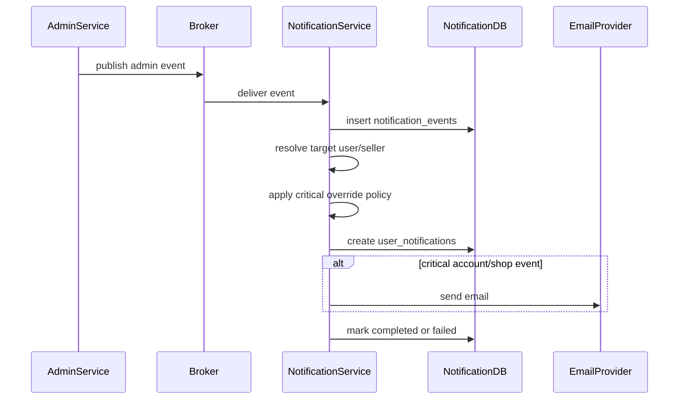

# Admin Notification Flow

## 1. Scope

Flow nay mo ta notification phat sinh tu Admin Service events lien quan enforcement, moderation va shop/user status.

In scope:

- Notify target user/seller khi bi suspend/restrict/product removed/shop suspended.
- Send critical email cho account/shop enforcement.
- Respect boundary: Admin owns decision, Notification owns delivery.

Out of scope:

- Creating enforcement/moderation decision.
- Mutating Auth/Social/Commerce state.
- Admin audit log.

## 2. Actors

- **Admin Service:** Publish enforcement/moderation events.
- **Notification Service:** Consume va deliver.
- **Target User/Seller:** Recipient.
- **Email Provider/FCM:** Delivery providers.

## 3. Source Tables

- `notification_events`
- `user_notifications`
- `user_notification_settings`
- `user_device_tokens`

## 4. Event Mapping

| Event Type | Recipient | Reference | Default Channels |
|---|---|---|---|
| `USER_SUSPENDED` | target user | `USER_ENFORCEMENT` or `USER` | in-app, push, email |
| `USER_RESTRICTED` | target user | `USER_ENFORCEMENT` or `USER` | in-app, push, email |
| `PRODUCT_REMOVED` | seller/product owner | `PRODUCT` | in-app, push |
| `REVIEW_HIDDEN` | review author optional seller | `REVIEW` | in-app |
| `SHOP_SUSPENDED` | shop owner | `SHOP` | in-app, push, email |

System announcement is documented in `system-announcement-fanout-flow.md`.

## 5. Flow Diagram

## 6. Required Payload Fields

Enforcement:

- `enforcement_id`
- `target_user_id`
- `action_type`
- `reason` sanitized
- `expires_at` optional

Moderation:

- `target_user_id` or `seller_user_id`
- `target_type`
- `target_id`
- `reason` sanitized

Shop:

- `shop_id`
- `shop_owner_id`
- `reason` sanitized

## 7. Business Rules

- Suspended user can still receive account/system critical notification.
- Enforcement email can override disabled email setting if policy says account-critical.
- Reason shown to user must be sanitized and user-safe.
- Product/review/shop moderation notification must not expose internal admin notes.
- Notification Service does not decide whether enforcement/moderation is valid.

## 8. Failure Cases

- **Missing target user:** fail event.
- **Unsafe reason/internal note in payload:** sanitize or fail by policy.
- **Email failure:** retry email delivery.
- **Duplicate admin event:** no duplicate user notification.
- **Unknown moderation event:** fail with unsupported event type.

## 9. Acceptance Criteria

- Enforcement events notify target user.
- Product/shop moderation events notify seller/owner.
- Critical account/shop events can send email.
- Internal admin note is not exposed.
- Notification Service does not mutate Admin/Auth/Social/Commerce data.

