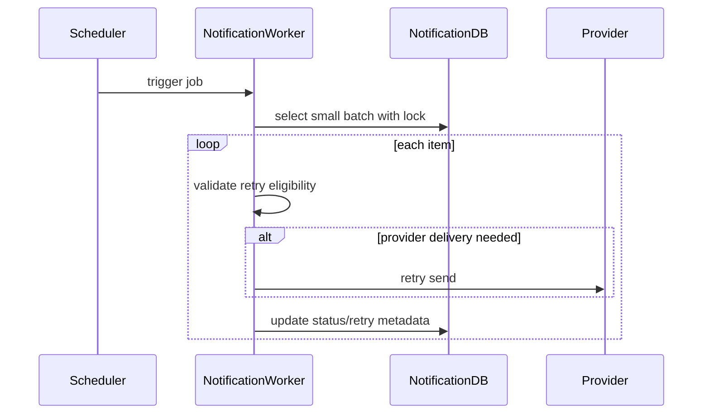

# Background Jobs Flow

## 1. Scope

Flow nay tong hop cac background jobs cua Notification Service trong MVP.

In scope:

- Process pending notification events.
- Retry failed notification events.
- Retry failed delivery.
- Cleanup invalid/stale device tokens.
- Optional cleanup old notifications.
- Optional review reminder.

Out of scope:

- Marketing scheduled campaign.
- Complex distributed scheduler.
- Real dead-letter queue infrastructure.

## 2. Actors

- **Scheduler:** Triggers periodic jobs.
- **Notification Workers:** Execute jobs.
- **Notification DB:** Stores job targets.
- **External Providers:** FCM/email provider for delivery retry.

## 3. Jobs

| Job | Trigger | Main Table | Required MVP |
|---|---|---|---|
| Process pending events | frequent polling | `notification_events` | yes |
| Retry failed events | scheduled | `notification_events` | yes |
| Recover stale processing | scheduled | `notification_events` | yes |
| Retry failed push/email | scheduled | `user_notifications` | yes if delivery can fail |
| Cleanup invalid/stale tokens | scheduled | `user_device_tokens` | yes |
| Cleanup old notifications | scheduled | `user_notifications` | optional |
| Review reminder | scheduled | Commerce integration | optional |

## 4. Flow Diagram

## 5. Business Rules

- Jobs must be idempotent and safe to rerun.
- Process in small batches.
- Use row lock / skip locked where possible.
- Do not retry beyond `max_retry_count`.
- Backoff required for provider failures/rate limits.
- Invalid device token cleanup should deactivate, not hard delete.
- Old notification cleanup is optional and must follow retention policy.

## 6. Transaction & Consistency

- Each batch should have bounded transaction size.
- External provider calls should not happen inside long DB transaction.
- If worker crashes, stale processing recovery returns row to retryable failure state.
- Job logs must be sanitized.

## 7. Failure Cases

- **Worker crash:** stale processing recovery handles locked rows.
- **Provider unavailable:** retry later with backoff.
- **DB lock contention:** skip locked rows and process next batch.
- **Permanent validation error:** keep failed and stop retry after max.
- **Invalid token:** deactivate token, do not retry.

## 8. Acceptance Criteria

- Pending events are eventually processed.
- Failed retryable events are retried.
- Stale `PROCESSING` rows are recovered.
- Invalid device tokens are deactivated.
- Jobs do not create duplicate notifications.

