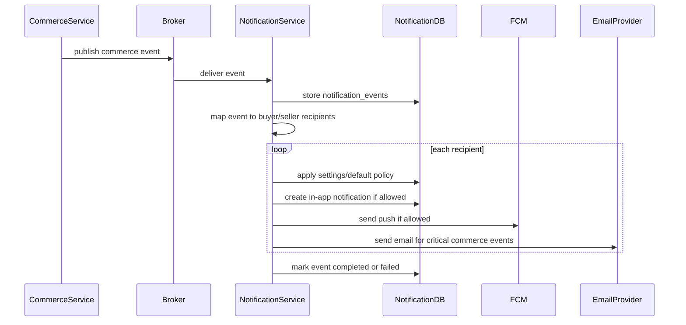

# Commerce Notification Flow

## 1. Scope

Flow nay mo ta notification phat sinh tu Commerce Service events lien quan order, payment, shipment va optional review reminder.

In scope:

- Notify buyer/seller theo commerce event.
- In-app, push va email theo default policy.
- Idempotent handling duplicate payment/order/shipment events.

Out of scope:

- Mutate order/payment/shipment.
- Direct Commerce DB access.
- Refund/support operation.

## 2. Actors

- **Commerce Service:** Publish order/payment/shipment events.
- **Notification Service:** Consume va send notification.
- **Buyer:** Nhan order/payment/shipment notification.
- **Seller:** Nhan new order notification neu applicable.

## 3. Source Tables

- `notification_events`
- `user_notifications`
- `user_notification_settings`
- `user_device_tokens`

## 4. Event Mapping

| Event Type | Recipients | Reference | Default Channels |
|---|---|---|---|
| `ORDER_CREATED` | buyer, seller(s) | `ORDER` | buyer: in-app/push/email, seller: in-app/push |
| `PAYMENT_SUCCESS` | buyer | `PAYMENT` or `ORDER` | in-app, push, email |
| `PAYMENT_FAILED` | buyer | `PAYMENT` or `ORDER` | in-app, push |
| `SHIPMENT_CREATED` | buyer, optional seller | `SHIPMENT` | in-app |
| `SHIPMENT_SHIPPED` | buyer | `SHIPMENT` | in-app, push |
| `SHIPMENT_DELIVERED` | buyer | `SHIPMENT` | in-app, push |
| `ORDER_COMPLETED` | buyer | `ORDER` | in-app, push |
| `REVIEW_REMINDER` optional | buyer | `ORDER`/`PRODUCT` | in-app, push |

If Commerce uses prefixed event names such as `COMMERCE_ORDER_CREATED`, Notification routing must map aliases explicitly.

## 5. Flow Diagram

## 6. Required Payload Fields

Common:

- `event_id`
- `event_type`
- `source_service = COMMERCE`
- `order_id` or related aggregate id
- `buyer_id`
- `seller_ids` when sellers need notification

Payment:

- `payment_id`
- `payment_status`
- `amount`
- `payment_method`

Shipment:

- `shipment_id`
- `tracking_code` optional
- `shipment_status`

Rules:

- Payload should include display-safe order code, not sensitive provider raw payload.
- Email needs recipient email or enough user id for an approved internal lookup/projection.

## 7. Business Rules

- Commerce Service owns all order/payment/shipment state.
- Notification Service only informs users.
- Payment success duplicate must not send duplicate notification.
- Order created can create multiple notifications for multiple sellers.
- Seller notification should not leak buyer PII beyond allowed support/fulfillment context.
- Payment success email is critical enough to use email by default.
- Payment failed does not email by default in MVP.

## 8. Failure Cases

- **Missing buyer_id:** fail event, no recipient.
- **Missing seller list:** buyer notification may still proceed if seller notification optional; otherwise fail by event contract.
- **Duplicate event:** no duplicate user notification.
- **Email provider failure:** in-app can still be created; email retry handled separately.
- **Unsupported prefixed event:** route via alias or fail with unsupported event error.

## 9. Acceptance Criteria

- Buyer receives correct order/payment/shipment notifications.
- Sellers receive new order notification when payload contains sellers.
- Commerce DB is never mutated by Notification Service.
- Duplicate commerce events do not duplicate notification.
- Channel policy matches criticality of event.

