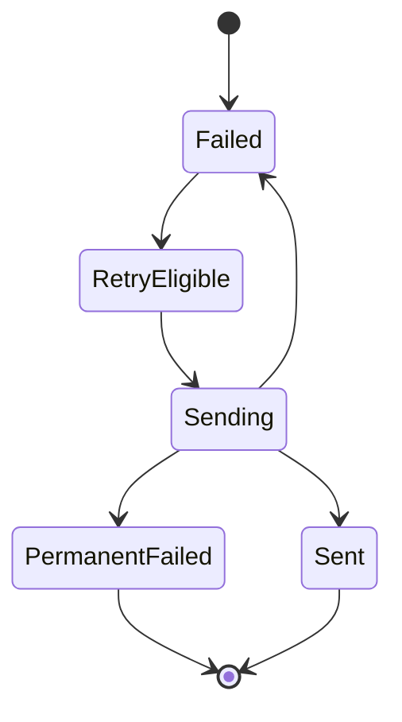
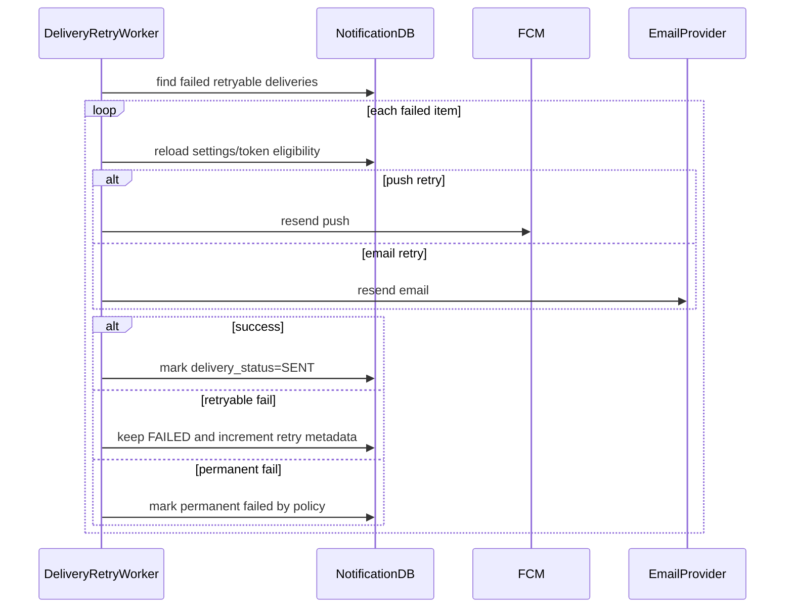

# Delivery Retry Flow

## 1. Scope

Flow nay mo ta retry cho delivery failures o channel push/email va general `delivery_status = FAILED` cua user notification trong MVP.

In scope:

- Classify retryable vs permanent failure.
- Retry push provider failures.
- Retry email provider failures.
- Deactivate invalid tokens.

Out of scope:

- Per-channel delivery table.
- Manual operator retry UI.
- Provider-specific advanced idempotency.

## 2. Actors

- **Delivery Retry Worker:** Retry failed deliveries.
- **FCM:** Push provider.
- **Email Provider:** Email provider.
- **Notification DB:** Stores failed delivery state.

## 3. Source Tables

- `user_notifications`
- `user_device_tokens`
- `user_notification_settings`
- `notification_events`

## 4. Failure Classification

Retryable:

- Provider timeout.
- Provider rate limit.
- Temporary network error.
- Provider 5xx.

Permanent:

- Invalid/unregistered device token.
- Invalid email address.
- Missing required template.
- Payload violates provider format.
- User/recipient no longer eligible by policy.

## 5. State Machine

## 6. Flow Diagram

## 7. Business Rules

- Retry should respect max retry and backoff.
- Invalid token disables `user_device_tokens.is_active`.
- If user disables push/email after failure but before retry, retry should respect latest setting unless event is critical override.
- In-app notification should remain visible even if push/email failed, unless event policy requires all channels.
- Retry must not create duplicate `user_notifications`.

## 8. Data Limitation In MVP

Current MVP stores general `delivery_status` on `user_notifications`, not per-channel attempts. This is enough for simple retry, but has limitations:

- Cannot separately track push success and email failure for same notification.
- Cannot store per-device attempt history.
- Cannot provide rich provider diagnostics.

If this becomes necessary, add `notification_deliveries` table later.

## 9. Failure Cases

- **Max retry exceeded:** Keep failed and expose to ops logs/metrics.
- **Token invalid:** deactivate and stop retrying that token.
- **Email invalid:** permanent failure.
- **Provider rate limit:** backoff and retry later.
- **Notification deleted by user:** stop non-critical push retry.

## 10. Acceptance Criteria

- Retryable push/email failures are retried.
- Permanent failures are not retried forever.
- Invalid tokens are deactivated.
- Latest user settings are respected on retry.
- Retry does not duplicate in-app records.

