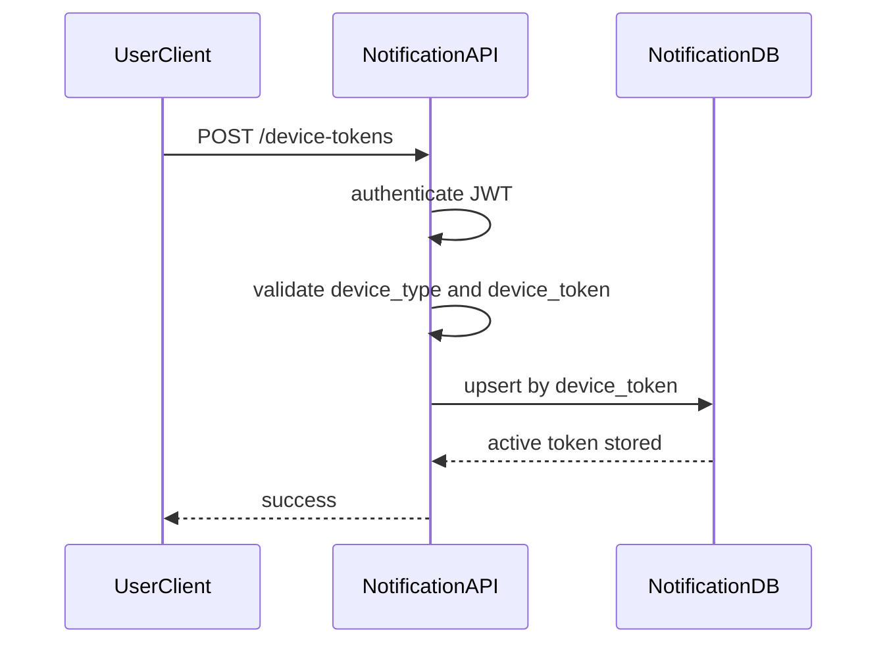
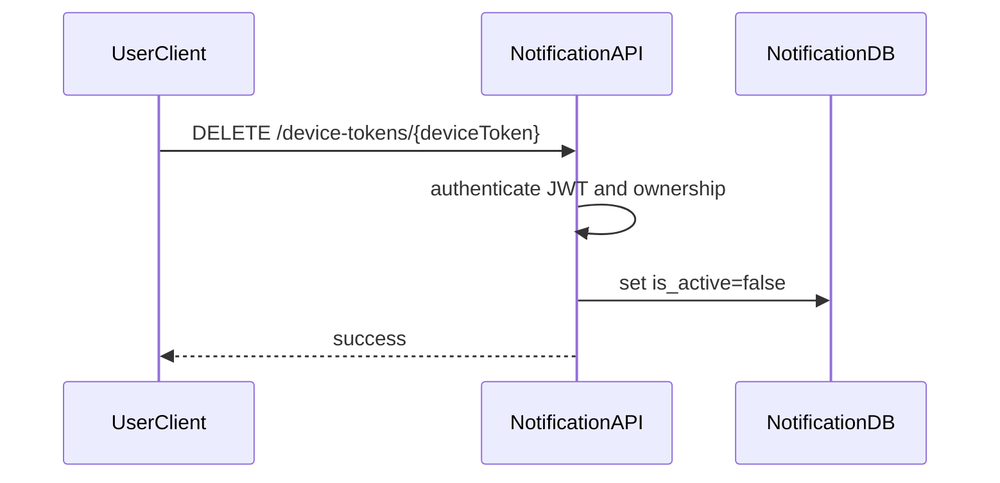

# Device Token Management Flow

## 1. Scope

Flow nay mo ta cach user/app dang ky, cap nhat, revoke va cleanup device token dung cho push notification.

In scope:

- Register/upsert FCM token.
- Revoke token khi logout.
- Deactivate invalid token.
- Protect device token as sensitive data.

Out of scope:

- APNS token lifecycle chi tiet.
- Device fingerprinting.
- Push campaign segmentation.

## 2. Actors

- **User Client:** Mobile/web app gui token.
- **Notification API:** Protected API xu ly token.
- **Notification Worker:** Deactivate invalid token khi FCM tra loi.
- **FCM:** Provider tra invalid/unregistered token.

## 3. Source Tables

- `user_device_tokens`

## 4. Register Flow

## 5. Revoke Flow

## 6. Business Rules

- `device_token` unique toan he thong.
- Register la upsert theo `device_token`.
- Khi same token duoc register lai, set `is_active = true`, update `user_id`, `device_type`, `last_used_at`, `updated_at` theo policy.
- User chi revoke token cua minh.
- Logout all devices co the deactivate tat ca token active cua user.
- FCM invalid/unregistered token phai set `is_active = false`.
- Khong log full device token; neu can debug chi log hash/last chars.

## 7. Security

- API requires JWT.
- `user_id` lay tu JWT, khong lay tu request body.
- Token value duoc coi la sensitive.
- Rate limit register endpoint de tranh spam tokens.

## 8. Failure Cases

- **Invalid device type:** 400.
- **Empty/malformed token:** 400.
- **Unauthorized:** 401.
- **Token owned by another user:** Reassign or reject theo security policy, can consistent trong FR.
- **DB unique conflict:** Retry/upsert safely.

## 9. Acceptance Criteria

- User can register active device token.
- User can revoke own token.
- Push delivery ignores inactive tokens.
- Invalid provider token is deactivated.
- Device token is never exposed/logged unsafely.

