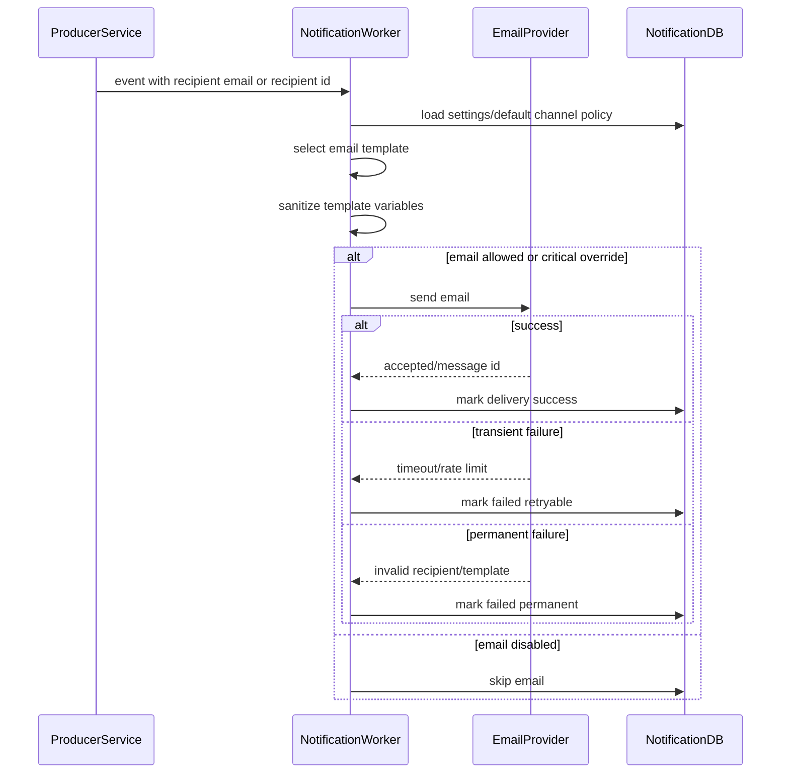

# Email Delivery Flow

## 1. Scope

Flow nay mo ta viec gui email notification cho cac event critical/system trong MVP.

In scope:

- Verify email.
- Password reset.
- Security/account emails.
- Order/payment/account enforcement emails.
- Retry transient provider failures.

Out of scope:

- Marketing email.
- Email campaign.
- Template builder.
- Multi-language template engine.

## 2. Actors

- **Notification Worker:** Dieu phoi email.
- **Auth/Commerce/Admin Service:** Publish event co email recipient/link/token da tao.
- **Email Provider:** SMTP/SendGrid/Mailgun hoac provider tuong duong.
- **User:** Nhan email.

## 3. Source Tables

- `notification_events`
- `user_notifications` optional for events also creating in-app notification.
- `user_notification_settings`

## 4. Email Event Types

MVP email applies to:

- `EMAIL_VERIFICATION_REQUESTED`
- `PASSWORD_RESET_REQUESTED`
- `PASSWORD_CHANGED`
- `ORDER_CREATED`
- `PAYMENT_SUCCESS`
- `USER_SUSPENDED`
- `USER_RESTRICTED`
- `SHOP_SUSPENDED`

## 5. Flow Diagram

## 6. Business Rules

- Notification Service deliver email token/link; Auth Service owns generation and validation of verification/reset token.
- Password/reset/OTP/token must not be logged.
- Email content must be generated from server-side trusted template.
- Normal non-critical events respect `allow_email`.
- Security-critical email can override user preference only if policy states it explicitly.
- Payment/order/enforcement emails should include enough context but no sensitive payment/provider secret.
- Invalid recipient email is permanent failure unless upstream later corrects email.

## 7. Transaction & Consistency

- Do not keep DB transaction open during slow provider call.
- Persist event processing state before/after provider call.
- For events also creating in-app notification, in-app persistence should not depend on email provider success unless policy requires all channels.
- Retry job handles transient provider failures.

## 8. Failure Cases

- **Provider unavailable:** Retry with backoff.
- **Invalid email:** Permanent failure.
- **Missing template:** Fail event/delivery for investigation.
- **Missing reset/verify link:** Fail event because Notification cannot generate Auth token.
- **Sensitive data in payload:** Sanitize or fail by policy.

## 9. Acceptance Criteria

- Critical Auth emails are sent via email channel.
- Marketing/campaign email is not part of MVP.
- Token/link is not generated by Notification Service.
- Email failures are classified retryable/permanent.
- Secrets are not logged or stored in `last_error`.

