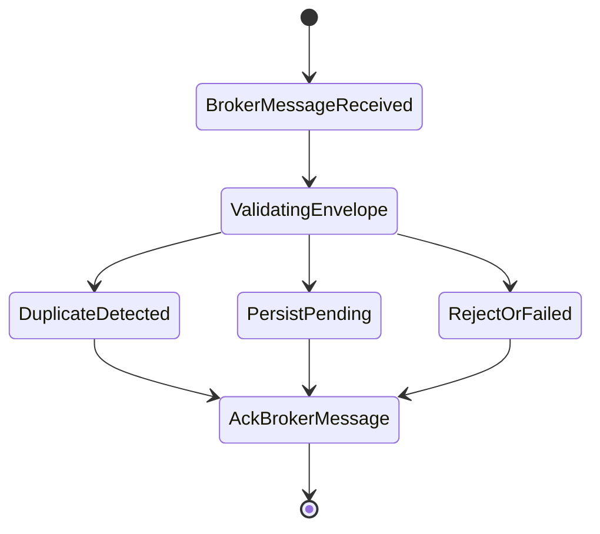
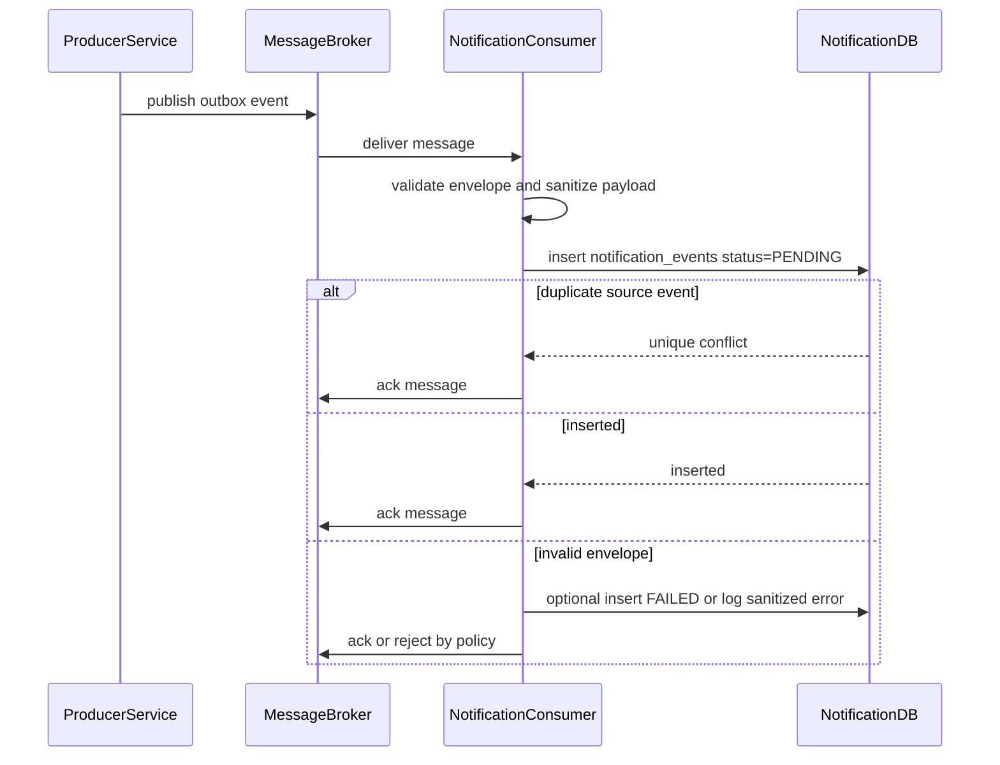

# Event Ingestion Flow

## 1. Scope

Flow nay mo ta cach Notification Service nhan domain event tu Auth, Social, Commerce va Admin thong qua broker/outbox, sau do ghi thanh `notification_events` de xu ly bat dong bo.

In scope:

- Validate event envelope.
- Deduplicate event theo producer event id.
- Persist internal queue row.
- Ack duplicate broker message an toan.

Out of scope:

- Tao `user_notifications`.
- Gui push/email.
- Business logic cua service producer.

## 2. Actors

- **Producer Service:** Auth/Social/Commerce/Admin publish outbox event.
- **Message Broker:** Van chuyen message at-least-once.
- **Notification Consumer:** Nhan message va persist vao `notification_events`.
- **Notification Processing Worker:** Xu ly event o flow rieng.

## 3. Source Tables

- `notification_events`

Logical upstream:

- Producer `outbox_events` cua Auth/Social/Commerce/Admin.

## 4. Event Envelope

Event toi thieu can co:

```json
{
  "event_id": "producer-outbox-event-id",
  "event_type": "PAYMENT_SUCCESS",
  "source_service": "COMMERCE",
  "event_key": "commerce.payment.payment-id.success",
  "aggregate_type": "PAYMENT",
  "aggregate_id": "payment-id",
  "actor_id": null,
  "recipient_user_ids": ["buyer-id"],
  "occurred_at": "2026-05-20T16:00:00Z",
  "payload": {}
}
```

Rules:

- `event_id` la idempotency key chinh.
- `source_service` chi chap nhan `AUTH`, `SOCIAL`, `COMMERCE`, `ADMIN`, `SYSTEM`.
- `event_type` dung `UPPER_SNAKE_CASE`.
- Payload khong duoc chua password, token, OTP secret, provider credential.

## 5. State Machine



## 6. Flow Diagram



## 7. Business Rules

- Ingestion phai idempotent vi broker co the deliver duplicate.
- Duplicate `(source_service, source_event_id)` khong duoc tao row moi.
- Neu `source_event_id` thieu, dung `(source_service, event_key)` neu co.
- Neu ca `source_event_id` va `event_key` deu thieu, event co the bi reject/FAILED vi khong dam bao idempotency.
- Unsupported `event_type` nen duoc mark `FAILED` voi `last_error = UNSUPPORTED_EVENT_TYPE` neu can trace.
- Consumer khong duoc goi service producer de mutate nghiep vu.
- Ack broker message chi sau khi DB insert/dedup decision da xong.

## 8. Transaction & Consistency

- Insert `notification_events` thuc hien trong transaction ngan.
- Unique indexes enforce idempotency:
  - `(source_service, source_event_id)`
  - `(source_service, event_key)`
- Broker delivery la at-least-once, Notification DB la durable inbox/queue.

## 9. Failure Cases

- **DB unavailable:** Do not ack broker message; broker redelivers.
- **Unique conflict:** Treat as success and ack.
- **Invalid JSON:** Reject/ack according to broker policy and log sanitized error.
- **Missing event type/source:** Mark failed or reject.
- **Sensitive payload detected:** Drop sensitive field or fail event by policy.

## 10. Acceptance Criteria

- Same producer event delivered multiple times creates one `notification_events` row.
- Valid event is stored with `status = PENDING`.
- Duplicate message is acknowledged without duplicate notification.
- Invalid event does not crash consumer loop.
- No sensitive token/OTP/secret is logged.

